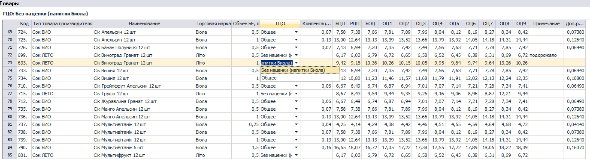
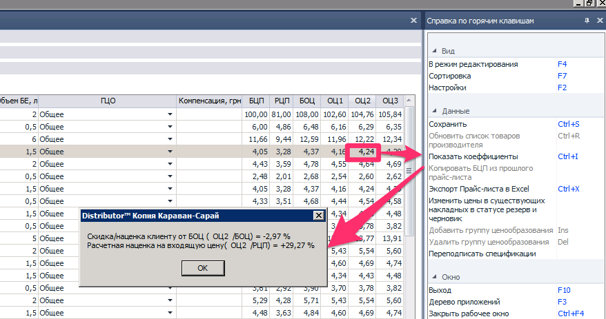

## 0704 СПР Прайс-листы производителя
*Бренд-менеджер*, *НОП*

| Тип компонента | Период действия | Журнал документов | Редактирование
|---------------|------------|----------------------------------------
|справочник| определяется пользователем | реализован |отдельная форма
Этот компонент выступает в роли головного инструмента в механизме ценообразования на всех участках цепочки
 движения товара **Производитель -> Дистрибьютор -> Клиент**. С его помощью системе задаются входные цены
 от Производителя[^1], которые задекларированы в спецификациях, доп.соглашениях и прочих приложениях к дистрибьюторскому
 договору между Производителем и Дистрибьютором, и механизмы возможных корректировок этих цен
 (бонус, штраф, маркетинг и пр.). Также в этом справочнике создается сетка отпускных цен для клиентов
 дистрибьютора, которая хранится и активно используется системой для формирования расходных документов,
  бухгалтерских проводок и построения множества отчетов.

### 1. Руководство пользователя.

Документ прайс-лист может создаваться и редактироваться на **Центральном офисе (ЦО)** с последующей синхронизацией на филиалы,
либо на филиале с признаком ЦО. Важно понимать, что по одному **производителю** в один период времени, на одном филиале может существовать только один
прайс-лист. Система всегда будет проверять на уникальность создаваемого или редактируемого документа. И в случае ошибки выдавать
сообщение в диалоговом окне.

Все документы собраны в журнале, в котором содержится основная справочная информация по каждому прайс-листу. Такая как: период действия, производитель, комментарий, а в случае филиальной структуры - принадлежность к филиалу.

Новый документ создается в журнале документов по одному из сценариев:
1. Добавить (**Ins**) - создает полностью пустой документ. Открывается пустая форма для редактирования, и пользователю необходимо вручную заполнять все поля.
2. Создать прайс-лист на основании - создает документ на основании выбранного в журнале документа-исходника [^4], и все поля нового документа, кроме примечания и дат, будут заполнены автоматически на основании исходного прайс-листа.

Любой сценарий приводит к открытию формы редактирования[^2], которую условно можно разбить на 3 части:
1. Шапочная часть, ([рис.1](./media/image1.png "рис.1")) - здесь задаются ключевые параметры, такие как: Производитель, Период Действия, Филиалы (для филиальной структуры) и пр.  
2. Условия расчета отпускных и приходных цен (рис.2) - табличная часть, в которой задаются механизмы расчета, приходных и отпускных цен, с учетом всевозможных скидок и компенсаций.
3. Таблица Товары (рис.3). - в этой таблице хранятся как уже рассчитанные цены[^7] по каждому **ТМЦ**, так и величины, участвующие в расчете и требующие заполнения пользователем.

#### 1.2 Шапочная часть.

  
*рис.1*

- **Производитель** - обязательно для заполнения, выбирается из справочника **Производители** (и в дальнейшем закрыто для редактирования), служит для подбора **ТМЦ**, и **Групп ценообразования**. При заполнении этого поля, система наполняет таблицу **Товары** строками со всеми **ТМЦ** в статусе **Активный**, а таблицу **Условия расчета** - строками со всеми **Группами ценообразования**, данного **производителя**[^5]
- **Период действия** - из календарной формы выбираются даты действия прайс-листа, таким образом задается период действия приходных и отпускных цен. В случае приходных все цены будут контролироваться по дате прихода, в случае расходных накладных по дате документа **Расходная Накладная (РН)**
  - с (начало действия) - обязательно для заполнения, пользователю необходимо задать с какого числа начинают действовать цены.[^3]
  - по (окончание действия) - необязательно для заполнения, пользователь в большинстве случаев не знает до какого периода будут действовать цены текущего
  прайс-листа, поэтому создает прайс-лист с открытым периодом действия.
- **Округление РЦП** - определяет параметр округления для расчета **РЦП**. Округление производится до второго знака после запятой и может быть:
 - Математически - стандартное округление к ближашему 2-му знаку после запятой
 - В большую сторону - если обнуляемые знаки не равны нулю, предшествующий знак увеличивают на единицу.
 https://ru.wikipedia.org/wiki/Округление
- **Тип цены для сотрудника** - задается по какой категории отпускной цены будет отпускаться товар сотрудникам компании. Это параметр используется при формировании документа **РН СОТ** в компоненте **2220 ЖД Накладная на сотрудника**
- **Комментарий к прайс-листу** - текстовое поле, заполняется вручную и несет смысловую нагрузку, какие обстоятельства сподвигли создать новый документ.
- **Переподписать спецификации** - признак, который определяет запускать **обработку**, закрывающую актуальность действующих **спецификаций**, в которых есть товары выбранного **производителя**.[^6]
- Поле **филиалы** - наполняется всеми доступными филиалами компании, и галочками отмечаются те, кому этот прайс-лист будет предназначен.

#### 1.3 Условия расчета отпускных и приходных цен.

Ценобразование входных и отпускных цен происходит по следующему принципу:
- Производитель презентует дистрибьютору схему работы, которая подразумевает, фиксированную входную цену по каждой **ТМЦ** - **Базовая цена прихода БЦП**. По разным группам товара (**Группы ценообразования**) могут быть определенные скидки или компенсации, а также дополнительные расходы. Дополнительные скидки которые может давать производитель дистрибьютору, формируют **Расчетную цену прихода - РЦП**. Поскольку множество производителей имеют разные схемы работы с дистрибьютором, у пользователя должна быть вариабельность инструментов, чтобы задать системе правильную модель взаимодействия. Ключевые отличия - в таблице ниже:  

|     | Компенсация | Скидка | Доп. расход |
|---------------|------------|----------------------------------------
| **Расчет РЦП** | не участвует| участвует |не участвует |
| **Проверка приходных накл.**|  не участвует|участвует| участвует|
| **Расчет БОЦ** |не участвует |не участвует |не участвует |
| **2143 OLAP**| попадает|не попадает|не попадает |

- В таблице **Товары** (рис.3) пользователь присваивает **БЦП** каждой **ТМЦ**. Это можно сделать как вручную, так и воспользовавшись кнопкой в правом меню **Копировать БЦП из прошлого прайс-листа**

  
*рис.2*

- **Скидка** - заполняется в **Условиях, для расчета РЦП** - и комбинацией двух возможных **способов расчета** формирует **РЦП**, причем задается как в процентах **Скидка, %** (весьма схожа с компенсацией), так и в копейках за литр, **Скидка, коп/литр** (удобно работать с пивными компаниями). Для второго способа важно чтобы в справочнике **0916 СПР Товары** был задан объем каждой **ТМЦ**.
      РЦП = (БЦП - Скидка_1) - Скидка_2;

 в формуле скобки не случайны, если обе скидки заданы в процентах, то при расчете вторая скидка работает с результатом действия первой скидки (процент от процента). Если используется **Скидка, коп/литр** то:

        Скидка = БЦП * Объем ТМЦ * Значение скидки,коп/л
Обратите внимание на 2 особенности: скидка может быть только положительной, а значение скидки №1 должно быть обязательно заполнено (если нет скидок необходимо поставить 0).

 После того как пользователь задаст системе механизм расчета скидок, в таблице **Товары** рассчитается и заполнится столбец **РЦП**.
 Теперь все **приходные накладные** при проведении, будут проходить проверку на то чтобы цена прихода не превышала **РЦП**, а в таких отчетах как например 2143 или 1084[^8] можно увидеть эту цену, а также % наценки и прибыль от данной цены.

- **Компенсация** - применяется преимущественно для индикативного товара, когда цена в накладных не может быть выше или ниже определенного уровня, при этом наценка и дистрибьютора, и производителя контролируется государством и не может превышать допустимого порога. На такие группы товара можно задать  % компенсации, для того чтобы потом в отчете суммарно увидеть объем вторичных продаж за определенный период. Процентная величина может быть как положительной так и отрицательной. Положительная - компенсируют нам, отрицательная - какие либо наши затраты (применяется редко, но тем не менее имеет место быть, например: если на определенный период производитель наложил штраф на дистрибьютора). Когда пользователь заполнит поле компенсация, программа автоматически рассчитает и заполнит в таблице **Товары** (рис.3), столбец **Компенсация, грн** по формуле:

      Компенсация,грн. = РЦП * %Компенсации.

- **Дополнительные расходы, (план)** - поле используется не так часто, в основном когда дистрибьютор хочет заложить в схему затрат то, что выходит за рамки, согласованной с производителем, ценовой модели. Например, транспортные затраты при самовывозе. При помощи этого параметра будет осуществляться дополнительный контроль на этапе проведения **приходных накладных**. Пользователю необходимо выбрать форму расчета **% РЦП** или **Сумма** и заполнить численный параметр (только положительные значения), система рассчитает и заполнит в таблице **Товары** (рис.3) дополнительные расходы по каждой ТМЦ.

- **% скидки или наценки для расчета отпускных цен** - в этом поле можно сформировать 10 различных категорий цен:
 - **Базовая отпускная цена (БОЦ)** - является основной, прайсовой ценой дистрибьютора и расcчитывается по следующей формуле:

        БОЦ = БЦП + % наценки до БОЦ
  чтобы в таблице **товары** рассчиталась эта цена, пользователю необходимо в столбце **БОЦ**, поставить необходимый % наценки от **БЦП** до **БОЦ** (рис.2)
 -  **ОЦ1, ОЦ2, ... ОЦ9** - девять дополнительных категорий **Отпускных цен**, для того чтобы задавать сетку скидок (наценок) для разных категорий клиентов.

          ОЦn = БОЦ + % наценки до ОЦn
чтобы в таблице **товары** рассчиталась эта дополнительная скидочная цена, пользователю необходимо в столбце соответствующей **ОЦ**, поставить необходимый % наценки от **БОЦ** до **ОЦ** (рис.2).

 Согласно отпускных цен формируются расходные накладные, поэтому если по какой-либо **ТМЦ** не будет задана цена, ее не получится продать клиенту, поэтому все столбцы **БОЦ** и **ОЦ** должны быть заполнены.

#### 1.4 Таблица Товары.

  
*рис.3*

В этой таблице как уже описывалось выше , пользователю необходимо заполнять только **БЦП**, все остальные данные будут заполнены автоматически. По сути это и есть прайс-лист дистрибьютора. Если же по каким-то причинам пользователь неправильно расценит
товар и какая-либо отпускная цена в таблице окажется ниже **РЦП** система выдаст предупреждение и обнулит неправильные цены, пользователю необходимо будет исправить свою ошибку.

Для того чтобы было проще проконтролировать наценку, можно поставить курсор на **ТМЦ** и интересующую категорию цен и в правом меню нажать **Показать коэффициенты (Ctrl+I)**, в диалоговом окне отобразится скидка (наценка) от БОЦ, и расчетная наценка от РЦП.

  
*рис.4*

Когда прайс будет сформирован, то перед тем как выполнить его сохранение, программа предложит пересчитать все накладные в статусе резерв и черновик, которые попадают в период действия этого прайс-листа, и пользователю необходимо будет принять решение. Иногда поздно созданный прайс-лист может содержать в себе значительные изменения в ценовой политике, и если к этому времени отделы продаж уже сформировали значительное количество заявок, то проигнорировав этот сценарий, накладные не пересчитаются и поедут в розницу по старым ценам, а это приведет компанию к определенным убыткам. Также это действие можно запустить в ручном режиме, нажав в правом меню, **Изменить цены в существующих накладных в статусе резерв и черновик**   

### 2. Приложения.
#### 2.1 Диаграмма ценообразования

  
*рис.5*

[^1]: под термином **Производитель** в контексте всей этой книги подразумевается поставщик дистрибьютора. Им может быть не только производитель какого либо товара, но также импортер, другой дистрибьютор (дистрибьютор поставляет товар субдистрибьютору), и вообще любой поставщик, с которым дистрибьютор заключил договор поставки в качестве покупателя.

[^2]: под термином **редактирование** подразумевается также и **создание** нового документа, так как в большинстве компонентов программы и создание, и редактирование документа происходит в одной и той же форме.

[^3]: период действия цен для расходных накладных будет определятся по **дате документа** **РН**

[^4]: в большинстве случаев это предшествующий прайс-лист того же **производителя**

[^5]: перенаполнение таблиц также происходит и при редактировании действующего прайс-листа

[^6]: при сохранении прайса, для всех спецификаций в статусе **Действительный**, с датой **действительна по** не указанной или больше  **дата начала действия прайс-листа - 1** и в которых есть товары **производителя**, обновляется дата **действительна по** согласно формуле: **действителен по = дата начала действия прайс-листа - 1**. Фактически, если прайс-лист начинает действовать с сегодняшнего дня, то действующие спецификации производителя закрываются вчерашним днем.

[^7]: все цены и абсолютные величины в этом документе без учета НДС.

[^8]: цена в **Акционных накладных** в **1084 ОТЧ Ежедневные отгрузки** берется в РЦП из действующего прайс-листа.
