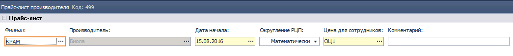

## 0704 СПР Прайс-листы производителя
*Бренд-менеджер*, *НОП*

| Тип компонента | Период дейтвия | Журнал документов | Редактирование
|---------------|------------|----------------------------------------
|справочник| определяется пользователем | реализован |отдельная форма
Этот компонент выступает в роли головного инструмента в механизме ценообразования на всех участках цепочки
 движения товара **Производитель -> Дистрибьютор -> Клиент**. С его помощью системе задаются входные цены
 от Производителя[^1], которые задекларированы в спецификациях, доп.соглашениях и прочих приложениях к дистрибьюторскому
 договору между Производителем и Дистрибьютором, и механизмы возможных корректировок этих цен
 (бонус, штраф, маркетинг и пр.). Также в этом справочнике создается сетка отпускных цен для клиентов
 дистрибьютора, которая хранится и активно используется системой для формирования расходных документов,
  бухгалтерских проводок и построения множества отчетов.

### Руководство пользователя.

Документ прайс-лист может создаваться и редактироваться на **Центральном офисе (ЦО)** с последующей синхронизацией на филиалы,
либо на филиале с признаком ЦО. Важно понимать что в один период времени, на одном филиале может существовать только один
прайс-лист. Система всегда будет проверять на уникальность создаваемого или редактируемого документа. И в случае ошибки выдавать
сообщение в диалоговом окне.

Все документы собраны в журнале, в котором содержится основная справочная информация по каждому прайс-листу. Такая как: период действия, производитель, комментарий, а в случае филиальной структуры - принадлежность к филиалу.

Новый документ создается в журнале документов по одному из сценариев:
1. Добавить (**Ins**)
2. Создать прайс-лист на основании.

Любой сценарий приводит к открытию формы редактирования[^2], которую условно можно разбить на 3 части:
1. Шапочная часть, [рис.1](рис.1) - здесь задаются ключевые параметры, такие как: Производитель, Период Действия, Филиалы (для филиальной структуры) и пр.  
2. Условия расчета отпускных и приходных цен (рис.2) - табличная часть, в которой задаются механизмы расчета, приходных и отпускных цен, с учетом всевозможных скидок и компенсаций.
3. Таблица Товары (рис.3). - в этой таблице хранятся как уже рассчитанные цены по каждому **ТМЦ**, так и величины, участвующие в расчете и требующие заполнение пользователем.

В первом случае открывается пустая форма для редактирования, и пользователю необходимо
вручную заполнять все поля.

- Производитель - обязательно для заполнения, выбирается из справочника **Производители**, служит для подбора **ТМЦ**, и **Групп ценообразования**.
- Период действия - из календарной формы выбираются даты действия прайс-листа, таким образом задается период действия приходных и отпускных цен. В случае приходных все цены будут контролироваться по дате прихода, в случае расходных накладных по дате документа **Расходная Накладная (РН)**
  - с (начало действия) - обязательно для заполнения, пользователю необходимо задать с какого числа начинают действовать цены.
  - по (окончание действия) - необязательно для заполнения, пользователь в большинстве случаев не знает до какого периода будут действовать цены текущего
  прайс-листа, поэтому создает прайс-лист с открытым периодом действия.

*рис.2*
 

*рис.3*
  

[^1]: под термином **Производитель** в контексте всей этой книги подразумевается поставщик дистрибьютора. Им может быть не только производитель какого либо товара, но также импортер, другой дистрибьютор (дистрибьютор поставляет товар субдистрибьютору), и вообще любой поставщик, с которым дистрибьютор заключил договор поставки в качестве покупателя.
[^2]: под термином **редактирование** подразумевается также и **создание** нового документа, так как в большинстве компонентов программы и создания и редактирование документа происходит в одной и той же форме.
