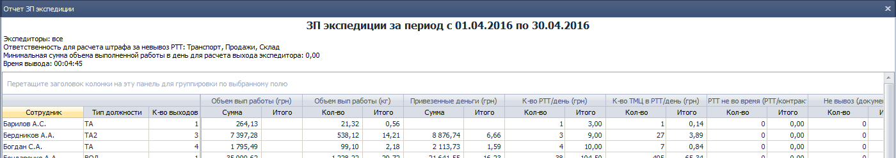
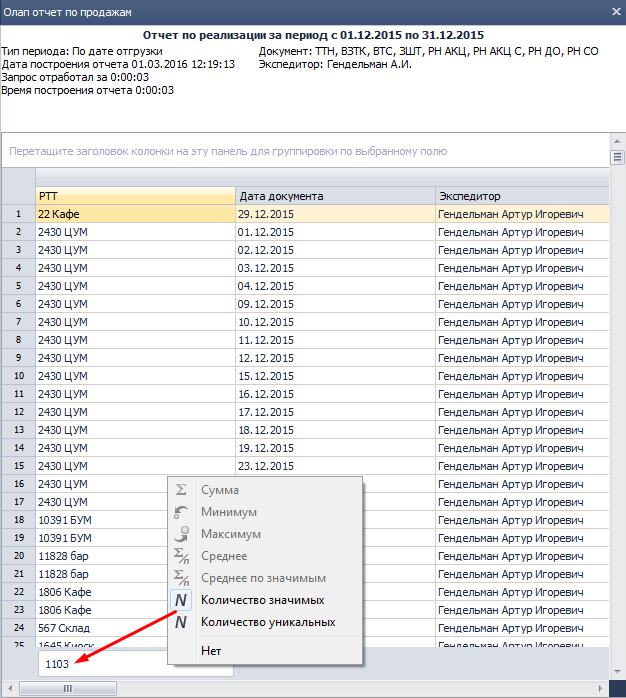
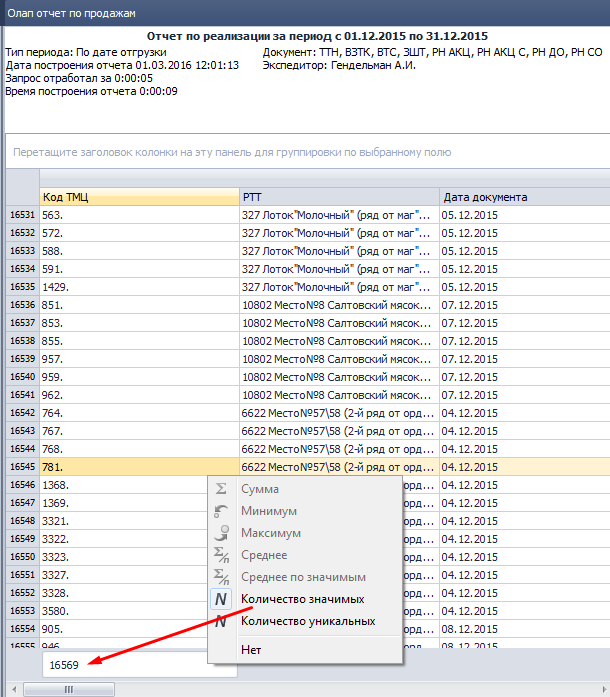
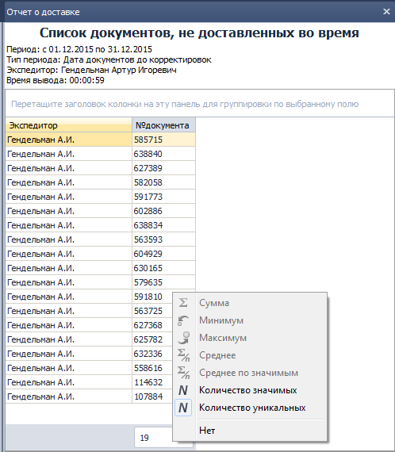

## 2246 ОТЧ Отчет ЗП экспедиции.

### 1. Назначение отчета.

| **Тип компонента** | **Связанные компоненты**             |   
|--------------------|--------------------------------------|
| отчет              | 2244 СПР Стоимость работы экспедиции |

*Транспортный логист, Бухгалтер по ЗП, Руководитель филиала*

Отчет используется в случаях, когда нужно детализировать начисленную сотруднику ЗП, например для проверки корректности начисления. Может использоваться для сравнительного анализа эффективности работы водителей-экспедиторов, экспедиторов, предварительного расчета ЗП сотрудника за любой отработанный период, в том числе еще не оплаченный.  
Отчет строится по сотрудникам, которые внесены в расходные документы как экспедитор.
Так же в отчете есть возможность детализации начисленной по каждому показателю суммы по ЦФО (Центр Финансовой Ответственности).  

### 2. Параметры отчета.

  
рис.1.

-   **Период**  
Период, за который берутся данные для построения отчета. Обязательное поле.
-   **Экспедиторы**  
Для ускорения построения отчета можно построить его по одному или нескольким сотрудникам, которые фигурируют в накладной как экспедитор. Если оставить поле пустым - будут учтены все документы за период. Необязательное поле.
-   **Ответственность для расчета штрафа за невывоз РТТ**  
Только по отмеченным ответственным будут начисляться штрафы. Подробнее начисление штрафов будет описано ниже.
-   **Минимальная сумма объема выполненной работы в день для расчета выхода экспедитора**  
Только экспедиторы, выполнившие в день объем работ более указанного попадут в отчет. Параметр используется при анализе для отсечения непоказательных данных. Если оставить незаполненным – выведутся все данные без ограничений.

### 3. Табличная часть.  
  
рис.2.

Отчет выводится в виде таблицы, первые три столбца которой закреплены. В каждой строке указаны показатели работы сотрудника за выбранный период. На одного сотрудника – одна строка.

### 4. Расчеты и формулы.

Каждому показателю работы экспедитора выделено два столбца. В одном выводится рассчитанное значение показателя, во втором – начисленная именно за этот показатель часть заработной платы.  
Начисление производится путем умножения показателя на актуальную в момент выполнения работы стоимость этого показателя.  
Стоимости показателей задаются в компоненте **2244 СПР Стоимость работы экспедиции**.  
Рассмотрим подробнее каждый показатель.  

**Объем вып работы (грн).**  
Сумма стоимости товаров за период по всем накладным, в которых в качестве экспедитора был указан сотрудник.  
Принимаются во внимание документы:  
- возврат товара от клиента;
- возврат товара через сотрудника;
- замена штучного товара;
- акционная накладная (доставка);
- расходная накладная на отсрочку – доставка;
- ттн.

Проверить расчет можно используя компонент **2143 ОТЧ OLAP отчет по продажам** с такими параметрами:  
Тип периода – по дате отгрузки.  
Данные – Объем выполненной работы без корректировок, грн с НДС.

**Объем вып работы (кг).**  
Показатель аналогичен предыдущему, но подсчитывается не сумма денежных средств, а вес.  
Проверяется аналогично, но данные - Объем выполненной работы без корректировок, кг с тарой.  
Так как в параметрах (**2244 СПР Стоимость работы экспедиции**) устанавливается стоимость за тонну, то при расчете бонуса показатель делится на 1000 кг.

**Привезенные деньги (грн).**  
Сумма по полю "Итого к оплате" из таксировки по сотруднику ("Через кого сданы деньги") за отчетный период.  
Так как в параметрах (**2244 СПР Стоимость работы экспедиции**) устанавливается стоимость за 1000 грн, то при расчете бонуса показатель делится на 1000.

**К-во РТТ/день (грн).**  
Сумма ежедневных количеств посещенных экспедитором (водителем-экспедитором) уникальных РРТ.

Проверить можно аналогично объему выполненной работы, выведя в отчет название РТТ и дату доставки и подсчитав количество значимых значений:

  
рис.3.

**К-во ТМЦ в РТТ/день (грн).**

Количество строк в документах, доставленных экспедитором (водителем-экспедитором) за выбранный период. Проверяется аналогично количеству РТТ, но с добавлением номенклатуры и подсчетом количества значимых:

  
рис.4.

**РТТ не вовремя (РТТ/контракт).**

Сверяется фактическое время доставки с плановым, которое указано в документе. Если время не указано – сверяется только дата. Считаются РТТ, доставленные либо позже указанного времени (или даты).
Если плановое время отсутвует, а фактическая дата доставки совпадает с датой документа, то считать доставлено вовремя.  
Количество доставленных невовремя считать по ЦФО.  

Как проверить.  
В компоненте 1588 (Формирование доставки) найти все авто, в которых присутствует проверяемый экспедитор. В **2175 (Гермес. Контроль доставки)** отобрать автомобили за нужный период. Установить фильтры:
Доставлено вовремя - только пустые.
Время вход (или время выход) - не пустые.
Количество значимых по "Код РТТ" = количество сданных не вовремя.  
(В разработке - добавление столбца "Экспедитор" в **2175 (Гермес. Контроль доставки)** - проверка станет проще.)  
  
рис.5.

**Не вывоз (документ).**
Количество документов, не доставленных сотрудником вовремя за выбранный период. Проверяется **1108 ОТЧ Отчет о доставке** путем подсчета уникальных значений по номеру документа в отчёте, построенном за период по сотруднику.

**Корректировки (грн).**  
Сумма всех корректировок, внесенных в документы, которые обработал сотрудник за выбранный период.
Проверяется используя компонент **2143 ОТЧ OLAP отчет по продажам**, по выбранному сотруднику, по сумме «Сумма корректировок с НДС».

### 5. Распределение по ЦФО.###
Если в параметрах отчета установлен признак «Детализация до ЦФО» - в отчете добавляется колонка «ЦФО». На одного сотрудника выводится столько строк, на сколько ЦФО распределяется ЗП сотрудника, в каждой строке, в соответствующих ячейках выводится название ЦФО и распределенная на него сумма по каждому показателю.  

### 6. Расчет распределения по ЦФО.###  
**Объем вып работы (грн).**  
На один ЦФО приходится один документ, обработанный сотрудником. Не может быть одного документа, в котором содержится более одного ЦФО. Поэтому затраты на ЗП сотрудника, начисленные по этому показателю распределяются пропорционально выручке, полученной по каждому ЦФО.  
Распределим, например долю зарплаты экспедитора за 2 дня.
День1.  
РТТ1 Накладная1(ЦФО1) 2000 грн.  
РТТ1 Накладная2(ЦФО2) 3000 грн.  
РТТ2 Накладная3(ЦФО1) 1000 грн.  
РТТ2 Накладная4(ЦФО3) 5000 грн.  
Итого на сумму 11000 грн, из них по ЦФО:  
ЦФО1 - 3000 (27,27% от 11000)  
ЦФО2 - 3000 (27,27% от 11000)  
ЦФО3 - 5000 (100%-(27,27%+27,27%))=100%-54,54%=45,46%)

*!!!ВАЖНО!!!*  
*Обратите внимание на расчет доли наибольшего показателя. Доля получается путем отнимания от 100% суммы всех остальных показателей. Это делается во избежание потерь при округлениях. Такой принцип применяется здесь и везде далее при пропорциональных распределениях.*

Допустим, за 1000 грн у нас установлен тариф 2 грн.
За 11000 грн по этому показателю будет начислено 22 грн, которые распределятся по ЦФО:  
ЦФО1=22\*0,2727=5,9994=6,00грн.  
ЦФО1=22\*0,2727=5,9994=6,00грн.  
ЦФО3=22-6-6=8,00грн

День2.
РТТ1 Накладная1(ЦФО1) 2500 грн.  
РТТ1 Накладная2(ЦФО4) 3700 грн.  
РТТ2 Накладная3(ЦФО1) 6000 грн.  
РТТ2 Накладная4(ЦФО5) 5000 грн.  

Итого на сумму 17200 грн, из них по ЦФО:  
ЦФО1 - 8500 (100%-(21,51+29,07))=100%-50,58%)=49,42% от 17200)  
ЦФО4 - 3700 (21,51% от 17200)  
ЦФО5 - 5000 (29,07% от 17200)  

За 17200 экспедитору будет начислено 34 грн, которые распределятся по ЦФО:
ЦФО1=34,4-7,4-10,00=17,00грн  
ЦФО4=34,4\*0,2151=7,39944=7,40грн  
ЦФО5=34,4\*0,2907=10,00008=10,00грн  

Суммируем за два дня:  
ЦФО1=6,00+17,00=23,00грн. (100%-11,03%-14,71%-13,60%-18,38%=42,28% от 54,4грн)  
ЦФО2=6,00грн. (11,03% от 54,4грн)  
ЦФО3=8,00грн. (14,71% от 54,4грн)  
ЦФО4=7,4грн. (13,60% от 54,4грн)  
ЦФО5=10,00грн. (18,38% от 54,4грн)  
ИТОГО 54,4грн.  
Такие суммы будут стоять напротив каждого ЦФО, в случае, если установлен признак "Детализация до ЦФО" и выбран период в рассмотренные два дня. Если же признак не выбран - будет одна строка с 54,4 грн.  

**Объем вып работы (кг).**  
Аналогично объему по денежным средствам, но распределяем пропорционально весу.  

**Привезенные деньги (грн).**  
Из таксировки, по документу определяем ЦФО, определяем сумму по ЦФО за период, пропорционально доле этой суммы в сумме по всем ЦФО за период – распределяем бонусную часть по этому показателю.

**К-во РТТ/день (грн).**  
Стоимость посещения одной РТТ из справочника **2244 СПР Стоимость работы экспедитора** делится равномерно между всеми ЦФО, которые принимали участие в доставке в РТТ за дату. Полученные числа суммируются за отчетный период для каждого ЦФО.

**К-во ТМЦ в РТТ/день (грн).**  
Для каждой посещенной РТТ посчитывается количество ТМЦ (строк) по каждому ЦФО. Суммируется за отчетный период. Пропорционально доле каждого ЦФО распределяется начисленная за показатель часть бонуса.

**РТТ не вовремя (РТТ/контракт).**  
Берем плановое время доставки из документов РН, если плановое время отсутствует, а фактическая дата доставки совпадает с датой документа, то считаем РТТ доставленной вовремя.

Сумма штрафа распределяется по ЦФО пропорционально количеству недоставленных по ЦФО документов в общей сумме доставленных не вовремя РТТ.

**Не вывоз (документ).**  
Подсчитывается, сколько документов какого ЦФО было доставлено не вовремя на каждую не вовремя доставленную РТТ за день, подсчитывается сумма по ЦФО за период, пропорционально доле каждого ЦФО распределяется сумма штрафа.

**Корректировки (грн).**  
Подсчитывается сумма корректировок в разрезе ЦФО за отчетный период, пропорционально доле каждого ЦФО распределяется сумма штрафа.
