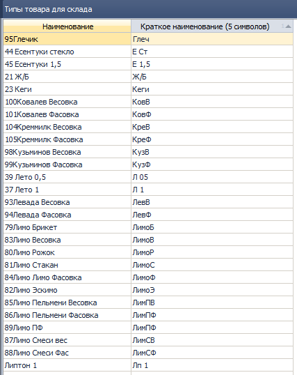
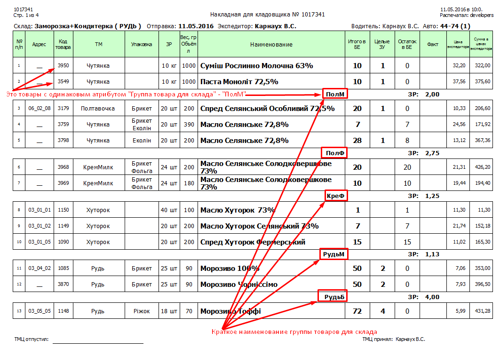

## 2248 СПР Тип товара для склада.

| **Тип компонента** | **Связанные компоненты**                             |   
|--------------------|-------------------------------------|
| Отчет         | 1508 ОТЧ Печать/экспорт пакета документов для склада |
| Журнал документов         | 1375 ЖД Накладная для кладовщика |

*Заведующий складом*  
Внешний вид:  
  
*рис.1.*  
Справочник содержит типы товаров для склада. Тип товара присваивается товару в карточке товара из справочника товаров **0916 СПР Товары**.  
Товары, имеющие одинаковый тип товара для склада группируются в НДК, как показано на рис.2., краткое наименование типа товара выводится под каждой группой.

*рис.2.*
