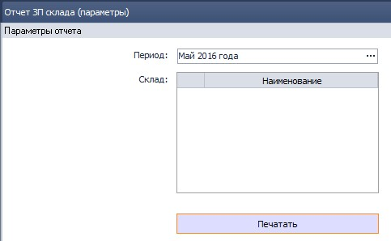
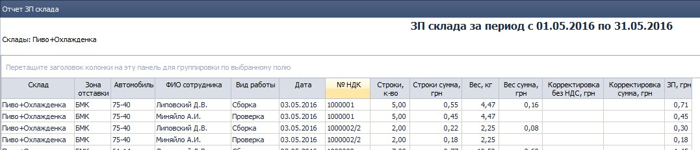
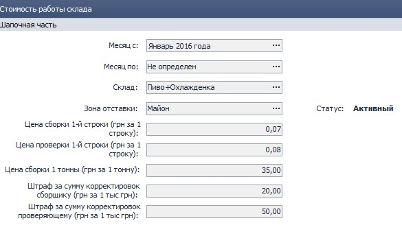

## 2276 ОТЧ ЗП склада.

### 1. Назначение отчета.

| **Тип компонента** | **Связанные компоненты**             |   
|--------------------|--------------------------------------|
| отчет              | 2292 СПР Стоимость работы склада     |

*заведующий складом, Бухгалтер по ЗП, Руководитель филиала*

Отчет используется в случаях, когда нужно детализировать начисленную сотруднику ЗП, например для проверки корректности начисления. Может использоваться для сравнительного анализа эффективности работы грузчиков и кладовщиков, предварительного расчета ЗП сотрудника за любой отработанный период, в том числе еще не оплаченный.  
Отчет строится по сотрудникам, которые внесены в НДК компоненте **1375 ЖД Накладные для кладовщика** как собравшие или проверившие НДК.

### 2. Параметры отчета.

  
рис.1.

-   **Период**  
Выбор периода для построения отчета.  
-   **Склад**  
Выбор склада для построения отчета.
### 3. Табличная часть.  
  
рис.2.

Отчет выводится в виде таблицы, в которой на каждую строку приходится сотрудник и собранная им НДК.
Возможно назначение нескольких сотрудников на одну НДК, в этом случае будет столько строк, сколько сотрудников.

### 4. Расчеты и формулы.

В расчете сдельной оплаты принимают участие три показателя:
- количество строк;  
- вес;
- корректировки.
Для вида работы "Проверка" вес не учитывается. Стоимость строки и штраф за корректировки разные для проверки и сборки. Эти показатели задаются в компоненте **2292 СПР Стоимость работы склада**:  
  
рис.3  

Параметры времязависимые, то есть имеют дату начала и окончания действия. Пересечение диапазонов действия внутри одной зоны склада недопустимо (при попытке установить - выдаст ошибку). Если "Месяц по" не указан (Не определен) - срок дейтвия тарифов будет бесконечным.
 При изменении показателей будут изменяться и данные в отчете.  
Рассмотрим подробнее каждый показатель.  

**Строки к-во**  
Для сборки подсчитывается количество строк в НДК и равномерно распределяется между всеми, кто указан в **1375 ЖД Накладные для кладовщика** как собравшие НДК. Таким образом могут получиться дробные количества строк - это нормально.
Полученное количество строк по каждой НДК умножается на заданную стоимость сборки строки для зоны склада, полученная сумма выводится в "Строки сумма, грн".
Для вида работ "Проверка" - аналогично, но берется стоимость проверки из **2292**.  
**Вес, кг**  
Для сборки подсчитывается вес строки в килограммах в НДК и равномерно распределяется между всеми, кто указан в **1375 ЖД Накладные для кладовщика** как собравшие НДК. Полученный вес переводится в тонны (делим на 1000) и умножается на заданную стоимость тонны для зоны склада, полученная сумма выводится в "Вес сумма, кг".  
Для вида работы "Проверка" вес не учитывается.  
**Корректировка без НДС, грн**  
В случае, если по накладной были корректировки - выводится их сумма. Для подсчета значения "Корректировка сумма, грн" полученная сумма переводится в тысячи (делим на 1000) и умножается на заданную стоимость корректировки для зоны склада для соответствующего вида работ (сборка или проверка).
=======
## 2276 ОТЧ ЗП склада.

### 1. Назначение отчета.

| **Тип компонента** | **Связанные компоненты**             |   
|--------------------|--------------------------------------|
| отчет              | 2292 СПР Стоимость работы склада     |

*заведующий складом, Бухгалтер по ЗП, Руководитель филиала*

Отчет используется в случаях, когда нужно детализировать начисленную сотруднику ЗП, например для проверки корректности начисления. Может использоваться для сравнительного анализа эффективности работы грузчиков и кладовщиков, предварительного расчета ЗП сотрудника за любой отработанный период, в том числе еще не оплаченный.  
Отчет строится по сотрудникам, которые внесены в НДК компоненте **1375 ЖД Накладные для кладовщика** как собравшие или проверившие НДК.

### 2. Параметры отчета.

  
рис.1.

-   **Период**  
Выбор периода для построения отчета.  
-   **Склад**  
Выбор склада для построения отчета.
### 3. Табличная часть.  
  
рис.2.

Отчет выводится в виде таблицы, в которой на каждую строку приходится сотрудник и собранная им НДК.
Возможно назначение нескольких сотрудников на одну НДК, в этом случае будет столько строк, сколько сотрудников.

### 4. Расчеты и формулы.

В расчете сдельной оплаты принимают участие три показателя:
- количество строк;  
- вес;
- корректировки.
Для вида работы "Проверка" вес не учитывается. Стоимость строки и штраф за корректировки разные для проверки и сборки. Эти показатели задаются в компоненте **2292 СПР Стоимость работы склада**:  
  
рис.3  

Параметры времязависимые, то есть имеют дату начала и окончания действия. Пересечение диапазонов действия внутри одной зоны склада недопустимо (при попытке установить - выдаст ошибку). Если "Месяц по" не указан (Не определен) - срок дейтвия тарифов будет бесконечным.
 При изменении показателей будут изменяться и данные в отчете.  
Рассмотрим подробнее каждый показатель.  

**Строки к-во**  
Для сборки подсчитывается количество строк в НДК и равномерно распределяется между всеми, кто указан в **1375 ЖД Накладные для кладовщика** как собравшие НДК. Таким образом могут получиться дробные количества строк - это нормально.
Полученное количество строк по каждой НДК умножается на заданную стоимость сборки строки для зоны склада, полученная сумма выводится в "Строки сумма, грн".
Для вида работ "Проверка" - аналогично, но берется стоимость проверки из **2292**.  
**Вес, кг**  
Для сборки подсчитывается вес строки в килограммах в НДК и равномерно распределяется между всеми, кто указан в **1375 ЖД Накладные для кладовщика** как собравшие НДК. Полученный вес переводится в тонны (делим на 1000) и умножается на заданную стоимость тонны для зоны склада, полученная сумма выводится в "Вес сумма, кг".  
Для вида работы "Проверка" вес не учитывается.  
**Корректировка без НДС, грн**  
В случае, если по накладной были корректировки - выводится их сумма. Для подсчета значения "Корректировка сумма, грн" полученная сумма переводится в тысячи (делим на 1000) и умножается на заданную стоимость корректировки для зоны склада для соответствующего вида работ (сборка или проверка).
>>>>>>> dev
