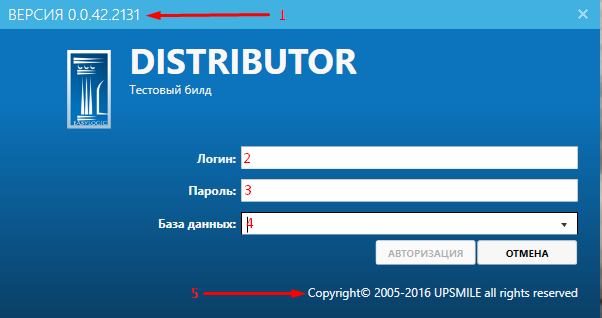
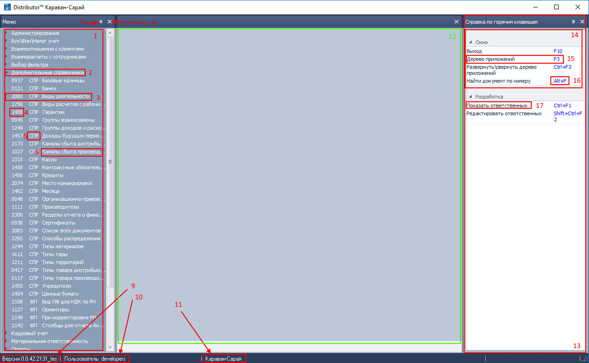
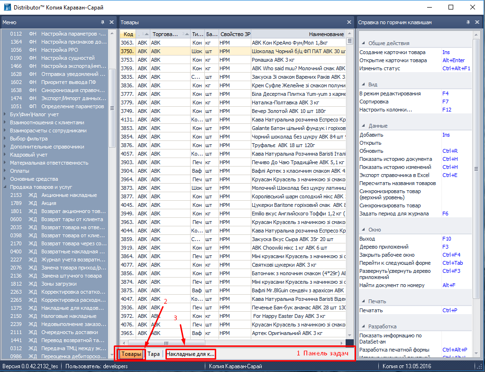
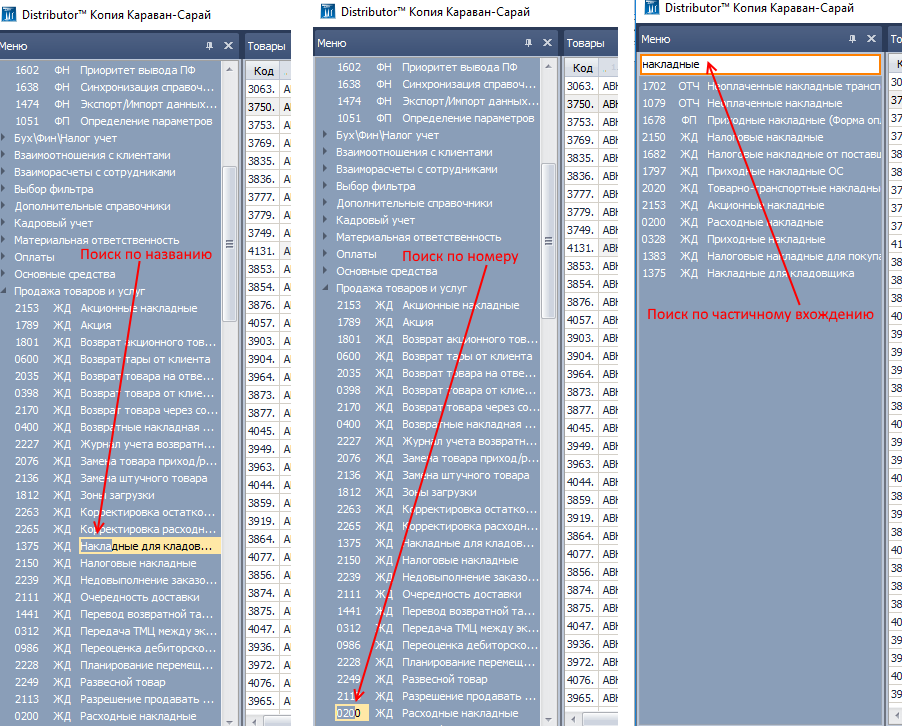
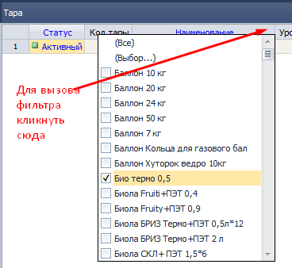
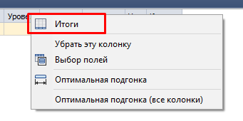
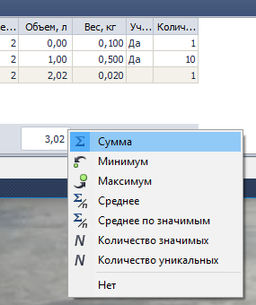
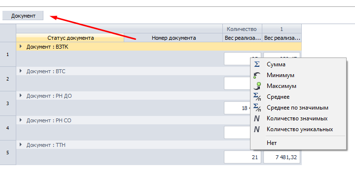
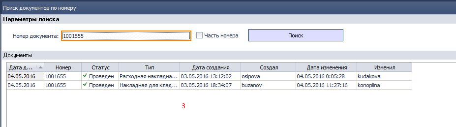

# Общие сведения об интерфейсе.  
В этом разделе кратко описана работа с основными элементами интерфейса без привязки к какому-то конкретному функционалу. Описание будет полезно начинающим, но и опытные пользователи могут открыть для себя новые возможности.
## Окно ввода логина и пароля
  
*рис.1*  

В окне выводится:  
- (1) номер версии программы;  
- (2) ввод имени пользователя (логин);  
- (3) ввод пароля пользователя;  
- (4) выпадающий список подключенных баз;
- (5) при клике на эту надпись откроется в браузере документация по программе. Документация постоянно дополняется.

После ввода действующего логина, пароля и выбора базы следует нажать кнопку "Авторизация". Попадаем в основной интерфейс.
## Основной интерфейс
Интерфейс состоит из таких элементов:  

  
*рис.2*  

|№|Название|Краткое описание|  
|:--:|--|--|  
|1|Меню|Другое название - "Дерево компонентов". Вызывается горячей клавишей F3|
|2|Родительская ветка меню|Компоненты системы сгруппированы по веткам. В развернутой ветке отображаются компоненты.|  
|3|Компонент|Элемент системы, посредством взаимодействия с пользователем обрабатывает или показывает данные. Все взаимодействие пользователя и системы производится в интерфейсе компонентов.|
|4|Номер компонента|Уникальный идентификатор компонента, 4 символа, цифровой|
|5|Тип компонента|Буквенный код, 2-3 символа, обозначающий тип компонента|
|6|Название компонента|Краткое название, отображающее суть работы компонента|
|7|Фиксатор меню|В нажатом состоянии панель отображается всегда. В отжатом - сворачивается при неактивности к левому краю экрана|
|8|Закрыть|Убирает панель с экрана|
|9|Номер версии|Номер запущенной версии|
|10|Имя пользователя|Имя пользователя, под которым осуществлен вход|
|11|Название базы|Название базы, к которой осуществлено подключение|
|12|Рабочая область|Здесь выводится интерфейс активного запущенного компонента|
|13|Справка по горячим клавишам|Содержимое справки меняется в зависимости от активного запущенного компонента и в зависимости от активного поля компонента. Содержит подсказки по допустимым в компоненте действиям и горячим клавишам к действиям. При клике на подсказку выполняется соответствующее действие, так же, как и при нажатии комбинации горячих клавиш.|
|14|Раздел справки|Для удобства восприятия справка логически разбита на функциональные группы-разделы.|
|15|Пункт справки|В зависимости от режима работы (редактирование или просмотр) или от фокуса на том или ином поле, пункт справки может быть активным или пассивным.|
|16|Горячая клавиша|Клавиша или комбинация клавиш, выполняющая действие.|
|17|Название действия|Краткое название действия|
При запуске компонента, его интерфейс отображается в рабочей области. При запуске нескольких компонентов, все они в свернутом виде отображаются в панели задач:  
  
*рис.3*  

|№|Название|Краткое описание|  
|:--:|--|--|  
|1|Панель задач|Вызывается горячей клавишей F3|
|2|Активный компонент|Компонент, интерфейс которого отображается в рабочей области|  
|3|Не активный компонент|Компонент, который запущен, но не активен.|  
Панель задач можно перетаскивать мышкой и закреплять в любом из 5 положений:
- под рабочей областью (по умолчанию);
- слева от рабочей области;  
- справа от рабочей области;  
- снизу, по всей ширине окна приложения;  
- сверху, по всей ширине окна приложения.
Последние два варианта более удобны при большом количестве запущенных компонентов.

## Поиск в дереве компонентов по названию или номеру компонента
По меню доступно несколько вариантов поиска.  

Пользователи, часто работающие с одним и тем же функционалом быстро запоминают названия и номера компонентов. Можно кликнуть мышью на любой компонет и начать набирать искомый номер или начало названия, будет выделен тот компонент, номер или начало названия которого совпадают с набираемым.  
Если номер или начало названия неизвестно - можно воспользоваться поиском по частичному входжению искомого текста, который вызывается по горячей клавише Ctrl+F1. По мере ввода текста в появившееся поле ввода, в дереве компонентов будут скрываться компоненты, названия которых не соответствуют поисковому запросу.    
  
*рис.4*  
# Интерфейс компонентов.  
## Таблица  
Самое простое и популярное представление данных - виде таблицы. В таблице доступны такие операции.

|№|Операция|Краткое описание|  
|:--:|--|--|  
|1|Перетаскивание столбцов|Зажав заголовок столбца мышкой можно перетащить его в любое место|
|2|Фильтр|Если кликнуть в правый верхний угол заголовка столбца - выпадет окно со всеми значениями в столбце. Фильтруем значения, отмечая их галочками. Можно набирать начало, если оно известно, тогда фокус автоматически переместится на строку, начало которой совпадает с вводимым текстом. Галочка ставится кликом мышки или пробелом.  |
|3|Итоги|Для числовых данных доступен вывод итогов по столбцам. Для этого кликаем правой кнопкой на заголовке столбца, выбираем пункт "Итоги":  В нижней части грида под столбцом появится пустое поле. Для выбора отображаемых значений - клик правой кнопкой под столбцом, итоги которого хотим вывести:  |
|4|Группировка|Строки с повторяющимися значениями можно группировать. Для этого перетаскиваем заголовок столбца, по которому хотим группировать выше грида (тут же данные сгруппируются) и правой кнопкой выбираем, какие промежуточные итоги хотим видеть:  Эта функция доступна не везде.|
# Общесистемные возможности.  
## Поиск документа по номеру.  
Глобальная горячая клавиша "Ctrl+F" - поиск документа по номеру.  
Работает в любом месте любого компонента, в том числе в печатных формах.  

Вызывает окно со строкой ввода. После ввода текста в строку ввода и нажатия кнопки "Найти" открывается компонент **1828 ОТЧ Поиск документов по номеру** с результатом поиска по введенному тексту.  
Например, построили отчет OLAP:  

*рис.5*  
Нажимаем "Ctrl+F", в появившемся окне вводим номер искомого документа, нажимаем "Enter", видим результаты поиска:  

  
*рис.6*  
## Горячие клавиши.  
Ниже приведены комбинации горячих клавиш, которые работают без привязки к конкретному компоненту. Для компонента могут быть свои комбинации, выполняющие операции, специфичные для конкретного компонента.  

|№|Сочетание|Действие|  
|:--:|--|--|  
|1|F1|Показать/скрыть дерево компонентов|  
|2|F3|Показать/скрыть справку по горячим клавишам|  
|3|Ctrl+F3|Развернуть/свернуть все ветки дерева компонентов|
|4|F4|Перейти в режим редактирования/просмотра|  
|5|Ctrl+F4|Закрыть активное окно|   
|6|F5|Фильтр по значению в активной ячейке|
|7|F6|Задать период отбора|
|6|F7|Сортировка по активному столбцу. Второе нажатие меняет порядок сортировки. Третье нажатие отменяет сортировку. Возможна сортировка по многим столбцам, порядок (приоритет) сортировки отображается в заголовке столбцов.|  
|7|F10|Выход|
|8|F12|Настроить колонки|
|9|Ctrl+Tab|Перейти к следующему открытому компоненту|
|10|Ctrl+P|Печать или выбор печатной формы, если у документа более одной печатной формы.|
|11|Ctrl+F|Поиск внутри активного элемента|  
|12|Alt+F|Поиск документа по номеру|   
|13|Ctrl+S|Сохранить изменения|  
|14|Ins|Добавить запись (вызвать форму подбора)|   
|15|Del|Удалить запись|  
|16|Ctrl+E|Экспорт в Excel|  
