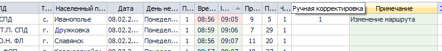
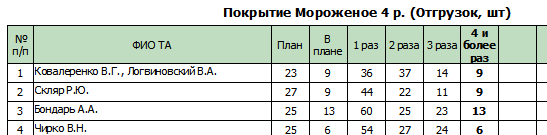
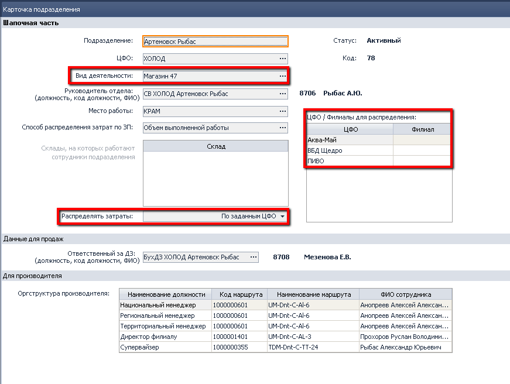
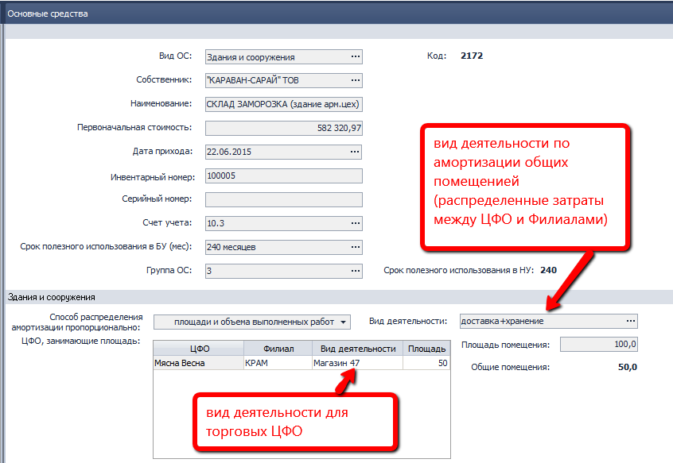
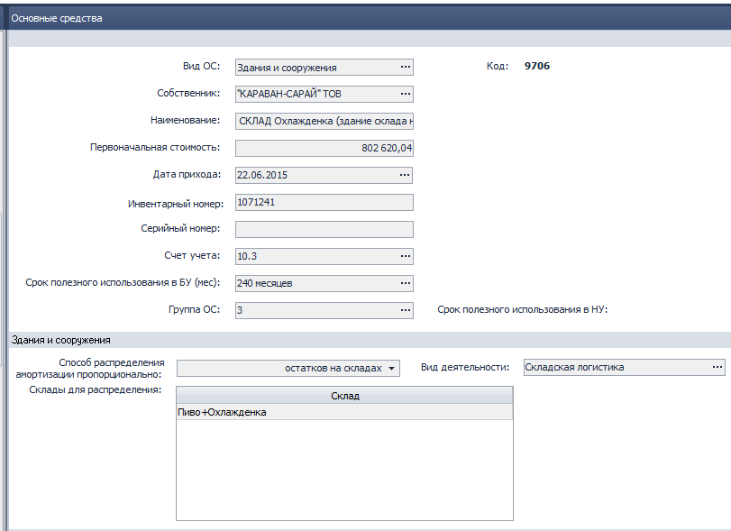
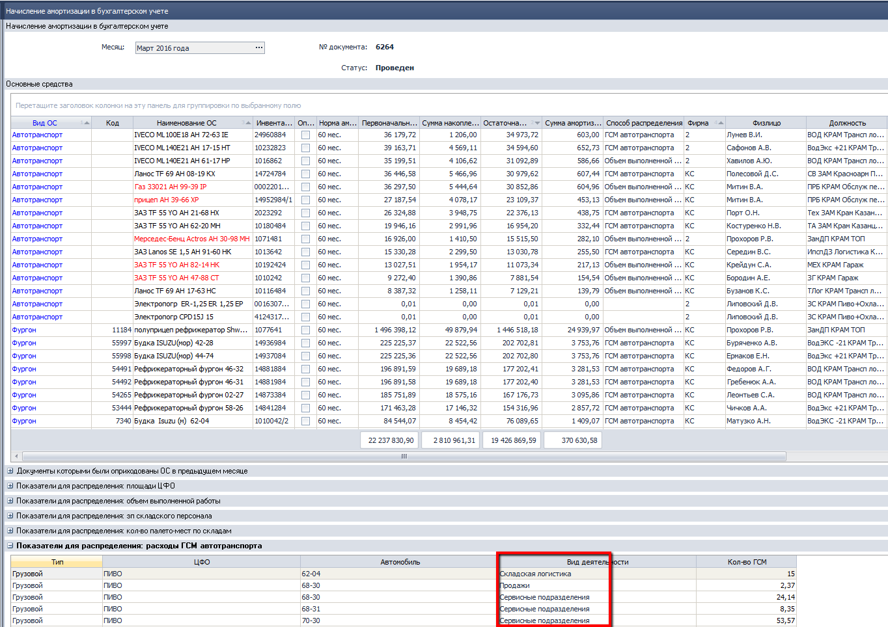
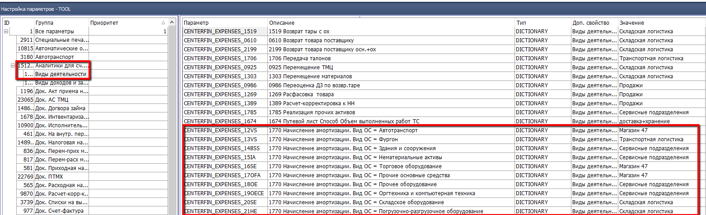

# Новости релиза 2016.03.17 (12)

## 2143 ОТЧ OLAP Отчет по продажам

*Топ менеджмент, Отдел продаж.*

-   Исправлена ошибка, приводящая к появлению предупреждения о превышении количества строк и, как следствие не позволяющая, построить отчет типа **Сводная таблица**, с использованием аналитик **Территория.**

## 2176 ОТЧ Гермес. Контроль посещений ТА

*Отдел продаж*

-   Исправлена ошибка, возникающая при ручной корректировке, в следствие которой статус "Ручная корректировка" не всегда сохранялся.

-   Исправлена уязвимость, позволяющая пользователям без прав на редактирование, вносить изменения в данный отчет.

## 1815 ОТЧ Утренний митинг.

*Отдел продаж*

-   В показателях выполнения плана реализации и покрытия, теперь не отображаются не продающие должности. Раньше у некоторых SV в отчетах могли появляться строки с бухгалтерами, операторами и пр. Теперь идет проверка по сумме реализации за период (текущий месяц), и таким образом в отчет попадут те должности, которые осуществляли продажу какого либо товара, но могли не продать ни одной позиции из входящих в план ТМЦ.

-   Исправлена ошибка приводящая к некорректным показателям по покрытию в **отгрузок, шт** при смене агента в плановом периоде (в течение месяца). Теперь покрытие считается по должности, а фамилии агентов несут не более чем информативную нагрузку и не являются уникальным ключом для какой-либо детализации. Иными словами: если в течение месяца на одной должности работало несколько агентов, в отчете все показатели будут свернуты в одну строку, со списком фамилий через запятую.

## 1084 ОТЧ Ежедневные отгрузки.

*Отдел продаж*

-   Оптимизированы запросы, вследствие чего сократилось время формирования и нагрузка на СУБД.

-   Исправлен расчет ЦПП с учетом фирмы.

## 0200 ЖД Расходные накладные

- Исправлены ошибки

Не выполнялся пересчет итоговой суммы скидки в документе при изменении Фирмы верхнего уровня на подчиненную.

При переходе в статус Резерв остатков в Расходной накладной со способом доставки самовывоз некорректно определялась Фирма в разделе Товары.

## 1919 ЖД Расчет ЗП в ЦО

- Исправлены ошибки

Не корректно рассчитывалась сумма к погашению при наличии нескольких договоров займа и текущей задолженности, превышающей суммарный платеж по нескольким договорам.

Как реализовано после исправлений:

- есть договор с закрытой датой окончания, но есть сумма долга, тогда отображаем сумму задолженности;

- есть договор с ежемесячным погашением и задолженностью - отображаем наименьшую из них

- есть несколько договоров незакрытых, тогда наименьшее из или суммарный ежемесячный платеж по всем договорам или сумма задолженности.

## 2094 СПР Подразделения

*Бухгалтер*

**Суть изменений:**

Одним из параметров формирования Отчета о финансовых результатах является Вид деятельности.
Ранее в качестве этой аналитики использовались системные константы, которые в том числе определяли какой из способов распределения затрат (доходов) по ЦФО и Филиалам применять.

Возможные варианты:

- прямые затраты/доходы по ЦФО и по Филиалу (Продажи);

- косвенные затраты/доходы по ЦФО и прямые по Филиалу (Филиал);

- косвенные затраты/доходы по ЦФО и по Филиалу (ЦО).

Переход от констант к элементам справочника позволит на каждом предприятии
настраивать свои виды деятельности, необходимые для анализа
и устанавливать для них свои способы распределения.  
Например, будут созданы такие элементы справочника:
Продажи, Транспортная логистика, Складская логистика, Сервисные подразделения.

Для реализации внесены изменения:

1. в алгоритмы распределения - добавлена связь элемента справочника Виды деятельности со способом распределения;

2. в комп.0112 ФН Настройка параметров – TOOL добавлены системные параметры для настраивания Видов деятельности по компонентам;

3. в справочники Подразделения, Основные средства добавлены поля для заполнения Пользователями.

Рассмотрим их более детально.

Для **поля Вид деятельности** заменили системные константы: Продажи, Филиал, ЦО на форму подбора значений из комп.2080 СПР Виды деятельности.

Для существующих значений выполнена замена соответствующими элементами.

Для **поля Распределять затраты** добавили возможность выбора значения **По заданным ЦФО**.

Изменения влияют на определение аналитики Виды деятельности в счетах доходов и затрат и их распределении по функции По подразделению.

**Поле Способ распределения затрат по ЗП** заполняет Пользователь выбором одного из возможных вариантов, которые задаются в комп.2295 СПР Способы распределения.

**Функция распределения По подразделению**

Внесены изменения в функцию распределения доходов и затрат По подразделению - добавлено определение способа распределения, реализован алгоритм для сценария «Распределять по заданным ЦФО».

**Исходные данные:**
- Должность
- Период
- Сумма к распределению

**Данные на выходе:**
- ЦФО
- Вид деятельности
- Филиал
- % распределения
- Сумма распределенная

**Определение исходных данных:**

**Вид деятельности** из комп. 2094 СПР Подразделения, к которому относится Должность.

**ЦФО:**

если Способ распределения затрат по зп = Напрямую на контракт,
из поля ЦФО комп. 2094 СПР Подразделения, % распределения =100%,
Сумма распределенная = Сумма к распределению.  
Для всех остальных значений поля Способ распределения затрат по зп
**ЦФО и распределение по ним определяются по объему выполненных работ ОВР**,
 либо по всем ЦФО, либо по заданным, либо за исключением выбранных ЦФО.  
Период для расчета ОВР, равен предыдущему месяцу от даты создания документа.

## 1674 ЖД Путевой лист
*Бухгалтер по ГСМ*

Изменения связаны с определением аналитики Виды деятельности для Путевого листа
**со Способом распределения=Объем выполненных работ ТС**
поле Вид деятельности заполняется из параметра
из комп. 0112 Настройки параметров-TOOL подраздела Виды деятельности
Параметр:

    CENTERFIN\_EXPENSES\_1674.

**со Способом распределения=Ручной**
 добавлен выбор значение в разделе Распределение по ЦФО и Филиалам.

**со Способом распределения=По подразделению**
Вид деятельности определяется по связке Должность – СПР Подразделение.

Аналогичные изменения внесены в
комп.1712 Печать ПЛ грузового автотранспорта
комп.1713 Пакетное создание ПЛ легкового транспорта

## 1746 СПР Основные средства
*Бухгалтер по ОС*

Изменения связаны с определением Видов деятельности при начислении амортизации по основным средствам для вида **Здания и сооружения**. Вид деятельности задаем в самом элементе СПР Основные средства

Для ОС со способом распределения амортизации пропорционально:
- площади офисов, занимаемых отделами продаж;
- ГСМ грузовых авто;
- остаткам на складах;

в раздел Здания и сооружения добавлено **обязательное к заполнению поле Вид деятельности**;

для ОС со способом распределения амортизации пропорционально: остаткам на складах
сделано обязательным к заполнению поле Склад - должен быть выбран хотя бы один;
для ОС со способом распределения амортизации пропорционально
площади и объему выполненных работ
в раздел Здания и сооружения

- добавлено поле Вид деятельности для общих помещений под полем Общие помещения
- в гриде Контракты, занимающие площадь добавлена графа Вид деятельности - обязательное к заполнению.

**Примечание Аналитика:**

в существующих элементах Пользователь должен будет внести данные в ручном режиме.

Для вида Основного средства = **Прочие основные средства** или **Оргтехника** или **Прочее оборудование**, Вид деятельности определяем **по МОЛ** по связке Основная должность - СПР Подразделения (комп.2094), если МОЛ НЕ сотрудник Вид деятельности равен параметру из комп. 0112 ФН Настройки параметров-TOOL.

**Примечание Аналитика:**

Определение Основной должности на основании связки МОЛа и Кадрового приказа (комп.1066)
с типом
- Кадровый приказ о приеме
- Кадровый приказ о приеме (легализация)
- Кадровый приказ о переводе

Для вида Основного средства = **Автотранспорт**, **Фургон** со **Способом распределения по ГCМ**
Вид деятельности определяется по распределению ГСМ, данные отображены в одноименном разделе

Для остальных видов основных средств из параметров в **комп.0112 ФН Настройки параметров-TOOL**.

## 1770 ЖД Начисление амортизации

*Бухгалтер*

- Внесены изменения в алгоритмы распределения затрат по амортизации под каждый вид основного средства (определение Вида деятельности).

- Реализована возможность для Пользователя в "ручном" режиме управлять затратами по амортизации в управленческом учете (включать или нет) через признак Спец. учет.

Пример:

здания и ТС принадлежат одному юр. лицу (1), пока юридически невозможно переоформить оформить переход права собственности, по факту ОС используются другим юридическим лицом (2).  
Для корректного распределения затрат такие ОС амортизируются в компании 2, а в компании 1 расходы по амортизации отражены с признаком Спец. учет, т.е. отражаются только в бух. учете для контролирующих органов.
В раздел Основные средства добавлено поле Спец. учет
по умолчанию у всех ОС поле Спец. учет = Нет.
Пользователь может изменить значение аналитики,
либо по одному ОС, либо во выделенным ОС через функцию.

## 1919 ЖД Расчет ЗП в ЦО, 1872ЖД Расчетные ведомости

*Бухгалтер по ЗП*

- Внесены изменения в определение Вида деятельности.
Поля заполняется по связке
ФЛ - Должность - Вид деятельности из Подразделения, к которому относится Должность

- Реализованы изменения в алгоритмы распределения.

## 2340 ОТЧ Регламентированный отчет по налоговому учету
*Бухгалтер*

**Новый функционал:**

Регламентированный отчет ежемесячно подается в налоговую инспекцию,
как приложение к Декларации по налогу на прибыль.  
Может быть использован для подготовки документов для встречных проверок с контрагентами.

**Описание формирования Отчета**

Отчет строится на основании проводок
с учетом фильтров, указанных Пользователем в Параметрах Отчета:
- за период
- по Фирме
- по Контрагенту/ам (необязательный параметр)
- по текущему Филиалу / заданным Филиалам для ЦО

Для **Реестра выданных документов** отобрать проводки в корреспонденции
Дт361 Кт7021  
Дт361 Кт7022  
Дт364 Кт7023  
Дт3771 Кт703  
Дт3771 Кт712  
Дт3771 Кт742  
Дт7041 Кт361 (сумму отображать в реестре с «минусом»)  
Дт7042 Кт361 (сумму отображать в реестре с «минусом»)  
Дт7043 Кт364 (сумму отображать в реестре с «минусом»)  
сгруппировать данные по документам,
рассчитать итоговую сумму по проводкам по документу
отобразить в Реестре выданных документов

**№ п/п** – порядковый номер строки

**Код контрагента-покупателя (ЕГР/ИНН):**

код ОКПО из комп.2099 СПР СПД по УР Клиента с письменной формой договоренности,
пустое поле для УР Клиента с устной формой договоренности.

**Наименование контрагента-покупателя:**

ОПФ + Наименование из комп.2099 СПР СПД по УР Клиента с письменной формой договоренности,

«Конечный покупатель» для УР Клиента с устной формой договоренности

**Дата составления документа** – дата проводки

**№ документа** – номер документа из проводки

**Сумма** - итоговую сумму по проводкам по документу

**Исключение:** НЕ отображать в Реестре документ Бухгалтерская справка.

**Для Реестра полученных документов** отобрать проводки в корреспонденции

Дт2811 Кт631  
Дт2841 Кт631  
Дт6415 Кт631  
Дт644 Кт631  
Дт2811 Кт632  
Дт2841 Кт632  
Дт2811 Кт\* (любой счет за исключением 631,632) – из документа Приходная накладная отразить поля Дата и Номер (новые поля в ПН)

Дт153 Кт6851  
Дт201-209 Кт6851  
Дт22 Кт6851  
Дт39 Кт6851  
Дт84 Кт6851  
Дт644 Кт6851  
Дт6415 Кт6851  
Дт151-154 Кт6852  
Дт201-209 Кт6852  
Дт22 Кт6852  
Дт644 Кт6852  
Дт6415 Кт6852  
Дт2841 Кт6854  
Дт6854 Кт2841 (сумму отображать в реестре с «минусом»)

сгруппировать данные по документам,
рассчитать итоговую сумму по проводкам по документу
отобразить в Реестре полученных документов

**№ п/п** – порядковый номер строки  
**Код контрагента-поставщика (ЕГР/ИНН)** - код ОКПО из комп.2099 СПР СПД Контрагента-Поставщика  
**Наименование контрагента-поставщика** - ОПФ + Наименование из комп.2099 СПР СПД Контрагента-Поставщика  
**Дата составления документа** – дата проводки  
**№ документа** – номер документа из проводки  
**Сумма** - итоговую сумму по проводкам по документу  
**Исключение:** НЕ отображать в Реестре документ Бухгалтерская справка.  
Данные отчета Пользователь может выгрузить в Excel файл.

## 0328  ЖД Приходные накладные
*Бухгалтер*

Добавлены привилегии, которые позволяют проигнорировать проверки
Фактической цены с РЦП/ЦПП
Суммы дополнительных расходов из комп.0704 Прайс-лист и Суммы фактических дополнительных расходов из ПН
