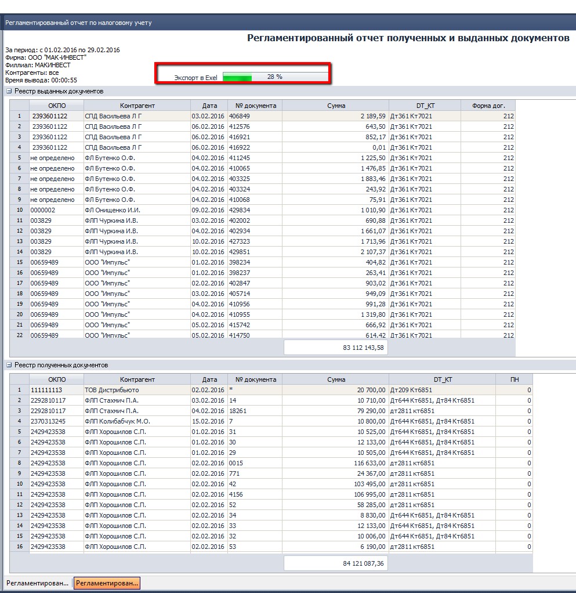

# Новости релиза 2016.03.31 (14)

---------------------
## 2143 ОТЧ OLAP Отчет по продажам

*Топ менеджмент, Отдел продаж.*

Исправлена ошибка экспорта отчета в Excel, теперь все числовые данные выгружаются в числовом формате, с двумя знаками после запятой. Обращаю внимание, что информация в более младших разрядах при этом сохраняется, поэтому их всегда можно отобразить клавишами на панели меню Excel. Кроме того сохранение информации во всех значимых разрядах, позволяет не опасаться за достоверность данных при арифметических операциях со столбцами (суммирование, вычитание, нахождение процента и пр.), а также минимизирует погрешность при округлениях.
  

------------------------
## 1815 ОТЧ Утренний митинг

*Отдел продаж*

-   Усовершенствован алгоритм отбора, для определения продающих должностей внутри подразделения для отчета – **План.** Теперь для того чтобы система идентифицировала должность как продающую, берется интервал 2 предыдущих недели и проверяется чтобы объем продаж по должности был >0, также если по данной должности выставлен план, она тоже будет восприниматься системой как продающая должность, и следовательно будет появляться в отчетах даже при отсутствии движения по плановым показателям. Это нововведение устранит отсутствие плановых показателей в первых числах месяца, когда еще нет никаких продаж, планы количественно еще не поставлены, но по каким ТМЦ они (планы) будут нам уже известно. Пользователь как и ранее может задать ТМЦ непосредственно в настройках данного отчета, и они по этим планам будут сформированы таблицы

----------------------------
## 0200 ЖД Расходные накладные.

*Бухгалтерия (Мак-Инвест)*

-   Исправлена ошибка экспорта в Excel документа: **Расходная накладная на русском языке без НДС (Win)**

-------------------
## 0916 СПР Товары.

*Бренд-менеджеры, Отдел продаж*

-   Исправлена ошибка, присвоения **кодов ТМЦ**. В редких случаях при интенсивной работе с базой, когда несколько пользователей одновременно заводили новые **ТМЦ**, разные товары получали один и тот же код. Эта ошибка была не явной, и обнаружить ее удалось случайно. Теперь алгоритм генератора кода включает в себя дополнительную проверку, на уникальность, которая полностью исключает подобную ошибку.

----------------------
## 2176 ОТЧ Hermes. Контроль посещений.

*Отдел продаж, SV, Диспетчер, Логист.*

-   Устранена ошибка приводящая к зависанию при инкрементном поиске, при отсутствии искомых значений.

------------------------
## 1566 ОТЧ Присутствие товара по категориям.

*Бренд-менеджеры, Топ-менеджмент, Отдел продаж*

-   Изменено расположение выбора категорий, теперь оно горизонтальное.

-   Исправлена ошибка с наименованиями ТМЦ в таблице отчета. Теперь там наименование 70 символов.

- При сворачивании шапочной части убирается, таблица отображается максимально эффективно, скрывается даже верхняя строка, которая отображает разделение двух областей: **Товары** и **Остаток на дату**.

------------------------
## 2340 ОТЧ Регламентированный отчет по налоговому учету

*Бухгалтер *

**Доработки: **

Добавлен Индикатор выгрузки данных в Excel, при экспорте большого объема данных и преждевременном открытии файла данные отсутствовали. Добавлена печатная форма Отчета, соответствующая требованиям законодательства.

---------------------------
## 2005 ОТЧ Журнал-ордер

*Бухгалтер *

**Оптимизация**

Ускорено время вывода отчета Журнал-ордер. Общие требования к временным параметрам формирования отчетов

-   при периоде = 1 день не более 1 мин.
-   при периоде = неделя - не более 2 мин.
-   при периоде = месяц и более - не более 5 мин.

Просьба сообщать Аналитикам об отчетах, которые не соответствуют принятым требования, для их оптимизации.

---------------------
## Функция Показать проводки (Ctrl+T)

*Бухгалтер *

**Внесены изменения:**  
в формат отображения проводок по документу.

**Преимущества:**

-   убраны объединенные ячейки, которые не позволяли выполнять стандартные операции с гридом;
-   добавлена группирующая панель, включены свойство грида: подсчет итогов, фильтрация, группировка, сортировка данных;
-   по умолчанию данные отображаются с группировкой по полям: Фирма - Корреспонденция счетов для отображения итоговых сумм по проводкам в разрезе Фирм;

-   в гриде отображается максимальное количество заполненных аналитик по счетам дебета и кредита из 8-ми возможных;
-   при переходе от строки к строке в шапочной части отображается название аналитик (вместо А1-А8);
-   при подводе курсора к ячейке в строке с левой стороны выводится наименование поля и его значение;
-   для упрощения поиска перед значением аналитики отображается ее код (при его наличии);
-   ускорено время отображения проводок.

К следующему обновлению планируется внести аналогичные изменения в функцию Показать историю изменений проводок и документ Бухгалтерская справка.

-------------------------
## 2099 СПР СПД

*Бухгалтер*

**Зачем нужны изменения?**

Контрагент является Филиалом, выделенным на отдельный баланс со своим кодом ЕДПРОУ. Бухгалтерский учет ведется отдельно по филиалу с последующим включением показателей в финансовую отчетность головного предприятия, а учет НДС ведется в целом по головному предприятию и всем филиалам.

При применение действующей схемы: РТТ аналог филиала (так организован учет в сетях), учет по СПД не разделен по филиалам, неправильно формируются налоговые (по СПД). При этом у каждого Филиала есть свои РТТ.

Поэтому наиболее простой **вариант решения**:

1.  Создать отдельную карточку СПД по Филиалу со своим кодом ЕДПРОУ(ОКПО) и ИНН головного предприятия.

2.  Присвоить признак Филиальная структура.

3.  Заполнить новые поля «ОКПО головного предприятия», «Номер филиала».

Новые поля будут использованы при импорте налоговых накладных, позволят автоматизировать отправку налоговых контрагентам через me-doc, по связке кодом головного предприятия и филиалов возможно реализовать формирование сводного акта сверки.

--------------------------------------------------------------

## 1963 ОТЧ Выгрузка данных для налоговых отчетов и отчетов в ПФУ

*Бухгалтер*

С 01.04.2016г. изменен формат налоговой накладной (НН) и расчета корректировки к ней (РК НН).Внесены изменения в выгрузку **НН и РК НН для регистрации в электронном реестре.**

**Краткое описание изменений:**

-   существенные изменения формы налоговой накладной и расчета корректировка;

-   добавлен признак сводная НН и корректировка к сводной НН;

-   код филиала Покупателя вынесен в отдельное поле;

-   добавлен признак в РК НН, кто обязан ее регистрировать:Покупатель, если сумма НДС < 0,00 / Продавец, если сумма НДС ≥ 0,00;

-   добавлено условие для СПД с признаком Филиальная структура, ОКПО выгружается из поля ОКПО головного предприятия из комп. 2099 СПР СП

-   добавлен ИНН физ.лица, регистрирующего налоговую из комп.1034

-   изменилась табличная часть накладных добавлена нумерация строк, в РК НН необходимо указывать номер строки НН, которая корректируется;

-   формат импорта изменяется с даты регистрации, а не с даты формирования НН и РК НН.

Внесены изменения в выгрузку **Данные для персонификации**

Добавлена выгрузка данных для поля ОТК Наличие трудовой книжки.

Реализована **Проверка наличия трудовых отношений физического лица** по Фирме в периоде начисления (Rule 5091).

**Использование**

Блокирующий Rule при начислениях отпускных, расчетных, больничных в периоде начисления по Фирме из документа.

--------------------
## 1111 СПР Производители

*Бренд-менеджеры, бухгалтерия, руководители ЦФО.*

Заполнение элементов справочника адаптировано под структуру без филиалов в части, касающейся распределения затрат по ЦФО.

Для всех производителей необходимо заполнить параметры распределения складских затрат. Это делается путем заполнения полей «Раздел затрат по ночной смене склада (отбор товара)» и «Раздел затрат для возврата товара на склад». Необходимо открыв карточку производителя:

1.  Перевести карточку в режим редактирования (F4).

2.  Нажать кнопку «Обновить филиалы синхронизации»:

3.  Автоматически заполняется грид «Синхронизация»:

4.  Отмечаем текущий филиал, повторно нажимаем «Обновить филиалы синхронизации»:

5.  Заполняем поля и сохраняем (Ctrl+S), или закрываем документ, при закрытии будет предложено сохранить изменения:
