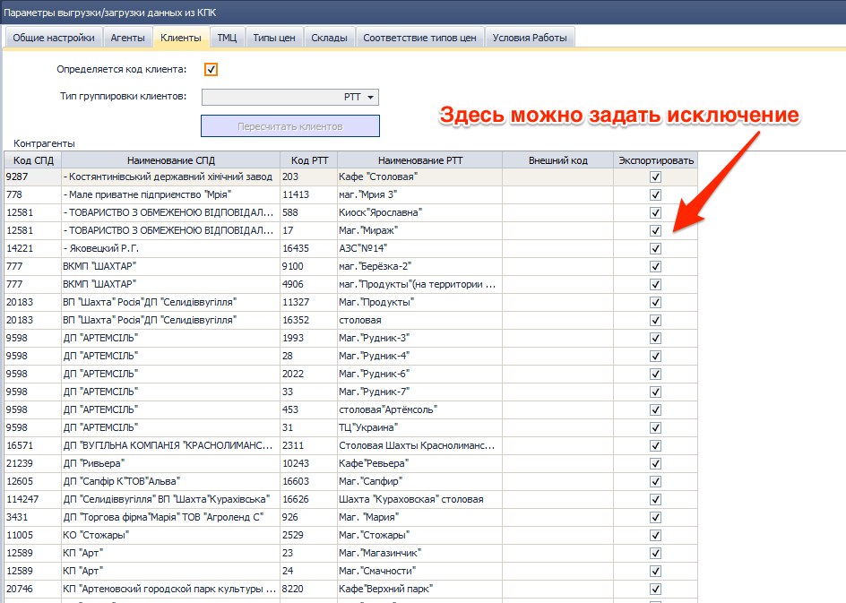

# Новости релиза 2016.04.14 (16)

---------------

## 2143 ОТЧ OLAP Отчет по продажам

*Топ менеджмент, Отдел продаж.*

-   Исправлен механизм расчета аналитики **Тип должности**, теперь в таблице данных сохраняются **ID** элементов справочника **1030 СПР Типы должностей**. ID – это уникальный номер элементов справочника. Изменение связано с оптимизацией быстродействия, а также для согласования с изменениями описанными ниже. С точки зрения пользователя в отчете ни каких визуальных изменений не произошло.

-   Исправлена ошибка связанная, с размножением данных на этапе запроса к таблицам и затем к не корректному их схлопыванию. Что давало не корректные или не явные показатели, особенно при подсчете %. *Например*: **Торговые Марки** или **Типы товаров производителя** с одинаковым названием, присутствующие у разных производителей могли схлопываться. Пользователь не подозревает о том что в справочниках есть элементы с одинаковым названием и в результате видит завышенные показатели (сумма по нескольким записям в одной строке). Теперь все элементы аналитики с одинаковым названиями в отчетах будут выводится в несколько строк.

***Важно запомнить:***

В настройках отчета при отборе и фильтрации показатели идентифицируются по ID, а в сформированной таблице отчета группировка, фильтрация и сортировка по текстовому значению (как и было раньше).

----------------------------
## 2153 ЖД Акционные накладные

*Отдел продаж, Операторы*

-   Изменена печатная форма документа **Акция подарок**. Добавлена следующая информация:
    -   Название акции
    -   Период действия акции
    -   Дата и номер накладной, которая «сыграла» в акции
    -   ТМЦ и их количество, которые приняли участие в акции
    -   Слово подарок, благодаря своему забавному выделению теперь бросается в глаза

 

Все новшества направлены в первую очередь для усиления визуального восприятия клиентом всех проводимых акций. Клиент должен знать: какая акция, с какой даты она идет (чтобы посокрушаться об упущенных возможностях), до какой даты она будет идти и за что он получает подарок (чтобы алчность сподвигла клиента распланировать свои заказы с целью получения максимального количества бонусов). А нарочито кричащее слово "подарок", лишний раз подчеркивает неофициальность данного документа, и даже наоборот привносит элемент поздравления от компании-партнера.

Обращаю внимания пользователей, что теперь необходимо придумывать и вносить «человеческие» **названия акций**, а также грамотного и корректного заполнение поля **примечания**. Если акция подарок не рассчитана на то чтобы клиент выбирал какой либо объем продукции, то соответственно вместо документа основания будет подтягиваться информация из поля **примечание**.

------------------------------------
## 2176 ОТЧ Hermes. Контроль посещений.

*Отдел продаж, SV, Диспетчер, Логист.*

-   Исправлена ошибка, связанная с некорректной работой фильтров по времени входа-выхода.

------------------------
## Административная консоль.
*Администраторы*

-   Исправлена ошибка, связанная с отсутствием настроек справочника **0907 СПР Категории товара.** Также приведены в соответствие настройки некоторых других справочников.

---------------------------------------------------
## 1450 СПР Параметры выгрузки/загрузки данных из КПК.

*Администраторы*

-   Изменен внешний вид и расположение элементов управления, более удобная структура с использованием закладок.

-   Все настройки выгрузки по версии по **SoftServe Version: 3.31** теперь сосредоточены в этом компоненте (Ранее частично использовался компонент **1466 ФН Настройка экспорта/импорта с внешними системами**). В дальнейших обновлениях настройки всех версий ПО обмена данными будут сосредоточены в **1450.**

-   В настройках выгрузки РТТ добавлено исключение для экспорта. Если по каким либо причинам мы не хотим показывать объем продаж по определенным контрагентам или торговым точкам, то в настройках достаточно снять галочку.

-   Реализована возможность импорта условий работы с КПК с последующим анализом и адаптацией к существующим условиям работы в учетной системе Distributor. Для этого добавлен справочник соответствий.

При помощи этого справочника реализован более совершенный алгоритм, кроме того он удобен с точки зрения пользовательских настроек экспортирующей и импортирующей стороны. Упрощенно он выглядит так:

Пользователям, совместно с представителями производителей, необходимо назначить и присвоить коды соответствия.

-   Исправлены грамматические ошибки.

----------------------------------------------------
## 0403 ЖД Комплекты документов по мат. ответственности

*Бухгалтер *

**Исправлена ошибка:** при добавлении физлица в поле Дополнение к первоначальному составу в Договор с типом Склад и последующем редактировании поля Дата вступления Система выдавала ошибку, условием ее возникновения был большой список дополнительного состава (появлялся боковой скрол).

-----------------------
## Функция Показать проводки (Ctrl+T)

*Бухгалтер *

**Доработки:** Дата проводки из верхней строки перенесена в табличную часть с проводками.

**Зачем?**  
Для корректного отображения данных, по комп.1909 Движение денег на пластиковой карте могут быть сформированы проводки разными датами, отличными от Даты документа.

-------------------------
## Функция Показать историю изменений (Ctrl+Н)

*Бухгалтер *

**Внесены изменения:** в формат отображения изменений проводок по документу.

**Базовые условия:** отображаются ТОЛЬКО те проводки, по которым были изменения
-   свойств: Даты, Фирмы, Филиала, Способа учета;
-   аналитик счетов;
-   количества и/или суммы.

Отображаются как удалённые/измененные проводки, так и вновь созданные.  
Если изменений в проводках не было, Пользователю выводится сообщение "Проводки не изменялись".

**Преимущества:**

-   убраны объединенные ячейки, которые не позволяли выполнять стандартные операции с гридом;
-   добавлена группирующая панель, включены свойство грида: подсчет итогов, фильтрация, группировка, сортировка данных;
-   по умолчанию данные группируются по полю Статус: Было /Стало;
-   для визуализации изменений «старые» проводки подсвечены красным цветом;
-   в гриде отображаются строки только с заполненными аналитикамисчетам дебета и кредита;
-   при переходе от строки к строке в шапочной части отображается название аналитик;
-   при подводе курсора к ячейке в строке с левой стороны выводится наименование поля, его значение и статус проводки;
-   для упрощения поиска перед значением аналитики отображается ее код (при наличии).

--------------------

## 0989 ЖД Чеки (алгоритм формирования)

*Бухгалтер *

**Зачем нужны изменения?**

С марта 2016г. приказом №13 Минфином утверждены формы расчетных документов, в том числе и Фискального чека. В новой форме Акциз выделен по аналогии с НДС в отдельном подразделе.

Ранее в соответствии с разъяснениями контролирующих органов акциз отображался в разделе Товары отдельной строкой с наименованием Акциз 5%.

**Что должно быть отображено в Чеке?**

Стоимость ТМЦ должна быть отображена с учетом всех налогов.  
Акциз начисляется только при формировании чека по РН (полной или частичной оплате).  
Для начисления Акциза должно выполняться условие: устная форма договоренности с Клиентом и реализованный товар является подакцизным.  
Товары, которые облагаются двумя налогами должны иметь буквенное обозначение:

      А -0 НДС 20%, Г – Акциз.

**Примечание**: ставка акциза установлена в размере 5%, но для правильности расчета в РРО Акциз=6% (начисляется на цену с НДС).

**Реализация:**

- **Оплата по РН** - в Чеке отображаются все позиции из документа, акциз рассчитывается, как в РН.

- **Частичная оплата по РН** - Система выполняет подбор ТМЦ из РН под сумму оплаты, если товар подакцизный - рассчитывается его стоимость с учетом Акциза и НДС.  
Данные по частичным оплатам в разрезе ТМЦ НЕ сохраняются (сложная реализация, необходимость хранения большого объема данных в разрезе ТМЦ).

- **Предоплата -** Система выполняет подбор товара в Чек самостоятельно по связке со складом, акциз НЕ рассчитывается и не отображается в Чеке.

Если в последствии у Покупателя будут претензии по несоответствию Товара в Чеке, фактически приобретенному, необходимо провести Отмену расчетной операции (ОРО) и сформировать оплату по РН.

**Изменения в Отмене расчетной операции (ОРО)**

При формировании ОРО по Чеку на основании РН повторен алгоритм отображения наименования ТМЦ, количества, цены, суммы с учетом всех налогов, выделения суммы налогов: НДС, акциза.  
Ранее в ОРО отображалось только тестовое поле Возврат наличности и сумма. Изменения необходимы для корректного уменьшения сумм налогов (данные накапливаются в РРО) при возвратах подакцизных товаров.  

Аналогичные изменения внесены в **функцию Печать выделенных чеков** из ЖД Чеки. Пользователь может печатать как один, так и множество выделенных чеков и на любой принтер. **Функция Печати копии чека** из Чека отключена, функционал дублируется и уже не нужен.

-------------------
## 0994 ЖД Таксировка

*Бухгалтер*

**Добавлена функция Быстрая печать чеков** для уменьшения "лишних" действий Пользователя: Сформировать Чек - Печатать чек - Подтвердить распечатку чека – Закрыть чек возврат в Таксировку.

При установленном признаке **Быстрая печать чеков** Система формирует и передает на печать Чеки последовательно без участия Пользователя.

Если произойдет сбой при печати, например, окончилась лента, Пользователю выводиться сообщение, после устранение проблемы можно продолжить формирование чеков как в быстром режиме, так и в ручном.

--------------------
## 0159 СПР План счетов

*Бухгалтер *

Добавлены аналитики: **Виды деятельности, Филиал** для счетов: 801, 802, 804, 805, 806, 807, 808, 809.

С помощью скрипта заполнены аналитики в существующих проводках:
- **Филиал**=Филиалу из проводки
- **Вид деятельности** для каждой базы свой элемент справочника:

Караван-Сарай - код 2 из комп. 2080 Вид деятельности=Сервисные подразделения  
Мак-Инвест новый - код 2 из комп. 2080 Вид деятельности=Сервисные подразделения  Сладкая жизнь ЦО - код 3 из комп. 2080 Вид деятельности=Сервисные подразделения ЦО  
Сладкая жизнь, остальные филиалы - код 2 из комп. 2080 Вид деятельности=Сервисные подразделения  
ТД Купец - код 2 из комп. 2080 Вид деятельности=Логистика  
ЧП Хлебников - код 2 из комп. 2080 Вид деятельности=Филиал  
ЧП Алексеев - код 2 из комп. 2080 Вид деятельности=Филиал

**Зачем?**  
Аналитики необходимы для корректного формирования Отчета о финансовых результатах.

---------------------------------
## 1768 ЖД Списание материалов (АСМ)

*Бухгалтер *

**Внесены изменения:**

Добавлен алгоритм распределения затрат по функции По подразделению.

**Исходные данные:**

Должность - из поля "ОС находится у" для причины списания Модернизация ОС,
для остальных причин списания в АСМ из поля "Затраты отнести на".

Период - равен предыдущему месяцу от даты создания документа.

Сумма к распределению - Количество в БЕ из грида Материалы.

Распределение выполняется при проведении АСМ.

**Изменены настройки проводок**

для причин списания: **Ремонт ОС** и **Использовано в хоз. деятельности**
отказались от формирования "лишних" проводок: списания материалов по складской цене (ЦПП) по 84сч., сторнировочную проводку по ЦПП по 80сч.,
будет формироваться только проводка по списанию себестоимости с распределением количества ТМЦ по ЦФО и Филиалам.

для причин списания: **Модернизация ОС** и **Создание ОС**
состав проводок не меняем, добавляем распределение для «затратных» проводок.

Пример распределенных проводок, суммы пересчитаны по СРЦ.

