## 0916 СПР Товары

*Отдел продаж, Бренд-менеджеры*

- Добавлена возможность задавать параметр "Объем БЕ, л" с точностью до 3 знаков после запятой. Необходимо для товаров, объем которых измеряется в миллилитрах.

-------------------------
## 2292 СПР Стоимость работы склада

*Заведующие складами*

-   Включены фильтры в списке условий:
  
*рис 1.*  
- Добавлен параметр "Коэффициент сложности". На этот коэффициент будет умножаться сумма рассчитанной сдельной части ЗП. Предполагается использование надбавочного коэффициента для разных температурных режимов складов. В случае, если коэффициент не установлен, он считается равным 0, расчитанная сумма бонусов соответственно умножается на 0.   
------------------
## 2276 ОТЧ ЗП склада

*Заведующие складами, руководители филиалов*

-   В Параметрах отчета добавлен фильтр по сотруднику:
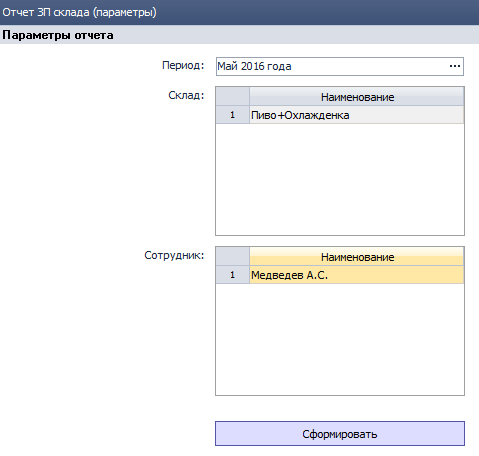  
*рис. 2*  
Если сотрудник не выбран - выводятся все сотрудники выбранного склада.
------------------
## 0112 ФН Настройка параметров - TOOL
*Системные администраторы, Транспортные логисты, Диспетчеры ТС*

Для мониторинга качества работы 2х разных служб таких как: **Отдел продаж и Транспортный отдел**, нельзя завязываться на одинаковые критерии оценки продолжительности визита. Поэтому теперь настройки 2-х разных отчетов  разведены на 2 параметра.

   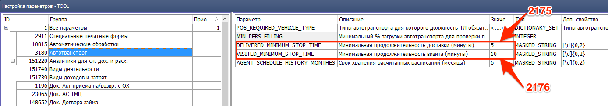
*рис. 3*

Группа настроек  **3180 Автотранспорт** теперь содержит:
1. DELIVERED_MINIMUM_STOP_TIME - **Минимальная продолжительность доставки (минуты)**,
этот  параметр используется в  **2175 ОТЧ Гермес. Контроль доставки** При построении отчета, все события входа-выхода в геозону РТТ с продолжительностью в минутах больше или равно чем в настройках, будут засчитываться как состоявшаяся доставка, остальные - нет.

2. VISITED_MINIMUM_STOP_TIME - **Минимальная продолжительность визита (минуты)**, этот параметр используется в **2176 ОТЧ Гермес. контроль посещений ТА**. При построении отчета все события, входа-выхода в геозону РТТ с продолжительностью в минутах больше или равно чем в настройках, будут засчитываться как состоявшийся визит, остальные - нет.

-------------

## 2175 ОТЧ Гермес. Контроль доставки

*Транспортные логисты, руководители филиалов*

-   В журнал документов добавлено поле "Экспедитор":
  
*рис. 4*  
Наличие поля упрощает проверку расчета ЗП экспедиции по параметру **РТТ не вовремя** и позволяет контролировать своевременность доставки в разрезе экспедиторов.
--------------  

## 1292 СПР Маршруты ТА
*НОП, SV, ТА*
- Исправлена ошибка обновления данных РТТ при открытии маршрута. Из-за которой **Распределенные РТТ**, имеющие признак **На развитие**, при добавлении условий работы в справочнике **0968 СПР УР с покупателем**, становились нераспределенными, т.е. теряли назначенные день и порядок визита в **маршруте ТА**
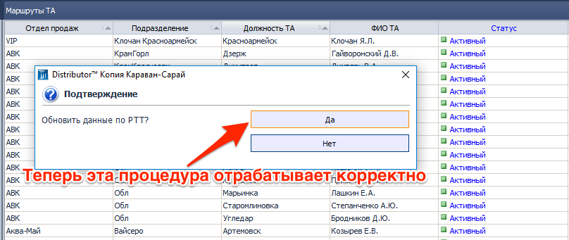
*рис. 5*  
------------------  
## 1508 ОТЧ Печать/экспорт документов для склада

*Заведующие складами*

-   В печатной форме НДК по РТТ альбомная для случаев, когда разрыв страницы попадает в середину накладной добавлен вывод шапки накладной и нумерация частей:
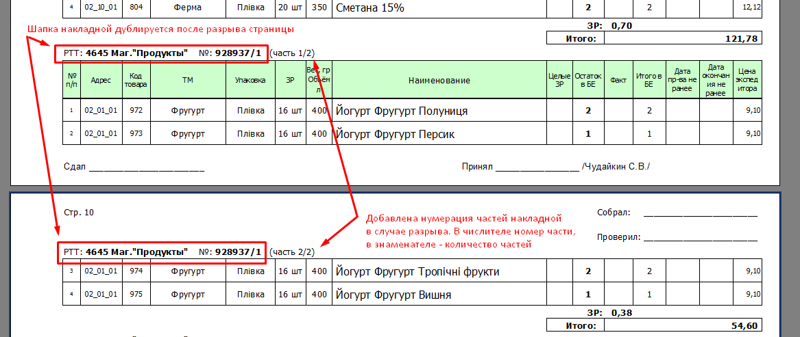  
*рис 6.*  
------------------  

## 1450 СПР Параметры выгрузки/загрузки данных из КПК
*Бренд-менеджеры, Системные администраторы*

- Добавлена настройка, расширяющая возможности экспорта цен. Согласно требования компании АВК, необходимо:
 - В компоненте **0704 Прайс-лист производителя** расценить ТМЦ производителя АВК согласно их требований (см. таблицу ниже)

  | | Тип цены АВК |Расшифровка |
 |--|--|--|
 |**База** |АВК0% |Цена соответствует базовому прайсу территории|
 |**Наценка** |АВК+1% |Базовый прайс территории + наценка 1%|
 | **Наценка** |АВК+2% | Базовый прайс территории + наценка 2%|
 | **Наценка** |АВК+3%|Базовый прайс территории + наценка 3%|
 |**Наценка** |...|     |
 |**Наценка** |АВК+N%|Базовый прайс территории + наценка N%|
 | **Скидка** |АВК-1%|Базовый прайс территории - скидка 1%|
 | **Скидка** |АВК-2%|Базовый прайс территории - скидка 2%|
 | **Скидка** |АВК-3%|Базовый прайс территории - скидка 3%|
 | **Скидка** |... ||
 | **Скидка** |АВК-N% |Базовый прайс территории - скидка N%|

  -  
   - В компоненте **1450** Действующие ОЦ дистрибьютора сопоставить с регламентируемыми ценами компании АВК (см. таблицу выше и рис.7). Для этого необходимо заполнить справочник как на примере.

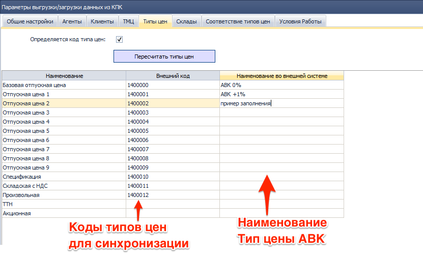
*рис. 7*
-  
  - каждой РТТ сопоставить регламентируемый тип цен, что у нас уже реализовано в справочнике **0968 СПР УР с покупателем**. Во избежание разночтений в справочнике УР запассивить лишние условия работы. В отделе продаж АВК не должно быть у одной РТТ нескольких условий работы с разным типом цен, в противном случае система при выгрузке будет выбирать первое попавшееся.

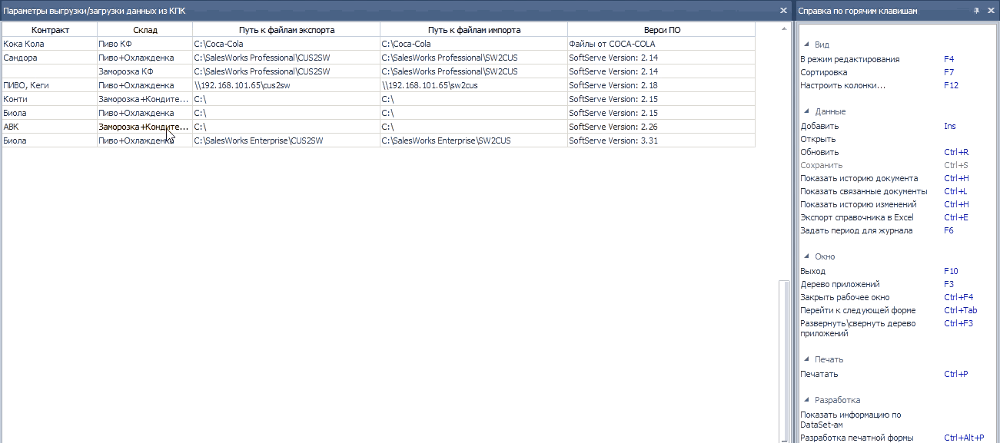

Таким образом при обмене данными с УС АВК, агенты будут видеть привязки к существующим типам цен, без возможности их редактирования. А в УС Distributor будут попадать заявки с правильным типом цен.

------------
## 1808 Комплект ТА.
*SV*
В настройках отчета добавлена новая форма подбора
- В настройках отчета добавлена новая форма подбора ТМЦ для отображения истории продаж **Производитель + Торговая марка**

- В старых методах подбора устранены ошибки, а их названия  приведены к соответствию их сущностей.  
**Производитель + Тип товара производителя**

- **Тип товара дистрибьютора**, теперь без связки с производителем.

Теперь настройки компонента 1808 аналогичны настройкам 1815, и обеспечивают вариабельность подбора ТМЦ с учетом специфики наполнения портфеля ТА.

--------------

1084 ОТЧ Ежедневные отгрузки
---------------------
*SV, ТА*

- **Исправлена ошибка:** при построении Отчета по сценарию По документу и фильтрации данных по Коду контрагента данные не отображались.

---------

1310 ЖД Инвентаризации ТМЦ на экспедиторе
--------------------------
*Бухгалтер*

- **Исправлена ошибка:** Не отображалась ПФ Акт инвентаризации ТМЦ на экспедиторе на базе Караван-Сарай.

-----------
## Импорт данных для Отчета по объемам приобретения и реализации алкогольных напитков в оптовой сети

*Бухгалтер*

За 04/2016г. сформированы и импортированы данные отчета в программу me-doc по ООО «Караван-Сарай».
Автоматизация Отчета планируется к следующему релизу (26.05.2016г.)

## 0989 ЖД Чеки
*Бухгалтер*

**Внесены изменения:**
В ЖД Чеки добавлен **признак Возможна печать копии**, для существующих чеков присвоены значения:

**Да** - есть все реквизиты чека и статус Чека = Проведен;

**Нет** - отсутствует хотя бы один реквизит и/или статус Чека ≠ Проведен.

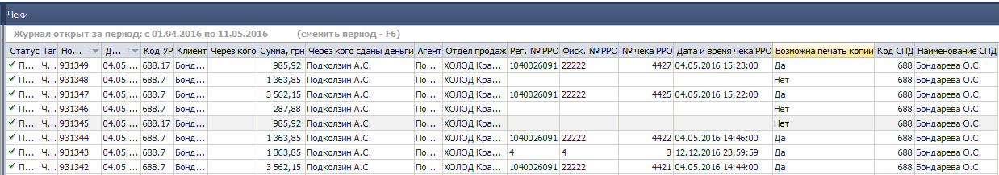
*рис. 12*

В Меню Справка по горячим клавишам добавлена **функция Заполнить реквизиты чека для печати копии**.
При вызове функции, открывается форма для заполнения данных Чека.

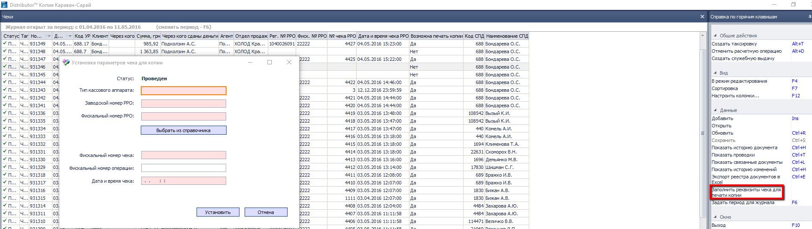
*рис. 13*

Пользователь может заполнить данные по РРО: Тип РРО, заводской и фискальный выбором из комп.2337 СПР РРО.
Приведены к единому формату **дата и время распечатки Чека** – у разных типов РРО форматы даты и времени в чеке разные и сохранялись в виде текстового значения, соответствующие изменения внесены в печатную форму Копии чека.
В Админ.консоль **добавлена привилегия**, которая позволяет Пользователю вносить данные по чеку.

**Зачем нужны изменения?**

При печати чеков иногда происходит сбой, если данные чека в программе не сохранялись печать копий чеков невозможна.
Функционал позволит отборать такие чеки по фильтру и заполнить данные без участия Разработчика на основании кассовой ленты, если чек "прошел" через РРО.
Вносить данные чека может Пользователь с установленной привилегией.
Контролировать чеки необходимо ежедневно.

----------
## Комп. ОТЧ Остатки возвратной тары у клиентов
*Бухгалтер*

**Внесены изменения:** для определения долга по возвратной таре добавлен счет учета расчетов с контрагентами по возвратной таре 036.5.

------------
## 1079 ОТЧ Неоплаченные накладные

*Бухгалтер*

**Внесены изменения:** в сценарий Неоплаченные накладные с учетом возвратной тары
для определения долга по возвратной таре добавлен счет учета расчетов с контрагентами по возвратной таре 036.5.

-------
## 1916 ЖД Начисление ЗП на филиале
*Бухгалтер по ЗП*

**Внесены изменения:** Для Способа распределения затрат по ЗП=Объем выполненных работ затраты распределяются с учетом значения поля Распределять затраты и ЦФО в поле ЦФО/Филиалы для распределения.

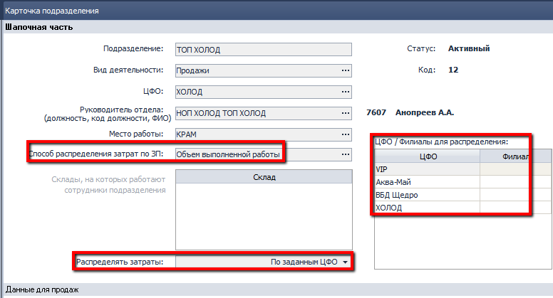
*рис. 14*
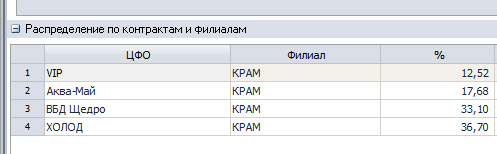
*рис. 15*

-----------------
## 2340 ОТЧ Регламентированный отчет по налоговому учету

*Бухгалтер*

**Доработки отчета:** Для Конечного потребителя в соответствии с Порядком Код ОКПО заполняется «КП».
В ПФ Отчета сортировка данных по Поставщикам в порядке возрастания значения кода ЕГР/ИНН.
Добавлено отображение № и даты документов из раздела доп. расходов.

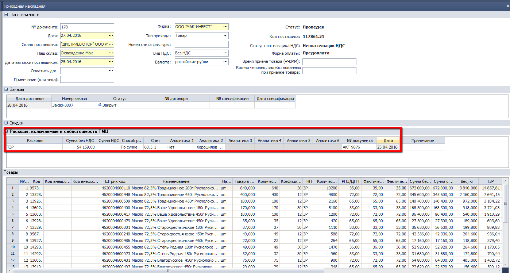
*рис. 16*
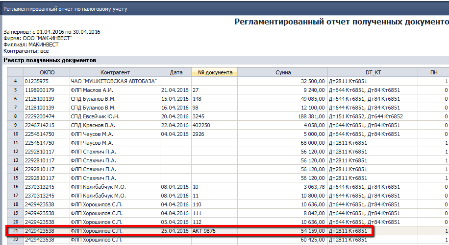
*рис. 17*

--------------

## 1880 ЖД Прочие начисления
*Бухгалтер по ЗП*

Добавлен тип документа **Больничные листы к.д.** – расчет больничных в соответствии с новым порядком по календарным дням.

Для **функции Печать/выгрузка данных** добавлен новый тип для формирования свода по налогам и взносам.
