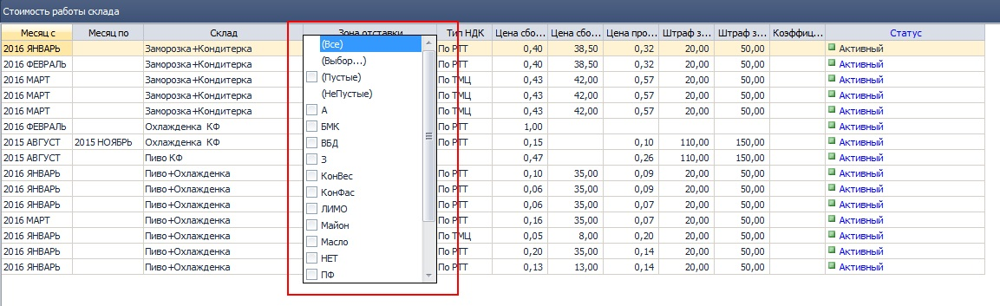

## 0916 СПР Товары

*Отдел продаж, Бренд-менеджеры*

- Добавлена возможность задавать параметр "Объем БЕ, л" с точностью до 3 знаков после запятой. Необходимо для товаров, объем которых измеряется в миллилитрах.

-------------------------
## 2292 СПР Стоимость работы склада

*Заведующие складами*

-   Включены фильтры в списке условий:
  
*рис 1.*  
- Добавлен параметр "Коэффициент сложности". На этот коэффициент будет умножаться сумма рассчитанной сдельной части ЗП. Предполагается использование надбавочного коэффициента для разных температурных режимов складов. В случае, если коэффициент не установлен, он считается равным 0, расчитанная сумма бонусов соответственно умножается на 0.   
------------------
## 2276 ОТЧ ЗП склада

*Заведующие складами, руководители филиалов*

-   В Параметрах отчета добавлен фильтр по сотруднику:
  
*рис. 2*  
Если сотрудник не выбран - выводятся все сотрудники выбранного склада.
------------------
## 0112 ФН Настройка параметров - TOOL
*Системные администраторы, Транспортные логисты, Диспетчеры ТС*

Для мониторинга качества работы 2х разных служб таких как: **Отдел продаж и Транспортный отдел**, нельзя завязываться на одинаковые критерии оценки продолжительности визита. Поэтому теперь настройки 2-х разных отчетов  разведены на 2 параметра.

   
*рис. 3*

Группа настроек  **3180 Автотранспорт** теперь содержит:
1. DELIVERED_MINIMUM_STOP_TIME - **Минимальная продолжительность доставки (минуты)**,
этот  параметр используется в  **2175 ОТЧ Гермес. Контроль доставки** При построении отчета, все события входа-выхода в геозону РТТ с продолжительностью в минутах больше или равно чем в настройках, будут засчитываться как состоявшаяся доставка, остальные - нет.

2. VISITED_MINIMUM_STOP_TIME - **Минимальная продолжительность визита (минуты)**, этот параметр используется в **2176 ОТЧ Гермес. котроль посещений ТА**. При построении отчета все события, входа-выхода в геозону РТТ с продолжительностью в минутах больше или равно чем в настройках, будут засчитываться как состоявшийся визит, остальные - нет.

## 2175 ОТЧ Гермес. Контроль доставки

*Транспортные логисты, руководители филиалов*

-   В журнал документов добавлено поле "Экспедитор":
  
*рис. 4*  
Наличие поля упрощает проверку расчета ЗП экспедиции по параметру **РТТ не вовремя** и позволяет контролировать своевременность доставки в разрезе экспедиторов.
--------------  

## 1292 СПР Маршруты ТА
*НОП, SV, ТА*
- Исправлена ошибка обновления данных РТТ при открытии маршрута. Из-за которой **Распределенные РТТ**, имеющие признак **На развитие**, при добавлении условий работы в справочнике **0968 СПР УР с покупателем**, становились нераспределенными, т.е. теряли назначенные день и порядок визита в **маршруте ТА**

*рис. 5*  
------------------  
## 1508 ОТЧ Печать/экспорт документов для склада

*Заведующие складами*

-   В печатной форме НДК по РТТ альбомная для случаев, когда разрыв страницы попадает в середину накладной добавлен вывод шапки накладной и нумерация частей:
  
*рис 6.*  
------------------  
