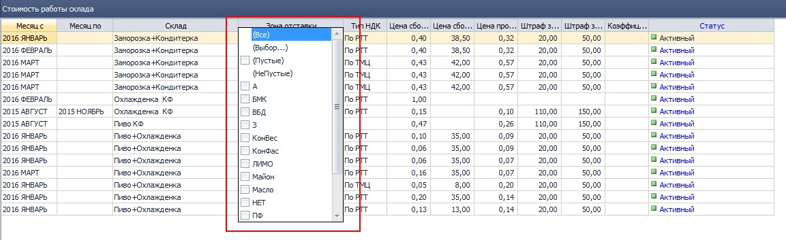
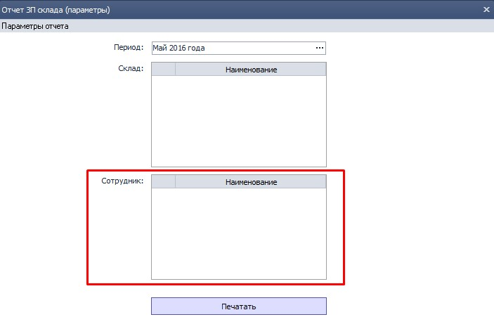
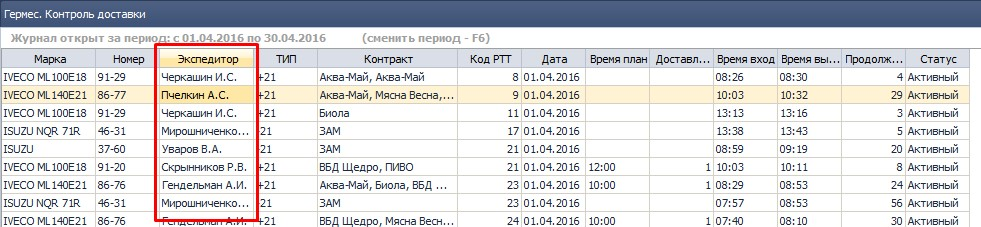

-------------
## 0916 СПР Товары

*Отдел продаж, Бренд-менеджеры*

- Добавлена возможность задавать параметр "Объем БЕ, л" с точностью до 3 знаков после запятой. Необходимо для товаров, объем которых измеряется в миллилитрах.

-------------------------
## 2292 СПР Стоимость работы склада

*Заведующие складами*

-   Включены фильтры в списке условий:
  
рис 1.  
- Добавлен параметр "Коэффициент сложности". На этот коэффициент будет умножаться сумма рассчитанной сдельной части ЗП. Предполагается использование надбавочного коэффициента для разных температурных режимов складов. В случае, если коэффициент не установлен, он считается равным 0, расчитанная сумма бонусов соответственно умножается на 0.   
------------------
## 2276 ОТЧ ЗП склада

*Заведующие складами, руководители филиалов*

-   В Параметрах отчета добавлен фильтр по сотруднику:
  
рис 2.  
Если сотрудник не выбран - выводятся все сотрудники выбранного склада.
------------------  
## 2175 ОТЧ Гермес. Контроль доставки

*Транспортные логисты, руководители филиалов*

-   В журнал документов добавлено поле "Экспедитор":
  
рис 3.  
Наличие поля упрощает проверку расчета ЗП экспедиции по параметру **РТТ не вовремя** и позволяет контролировать своевременность доставки в разрезе экспедиторов.
------------------  
