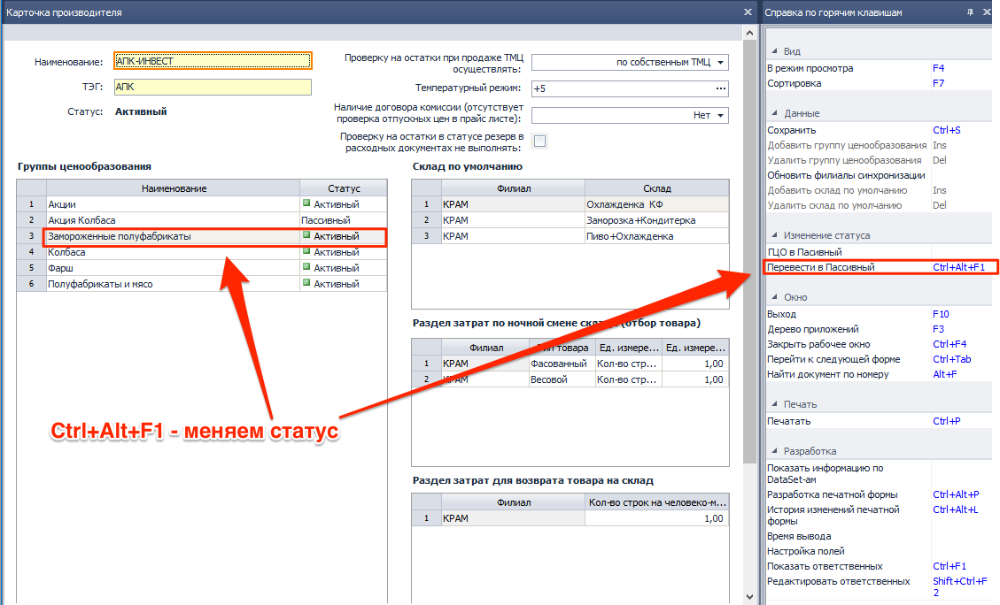
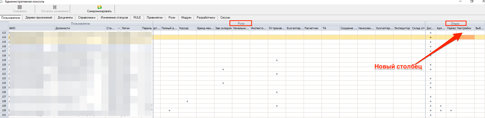
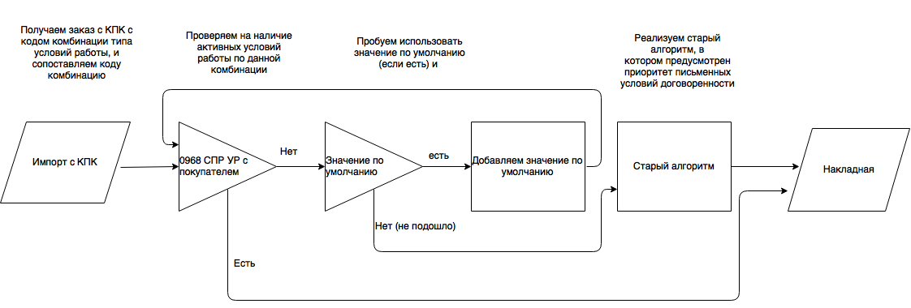
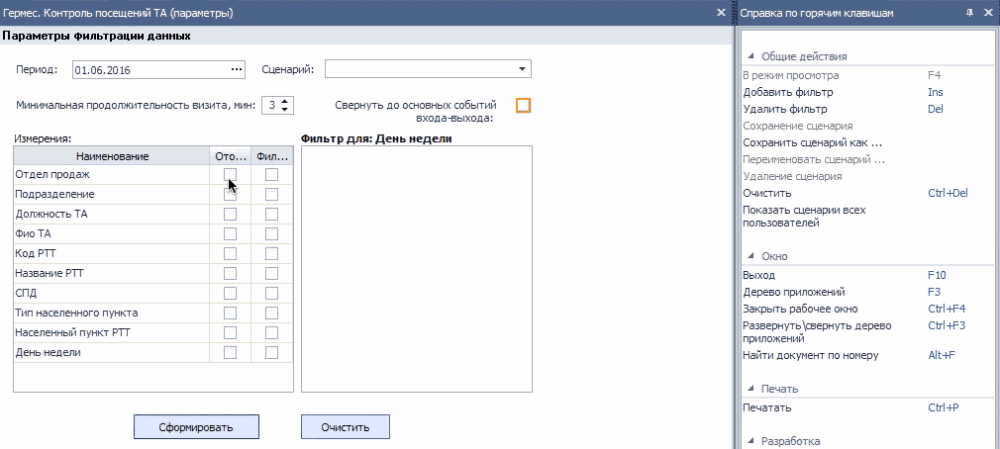

[//]:# (Чистый лист)
## 2194 СПР Торговая Марка
*Бренд-менеджеры*

- Исправлена ошибка присвоения первого номера. Теперь при наполнении пустого справочника, на этапе создания первой записи, проблем с присвоением кода (номера) не существует.

------------
## 1111 СПР Производители
*Бренд-менеджеры*

- В карточке **Производители** изменен подход к редактированию **Группы ценообразования (ГЦО)**. Появилась возможность переводить группы ценообразования в статус **пассивный**.
Теперь при создании или редактировании в компоненте **0704 СПР Прайс-листы производителя** в выпадающих списках будут появляться только **ГЦО** со статусом активный.Осталась возможность добавлять и переименовывать ГЦО. В последующих версиях появится также возможность удаления.

   
- Оптимизировано расположение и размер элементов.

--------
## Административная Консоль
*Системные администраторы*

- В таблице **Пользователи** появилось визуальное разделение табличной части между двумя сущностями **Роли** и **Опции**, это сделано для удобства работы пользователя и дабы в последствии избегать подмены этих двух понятий.
- Также в таблице **Пользователи**  в разделе **Опции** добавлен  новый столбец - **Настройки**, в нем будут задаваться права доступа пользователя к настройкам **Distributor**

------------
## 1450 СПР Параметры выгрузки/загрузки данных из КПК. Версия ПО SoftServe Version: 2.18 (САН ИнБев)

*Администраторы*

-   Реализована возможность импорта условий работы с КПК с последующим анализом и адаптацией к существующим условиям работы в учетной системе Distributor. Для этого добавлен справочник соответствий.

При помощи этого справочника реализован более совершенный алгоритм, кроме того он удобен с точки зрения пользовательских настроек экспортирующей и импортирующей стороны. Упрощенно алгоритм выглядит так:

Пользователям, совместно с представителями производителей, необходимо назначить и присвоить коды соответствия.
- Реализована возможность редактирования путей к файлам экспорта/импорта вручную.

---------
 ## 2143 ОТЧ OLAP отчет по продажам
 *Топ-менеджмент, Отдел-продаж, Бренд-менеджеры, SV, НОП*

 - В настройках отчета переименованы столбцы, теперь название полностью отражает сущность.

----------
## Печать документов
*все*
- Устранена критическая ошибка, которая возникала при некорректно настроенных драйверах принтера, приводящая к отказу печати, даже при устранении проблем с драйверами.

------------
## 0200 ЖД Расходные накладные
*Отдел-продаж, Операторы*

- Устранена ошибка конфликта определения цены. Проявлялась в редких случаях, когда по клиенту созданы условия работы с типом цены БОЦ, с исключениями по производителю.

---------------------------------------

## 2176 ОТЧ Гермес. Контроль посещений ТА
*Отдел продаж, НОП, SV*

- Отчет стал настраиваемым аналогично **2143**, т.е. можно натроить отображаемые измерения а также произвести по ним предварительную фильтрацию.
 - **Минимальная продолжительность визита** - теперь это настраиваемый пользователем параметр, если между событиями входа-выхода в геозону РТТ продолжительность меньше, то это событие не будет считаться визитом ("холостое событие").
 - **Отображать в свернутом виде** - это рекомендуемый для большинства пользователей параметр фильтрации отчета, при котором отсеиваются все "холостые" события входа-выхода в геозону РТТ (проезды без остановок мимо РТТ, повторные краткосрочные визиты). Если необходимо просмотреть детализированно всю информацию, фильтр можно снять.
 - Реализована работа с пользовательскими сценариями.
   
- Отчет по прежнему редактируемый, но благодаря предварительным настройкам повысились скорость его работы, и удобство с точки зрения пользователя.
