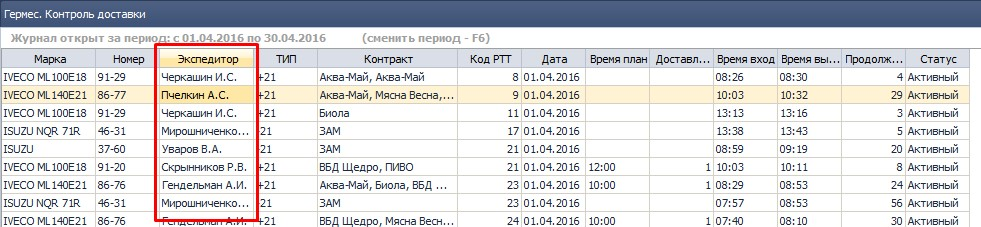

## Все компоненты
*Все пользователи*  
Добавлена глобальная горячая клавиша "Ctrl+F" - поиск документа по номеру.  
Работает в любом месте любого компонента, в том числе в печатных формах.  

Вызывает окно со строкой ввода. После ввода текста в строку ввода и нажатия кнопки "Найти" (или Ентер) открывается компонент **1828 ОТЧ Поиск документов по номеру** с результатом поиска по введенному тексту.  
Например, построили отчет OLAP:  

*рис.1*  
Нажимаем "Ctrl+F", в появившемся окне вводим номер искомого документа, нажимаем "Enter", видим результаты поиска:  

  
*рис.2*  

-----------------------
## 1375 ЖД Накладные для кладовщика,   1508 ОТЧ Печать\экспорт пакета документов для склада

*Заведующие складами*

- Исправлена ошибка задвоения номенклатуры в печатной форме НДК в случае, если одна и та же номенклатура отпускается по двум фирмам в одну РТТ и доставляется одним автомобилем. Нпример по акционной накладной и по расходной накладной при включенном механизме Спец РН.

-----------------------
## 1113 ОБР Присвоение товарам адресов хранения на складе
*Заведующие складами*

Исправлена ошибка невозможности отмены фильтра при смене склада. Ошибка возникала, если установить фильтр в каком-либо столбце и перейти в другой столбец, причем фильтр установить так, что бы при изменении склада, фильтр выдал пустой результат. Теперь смена склада автоматически сбрасывает фильтры.

-----------------------
## 0200 ЖД Расходные накладные.
*Операторы отдела продаж*

- Убран столбец "Клиент", вместо него выведен столбец "СПД", в который выводится значение поля СПД из 2099 СПР СПД
- Убран столбец "Наименование клиента", вместо него выведен столбец "Код и название РТТ", в который выводится значение поля "Код и название РТТ" из 0968 СПР УР с покупателем.
- Соответствие подбиратся через поле "Код УР" из РН.
   
*рис. 3*

-----------------------
## СПР 1048 Склады.  
*Заведующие складами*  
Убрано ограничение на вводимые символы для названия зоны склада. Теперь можно вводить любые символы, в том числе пробелы, подчеркивания, цифры, запятые и так далее. Оставлено ограничение в 25 символов для названия зоны. Тепереь можно задавать например такое название зоны:  
  
*рис. 4*  
*Рекомендуется все же подходить к названию зон ответственно и пользоваться информативными, но краткими названиями, не забывать, что название зоны выводится в печатной форме "Реестр загрузки в автомобиль" как заголовок столбца.*  

-----------------------
## 2251 ОТЧ Реестр загрузки в автомобиль.  
*Транспортные логисты, заведующие складами*  
Добавлена новая печатная форма реестра в минималистичном варианте, книжной ориентации. Старая форма так же доступна (альбомная ориентация):

*рис.5*  
Новая форма:  
  
*рис.6*  
Старая форма:  
  
*рис.7*  

-----------------------
## 2246 Отчет ЗП экспедиции
*Руководитель филиала, транспортные логисты*  

Добавлена возможность расчета ЗП с детализацией по ЦФО.  
  
*рис.8*  
Если в параметрах отмечен чекбокс "Детализация до ЦФО" - выводится в грид столбец "ЦФО" (после "Сотрудник"). При этом на каждого сотрудника выводится столько строк, сколько ЦФО принимает участие в формировании показателей.
При неотмеченном чекбоксе отчет (табличная его часть) выводится в нынешнем виде (один сотрудник - одна строка, без столбца "ЦФО").  

-----------------------
## 1590 СПР Маршруты доставки  
*Транспортные логисты, руководитель филиала*  
Исправлена ошибка, не позволяющая создать (и распечатать) новый документ.  

-------------------------

------------------
## 2175 ОТЧ Гермес. Контроль доставки

*Транспортные логисты, руководители филиалов*

-   В журнал документов добавлено поле "Экспедитор":
  
*рис. 4*  
Наличие поля упрощает проверку расчета ЗП экспедиции по параметру **РТТ не вовремя** и позволяет контролировать своевременность доставки в разрезе экспедиторов.

--------------  
