[//]:# (Смаглий)
## Все компоненты
*Все пользователи*

Добавлена глобальная горячая клавиша "Ctrl+F" - поиск документа по номеру.  
Работает в любом месте любого компонента, в том числе в печатных формах.  

Вызывает окно со строкой ввода. После ввода текста в строку ввода и нажатия кнопки "Найти" (или Ентер) открывается компонент **1828 ОТЧ Поиск документов по номеру** с результатом поиска по введенному тексту.  
Например, построили отчет OLAP:  
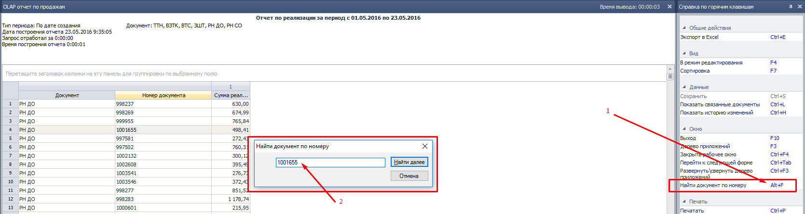
*рис.1*  
Нажимаем "Ctrl+F", в появившемся окне вводим номер искомого документа, нажимаем "Enter", видим результаты поиска:  

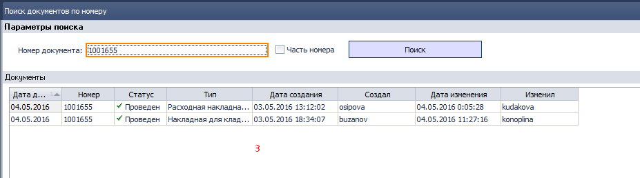  
*рис.2*  

-----------------------
[//]:# (Смаглий)
## 1375 ЖД Накладные для кладовщика,   1508 ОТЧ Печать\экспорт пакета документов для склада

*Заведующие складами*

- Исправлена ошибка задвоения номенклатуры в печатной форме НДК в случае, если одна и та же номенклатура отпускается по двум фирмам в одну РТТ и доставляется одним автомобилем. Нпример по акционной накладной и по расходной накладной при включенном механизме Спец РН.  
- Добавлена возможность вносить нескольких проверивших по аналогии с несколькими собравшими.

-----------------------
[//]:# (Смаглий)
## 1113 ОБР Присвоение товарам адресов хранения на складе
*Заведующие складами*

Исправлена ошибка невозможности отмены фильтра при смене склада. Ошибка возникала, если установить фильтр в каком-либо столбце и перейти в другой столбец, причем фильтр установить так, что бы при изменении склада, фильтр выдал пустой результат. Теперь смена склада автоматически сбрасывает фильтры.

-----------------------
[//]:# (Смаглий)
## 0200 ЖД Расходные накладные.
*Операторы отдела продаж*

- Убран столбец "Клиент", вместо него выведен столбец "СПД", в который выводится значение поля СПД из 2099 СПР СПД
- Убран столбец "Наименование клиента", вместо него выведен столбец "Код и название РТТ", в который выводится значение поля "Код и название РТТ" из 0968 СПР УР с покупателем.
- Соответствие подбиратся через поле "Код УР" из РН.
   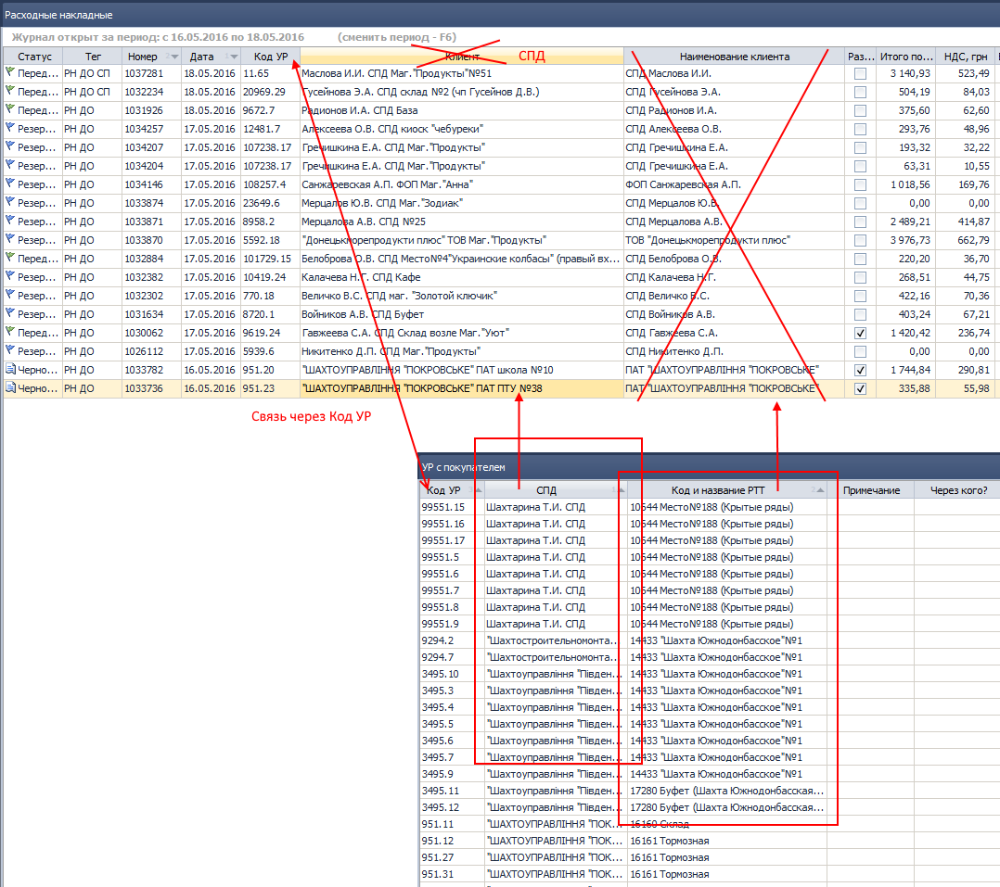
*рис. 3*
- Устранена ошибка конфликта определения цены. Проявлялась в редких случаях, когда по клиенту созданы условия работы с типом цены БОЦ, с исключениями по производителю.

-----------------------
[//]:# (Смаглий)
## СПР 1048 Склады.  
*Заведующие складами*  
Убрано ограничение на вводимые символы для названия зоны склада. Теперь можно вводить любые символы, в том числе пробелы, подчеркивания, цифры, запятые и так далее. Оставлено ограничение в 25 символов для названия зоны. Тепереь можно задавать например такое название зоны:  
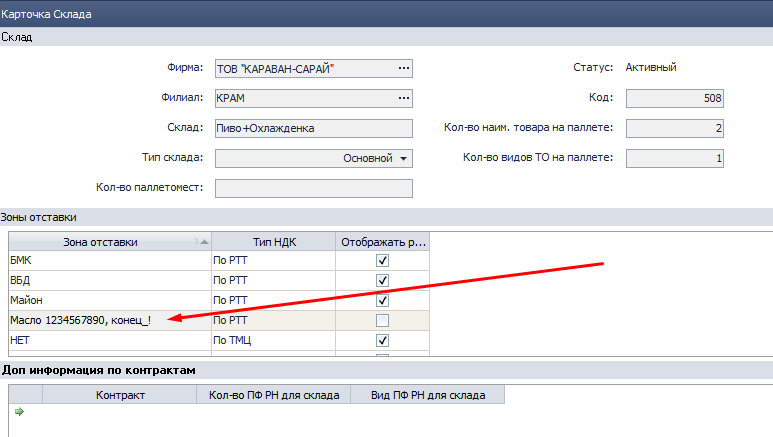  
*рис. 4*  
*Рекомендуется все же подходить к названию зон ответственно и пользоваться информативными, но краткими названиями, не забывать, что название зоны выводится в печатной форме "Реестр загрузки в автомобиль" как заголовок столбца.*  

-----------------------
[//]:# (Смаглий)
## 2251 ОТЧ Реестр загрузки в автомобиль.  
*Транспортные логисты, заведующие складами*  
Добавлена новая печатная форма реестра в минималистичном варианте, книжной ориентации. Старая форма так же доступна (альбомная ориентация):
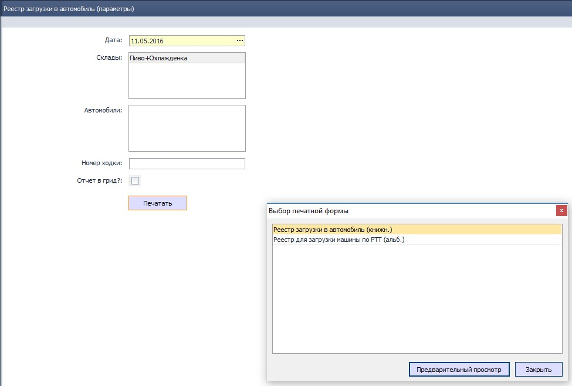
*рис.5*  
Новая форма:  
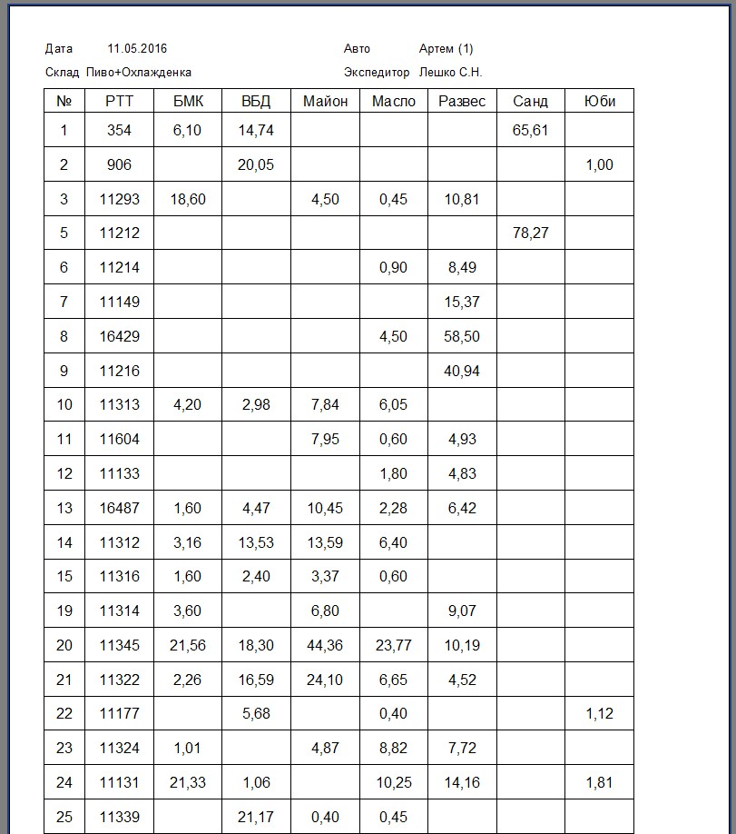  
*рис.6*  
Старая форма:  
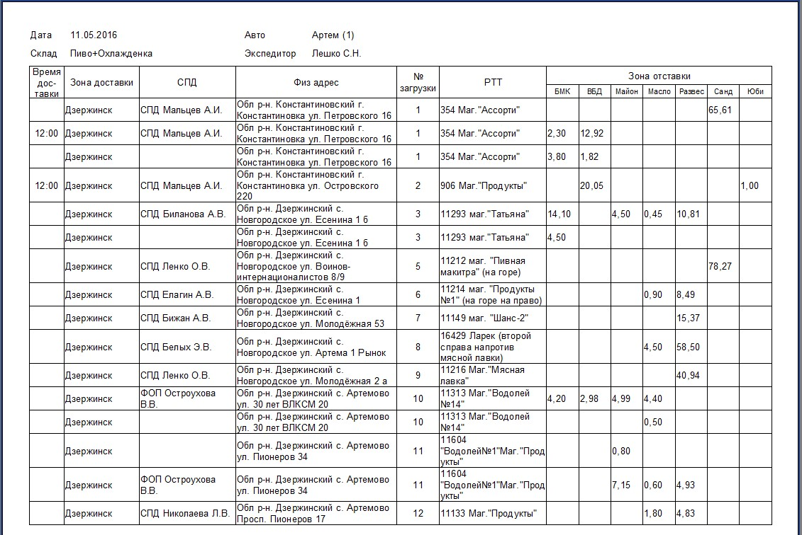  
*рис.7*  

-----------------------
[//]:# (Смаглий)
## 2246 Отчет ЗП экспедиции
*Руководитель филиала, транспортные логисты*  

Добавлена возможность расчета ЗП с детализацией по ЦФО.  
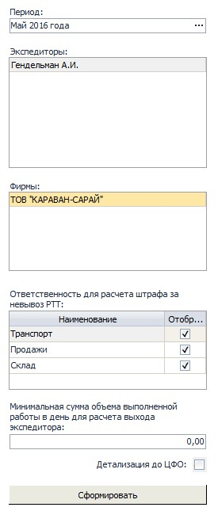  
*рис.8*  
Если в параметрах отмечен чекбокс "Детализация до ЦФО" - выводится в грид столбец "ЦФО" (после "Сотрудник"). При этом на каждого сотрудника выводится столько строк, сколько ЦФО принимает участие в формировании показателей.
При неотмеченном чекбоксе отчет (табличная его часть) выводится в нынешнем виде (один сотрудник - одна строка, без столбца "ЦФО").  

-----------------------
[//]:# (Смаглий)
## 1590 СПР Маршруты доставки  
*Транспортные логисты, руководитель филиала*  
Исправлена ошибка, не позволяющая создать (и распечатать) новый документ.  

----------
## 1196 ОТЧ Акт сверки

*Бухгалтер*

**Исправлена ошибка:** при построении Отчета по сценарию По Клиенту и Поставщику неправильно отображалось сальдо начальное и конечное.

----------------------------  
## 1034 СПР Физ.лица
*Бухгалтер*  

**Исправлена ошибка** при открытии карточки ФЛ.  

--------------  
## 1312 ЖД Списание ТМЦ с места хранения

*Бухгалтер*

**Исправлена ошибка** неправильно рассчитывалось количество ТМЦ при заполнении табличной части на основании документов, из-за отсутствия фильтра по Статусу Проведен.

-------------------------------------
## 2150 ЖД Налоговые накладные

*Бухгалтер*

**Изменения внесены** для оптимизации времени на выписку налоговых накладных по предоплате и расчетов-корректировок к ним при смене номенклатуры.

Для типа налоговых ПНН **добавлено необязательное поле Документ-основание** с формой подбора документов из ЖД Счета-фактуры и ЖД расходные накладные с фильтром по СПД, за период, равный месяцу из налоговой по умолчанию.

В ФП отображены: дата, тег документа, номер документа, статус, код СПД, наименование, форма договоренности, сумма с НДС, НДС.

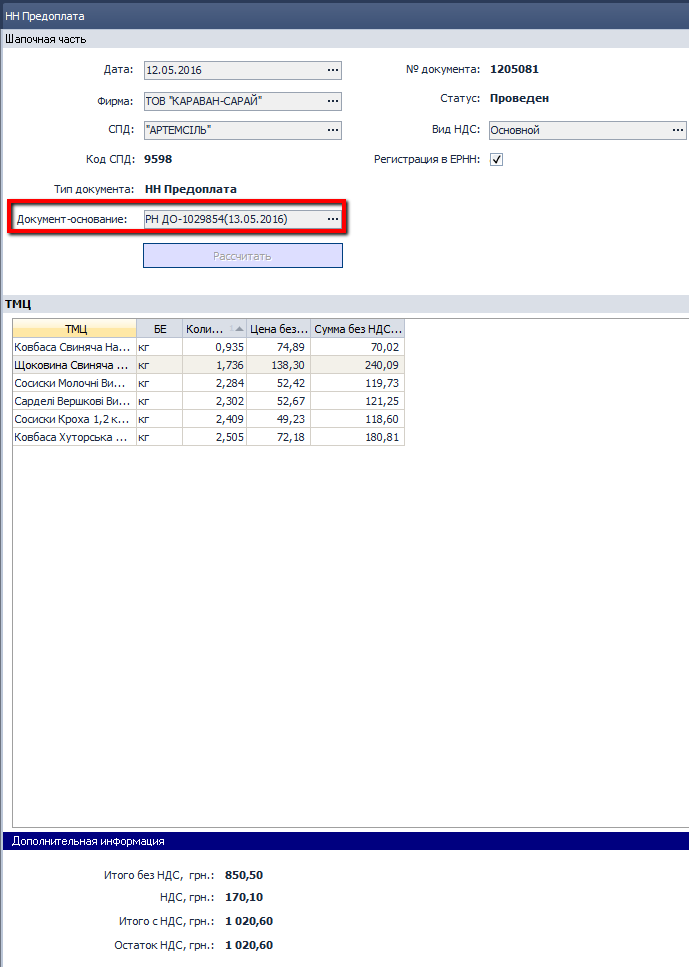  
*рис.9*  

При создании ПНН обработкой поле Документ-основание - НЕ заполняется, в ручном режиме или режиме редактирования Пользователь может выбрать документ-основание, при этом в ПНН отображается номенклатура, количество и цена из документа. Пользователь может корректировать данные.

При сохранении выполняется неблокирующая проверка суммы с НДС из налоговой с сальдо по Кт счетов 361+3771 по СПД и форме договоренности=Письменная.

Если проверка не пройдена, выводится сообщение: "Сумма с НДС по налоговой накладной не равна сальдо по кредиту счетов 361 и 3771. Продолжить?"

Аналогичные **изменения внесены в Расчет-корректировку к налоговой**.

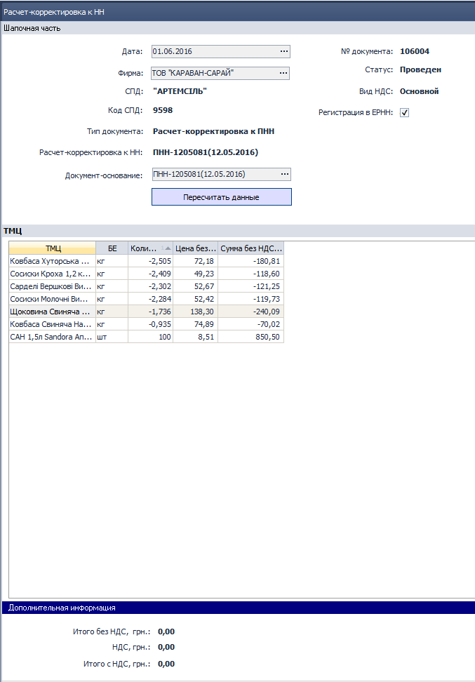  
*рис.10*  

Пользователь может выбрать любой вид налоговой в поле Документ-основание.

При выборе документа заполняется номенклатура, количество, цена (отрицательные значения), Пользователь может корректировать все поля и вносить новые строки в документ.

Выполняется неблокирующая проверка: сумма корректировки НДС должна быть равной нулю.

Примечание Аналитика:

В РК НН добавленные строки отображаются без нумерации, это правильно, так как они отсутствуют в налоговой, которая корректируется.

РК НН с нулевой или положительной суммой корректировки НДС регистрирует Продавец.  

----------------------
## 1783 ЖД Перемещение ОС

*Бухгалтер*

**Изменен расчет остатков ОС по МОЛ**.

В Перемещения ОС с типами: внутри филиала и расход

доступны для выбора ОС, по которым есть количественный остаток (ранее использовали суммовой остаток) на Дату документа, по Фирме из шапочной части.

Изменения внесены в функции Добавить ОС и Заполнить автоматически.  

-----------
## 0977 ЖД Бухгалтерские справки

*Бухгалтер*

Внесены изменения в Тип документа Бухгалтерская справка:

- изменен порядок расположения полей Фирма и Содержание, поле Фирма отображено в Журнале документов;
- в табличной части документа объеденные ячейки заменены строкой по аналогии с отображением проводок по функции Показать проводки;
- добавлена группирующая панель, включены свойства грида, фильтры, итоги и т.д.;
- оптимизировано копирование проводок в документе;
- убран раздел Дополнительная информация с Итогами - данные дублируются;
- добавлена возможность копирования документа с помощью функции Копировать в меню Журнала документов.  

------------
## 2340 ОТЧ Регламентированный отчет по налоговому учету

*Бухгалтер*

Добавлена возможность группировки данных по Конечному потребителю, из-за большого объема группировку данных согласовывают с контролирующими органами

Пользователь может выбрать одно из значений:

-   без группировки - данные отображаются, как сейчас, сценарий по умолчанию;
-   по дате - суммирование данных за день по Клиенту=Конечный потребитель, отобразить итоговую сумму, поле Дата=дате группировки, Номер документа- пустое поле;
-   за месяц - суммирование данных за месяц по Клиенту=Конечный потребитель, отобразить итоговую сумму, поле Дата=месяц группировки, Номер документа- пустое поле.  

-----------------

Описанные ниже изменения связаны с автоматизацией Отчета по объемам приобретения и реализации алкогольных напитков в оптовой сети.

Вспомогательные справочники УКТВЭД и Виды продукции необходимы для

- минимизации ошибок Пользователей при ручном вводе УКТВЭД в элемент справочника Товары;
- группировки данных в Отчете по объему приобретения и реализации алкогольных напитков;
- заполнение налоговых накладных.

Рассмотрим их подробнее.  

---------

### 2347 СПР УКТВЭД

*Бухгалтер, бренд-менеджер*

УКТВЭД – украинский классификатор товаров внешнеэкономической деятельности, состоит из 10 цифр.

Элементы справочника создаются и редактируются только на базе с признаком ЦО, 
синхронизируются на базы с признаком Филиал.

Справочник состоит из полей 
*Код УКР ВЭД* – реализован в виде маски ХХХХ ХХ ХХ ХХ, 
где Х - это число в диапазоне от 0 до 9, поле обязательное к заполнению.
*Наименование товара* - текстовое поле, 100 символов, обязательное к заполнению.
*Вид продукции* - Выбирает Пользователь выбором из одноименного справочника, поле необязательное к заполнению.
Статус - Активный / Пассивный.

Реализованы функции:
Ins - Создать, открывается карточка элемента справочника в статусе Активный;
Ctrl+S - Сохранить элемент справочника, выполнять блокирующие проверки (см. описание ниже);
F4 - переход в режим редактирования значений элемента справочника;
Ctrl+Alt+F1- Перевести статус в Пассивный.

Блокирующие проверки при сохранении и редактировании элемента справочника:

- на наличие кода УКТ ВЭД в статусе Активный/Пассивный;
- на заполнение всех 10 знаков кода УКТ ВЭД.

Справочник создан и заполнен элементами данными из СПР Товары, наименования присвоены из Классификатора.

При создании новых элементов наименование можно найти по коду УКТВЭД на сайте  [*http://qdpro.com.ua/*](http://qdpro.com.ua/).

-----------------------
## 2349 СПР Виды продукции

*Бухгалтер*

Создан и заполнен данными из приложения к приказу 49 от 11.02.2016 справочник Виды продукции.
Состоит из полей:
- *Вид продукции* - текстовое поле, 100 символов, обязательное к заполнению
- *Код продукции* - 2-х значный цифровой код, поле обязательное к заполнению
- *Статус* - Активный / Пассивный.

Для заполнения связки УКТВЭД с Видом продукции использованы «умные» фильтры для выбора доступны только те виды, которые соответствуют коду УКТВЭД или его части.

-----------------------------------
## 2351 ОТЧ Оборот подакцизных товаров

*Бухгалтер*

Функционал предназначен для формирования отчетов в контролирующие органы по обороту подакцизных товаров: данные по остаткам, поступления, реализация оптом и в рознице. Пользователь может проанализировать данные учета, импортировать отчеты в me-doc.
Параметры отчета:  

*Сценарии* - Пользователь выбирает один из сценариев:

-   оборот подакцизных товаров в опте и в рознице
-   перечень поставщиков и покупателей для опта
-   импорт данных для отчета 1-ОА (опт)
    По умолчанию отображать 1-ый сценарий.

*Период* - задает Пользователь, по умолчанию отображать Месяц, предыдущий текущему. Установить ограничение: "Дата по" должна быть ≥ "Дата с"

*Фирма* - выбирает Пользователь из одноименного комп.1073 СПР Фирмы.
По умолчанию отображать Фирму с признаком "Фирма по умолчанию".

*Путь для выгрузки файла* - Пользователь выбирает папку для сохранения файла для импорта в me-doc. Реализовать, как в 1963.

*Сформировать отчет* - вызов Пользователем функции формирования отчета по заданному сценарию.

Код административно-территориальных единиц задается в Настройках отчета, пока принято решение не создавать справочник

Формирование отчета **Оборот подакцизных товаров в опте и в рознице**
Для получения данных использован алгоритм отчета Журнал-ордер (комп.2005) с параметрами:
Период = Периоду из параметров Отчета
Счет 28.1 с аналитиками: Товары=Разворачивать; Места хранения, МОЛ, Движение ТМЦ = Не учитывать.
Фирма = Фирме из параметров Отчета
Филиалы - все
Спец.учет - Отбирать всех
Степень детализации - Без детализации
Отображать: Остатки начальные и конечные, Обороты дебетовые и кредитовые.
Показывать: Только количество, в тыс. даллах

Дополнительные фильтры:
по ТМЦ - отображать только ТМЦ с полем Код УКТВЕД ≠пустое значение, данные группировать по Виду продукции.

Формирование отчета **Перечень поставщиков и покупателей**.
Отчет можно сформировать по заданным Контрагентам, выбрав СПД в поле Контрагенты.
Для получения данных использовать алгоритм отчета Журнал-ордер (комп.2005) с параметрами:
Период = Периоду из параметров Отчета
Счет 28.1 с аналитиками: Товары=Разворачивать; Места хранения, МОЛ, Движение ТМЦ = Не учитывать.
Фирма = Фирме из параметров Отчета
Филиалы - все
Спец.учет - Отбирать всех
Степень детализации - Дата
Отображать: Обороты дебетовые и кредитовые.
Показывать: Только количество

Дополнительные фильтры:
по ТМЦ - отобрать ТМЦ с полем Код УКТВЕД ≠пустое значение
Оборот по Дебету - отобрать обороты по счету 631, по аналитике Контрагент-Поставщик определить СПД, за одну дату данные по одному СПД группировать.
Оборот по Кредиту - отобрать обороты по счету 9021 по по УР с письменной ФД, по аналитике Клиент поставщик определить СПД, за одну дату данные по одному СПД группировать.

Отчет **Импорт данных для отчета 1-ОА (опт) –** импортируются данные в заданном формате

Особенности:

Сальдо начальное и конечное, объем закупки Оборот по Кт631счета и реализация оптовая – оборот по счету 9021 с аналитикой УР Клиента с письменной формой договоренности соответствуют данным учета, все остальные показатели прочие поступления и списания (излишки/недостачи по инвентаризации, списание боя, акционные накладные, накладные на сотрудника и т.д.) рассчитаны и отражены в розничных продажах.

-------------------
[//]:# (Абросимов)
## 2194 СПР Торговая Марка
*Бренд-менеджеры*

- Исправлена ошибка присвоения первого номера. Теперь при наполнении пустого справочника, на этапе создания первой записи, проблем с присвоением кода (номера) не существует.

------------
[//]:# (Абросимов)
## 1111 СПР Производители
*Бренд-менеджеры*

- В карточке **Производители** изменен подход к редактированию **Группы ценообразования (ГЦО)**. Появилась возможность переводить группы ценообразования в статус **пассивный**.
Теперь при создании или редактировании в компоненте **0704 СПР Прайс-листы производителя** в выпадающих списках будут появляться только **ГЦО** со статусом активный.Осталась возможность добавлять и переименовывать ГЦО. В последующих версиях появится также возможность удаления.

   
   *рис.11*
- Оптимизировано расположение и размер элементов.

-----------------------
[//]:# (Абросимов)
## 0916 СПР Товары
*Отдел продаж, Бренд-менеджеры*

- Из карточки товара удалена настройка **Группы ценообразования**, товар приобретает это свойство  в документе **0704 Прайс-лист производителя**.
- переименовано поле Код акциза в Код УКТ ВЭД;
- заменены значения на одноименные элементы СПР Коды УКТ ВЭД;
- скрыты неиспользуемые поля (хмелеводство).

-----------------
[//]:# (Абросимов)
## 0704 СПР Прайс-листы производителя.
*Отдел продаж, Бренд-менеджеры*
- Оптимизирован внешний вид документа и его интерфейс, убраны лишние элементы управления.
- Теперь в документе задается лишь дата начала его действия, датой окончания система принимает начало действия следующего прайс-листа.
- Группы ценообразования (**ГЦО**) теперь можно добавлять и удалять в  самом документе, в других прайс-листа этого производителя набор **ГЦО** не изменится. Таким образом каждый прайс-лист имеет свой набор **ГЦО**
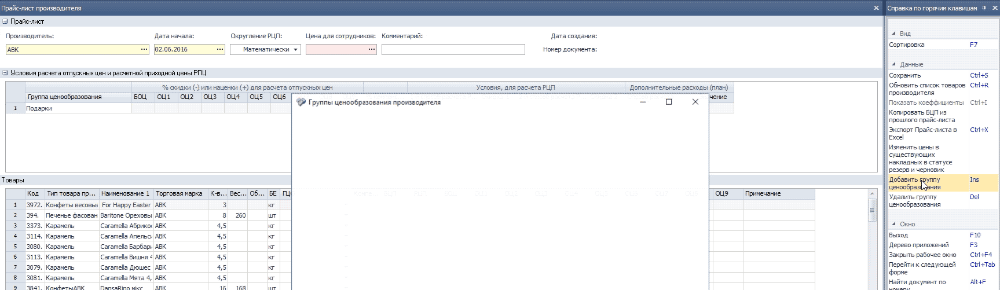
   *рис.12*

- В таблице с товаром появились дополнительные столбцы, по которым можно сортировать и фильтровать записи в таблице.
- **ГЦО** задается каждому товару в самой таблице при помощи выпадающего списка, как поэлементно, так и множественно (на выделенную группу товаров).
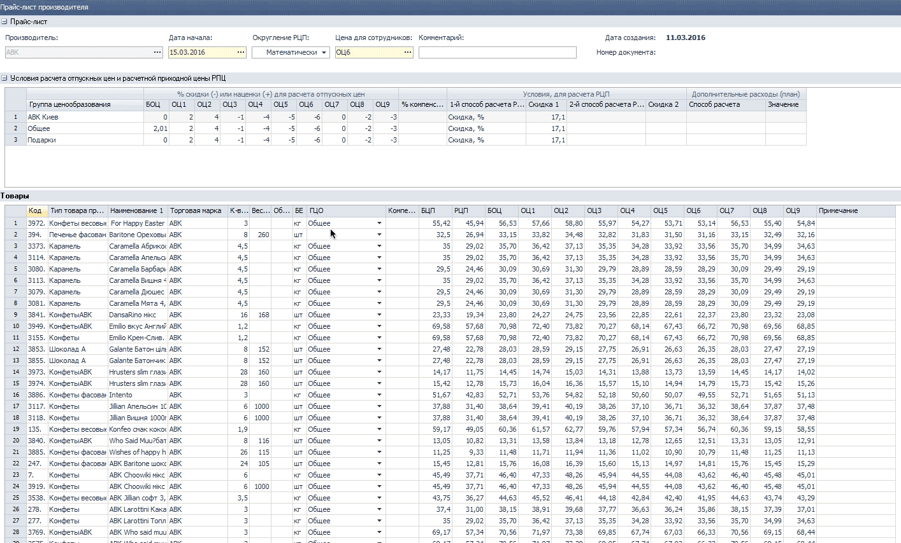
   *рис.13*

Таким образом **ГЦО** стало свойством товара, которое "живет" в периоде действия документа прайс-лист.
- В таблицу с товаром добавлен столбец **Примечание** -текстовое поле редактируемое пользователем.

--------
[//]:# (Абросимов)
## Административная Консоль
*Системные администраторы*

- В таблице **Пользователи** появилось визуальное разделение табличной части между двумя сущностями **Роли** и **Опции**, это сделано для удобства работы пользователя и дабы в последствии избегать подмены этих двух понятий.
- Также в таблице **Пользователи**  в разделе **Опции** добавлен  новый столбец - **Настройки**, в нем будут задаваться права доступа пользователя к настройкам **Distributor**

*рис.14*

------------
[//]:# (Абросимов)
## 1450 СПР Параметры выгрузки/загрузки данных из КПК. Версия ПО SoftServe Version: 2.18 (САН ИнБев)

*Администраторы*

-   Реализована возможность импорта условий работы с КПК с последующим анализом и адаптацией к существующим условиям работы в учетной системе Distributor. Для этого добавлен справочник соответствий.

*рис.15*

При помощи этого справочника реализован более совершенный алгоритм, кроме того он удобен с точки зрения пользовательских настроек экспортирующей и импортирующей стороны. Упрощенно алгоритм выглядит так:

*рис.16*

Пользователям, совместно с представителями производителей, необходимо назначить и присвоить коды соответствия.
- Реализована возможность редактирования путей к файлам экспорта/импорта вручную.

---------
 ## 2143 ОТЧ OLAP отчет по продажам
 *Топ-менеджмент, Отдел-продаж, Бренд-менеджеры, SV, НОП*

 - В настройках отчета переименованы столбцы, теперь название полностью отражает сущность.

----------
[//]:# (Абросимов)
## Печать документов
*Все пользователи*
- Устранена критическая ошибка, которая возникала при некорректно настроенных драйверах принтера, приводящая к отказу печати, даже при устранении проблем с драйверами.

---------------------------------------
[//]:# (Абросимов)
## 2176 ОТЧ Гермес. Контроль посещений ТА
*Отдел продаж, НОП, SV*

- Отчет стал настраиваемым аналогично **2143**, т.е. можно настроить отображаемые измерения а также произвести по ним предварительную фильтрацию.
 - **Минимальная продолжительность визита** - теперь это настраиваемый пользователем параметр, если между событиями входа-выхода в геозону РТТ продолжительность меньше, то это событие не будет считаться визитом ("холостое событие").
 - **Отображать в свернутом виде** - это рекомендуемый для большинства пользователей параметр фильтрации отчета, при котором отсеиваются все "холостые" события входа-выхода в геозону РТТ (проезды без остановок мимо РТТ, повторные краткосрочные визиты). Если необходимо просмотреть детализировано всю информацию, фильтр можно снять.
 - Реализована работа с пользовательскими сценариями.
   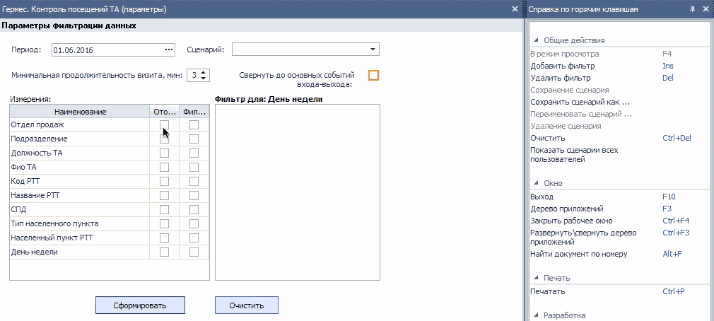
   *рис.17*

- Отчет по прежнему редактируемый, но благодаря предварительным настройкам повысились скорость его работы, и удобство с точки зрения пользователя.  
