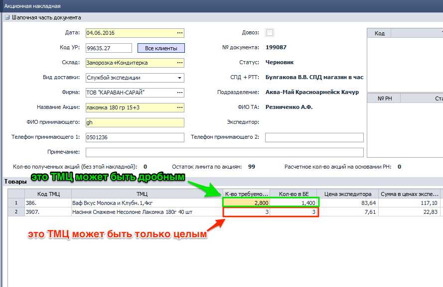
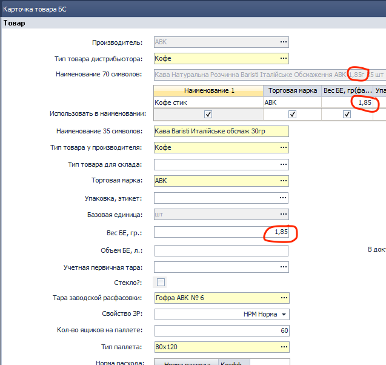
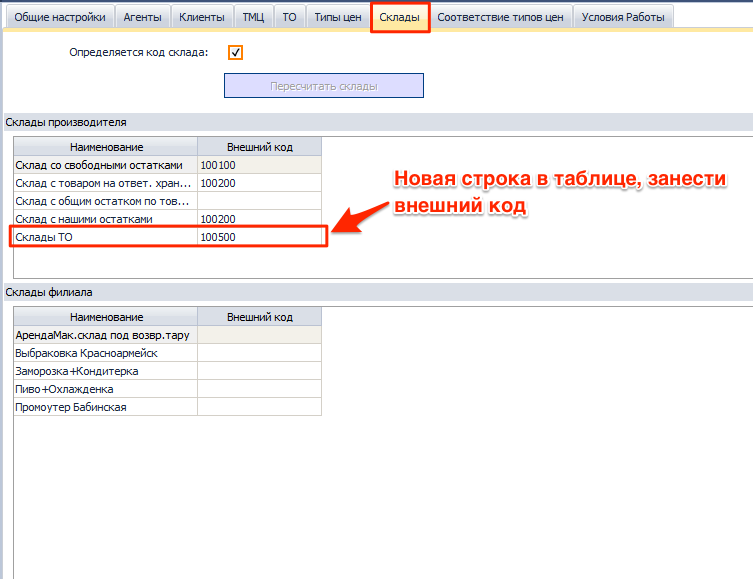
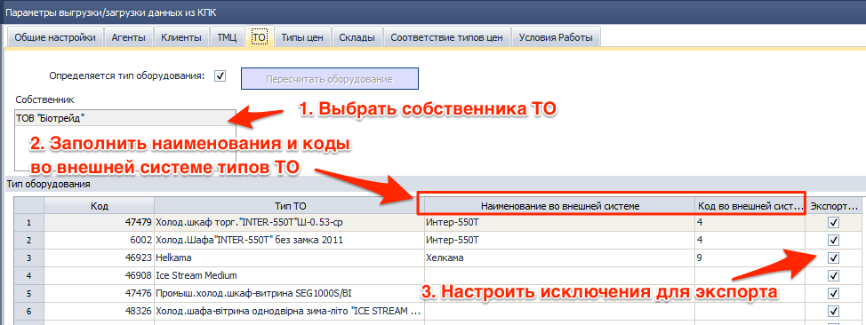
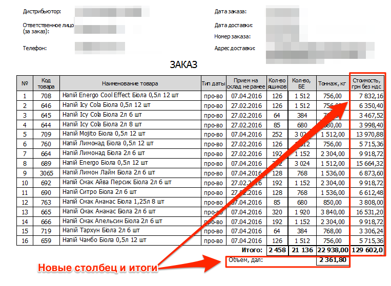

[//]:# (Абросимов)
## Настройки
*Все пользователи*
* Из дерева компонентов удален **0112 СПР Настройки системы**.
* В каждый компонент добавлена горячая клавиша **F2** - **Настройки компонента**.
 Теперь пользователь с правами доступа может настраивать работу компонента, задавая значения переменным или выбором из справочника.[^1]
* Добавлена общая горячая клавиша **Ctrl+F2** здесь пользователь управляет параметрами влияющими на работу нескольких компонентов.

**Важно!**  
*Сейчас большинство компонентов не имеют своих настроек, поэтому при вызове будет выводится окно предупреждения. В этом случае необходимо вызывать системные настройки и настраивать параметры там. Системные настройки на данный момент представляют собой бывший компонент 0112, но со временем все индивидуальные настройки компонента уйдут из системных.*

[//]:# (Абросимов)
## Работа с таблицами.
*Все пользователи*
* Добавлены две новых опции:
 * **Сбросить все фильтры - Ctrl+F5**
 * **Отменить все сортировки Ctrl+F7**  

Сброс происходит как быстрых фильтров так и тех, которые задаются в шапке таблицы.

|Операция|Установка|Снятие|Сбросить все|
|---|--|--|
|Быстрый фильтр|F5|F5|Ctrl+F5|
|Быстрая сортировка|F7|F7|Ctrl+F7|

[//]:# (Абросимов)
## Одностраничные печатные формы.
*Все пользователи*
* Исправления. На некоторых печатных формах проявлялась ошибка, когда документ занимающий не более страницы, при печати прогонял через принтер второй пустой лист. Данная ошибка  устранена.

[//]:# (Смаглий)  
## 1916 ЖД Начисление ЗП на филиале (Транспортная логистика)  
*Руководители филиалов,транспортные логисты*  

При создании нового документа, для подразделения со способом распределения затрат "Транспортная логистика" для поля "Бонусы (расчетные)" реализовн алгоритм автоматического расчета значения, идентичный расчету поля "Сумма всего" в компоненте 2246 по сотруднику, который относится к выбранным подразделениям шапки и за период из шапки документа.
Другими словами, теперь бонусы для транспортной логистики (для экспедиторов и водителей-экспедиторов) проставляются автоматически и считаются по такому же алгоритму, как и в **2246 ОТЧ ЗП Экспедиции**.  

[//]:# (Смаглий)  
## 2276 ОТЧ ЗП склада  
В параметрах, в форме подбора сотрудника теперь можно выбрать и уволенных сотрудников. Раньше уволенные сотрудники были недоступны для выбора и увидеть по ним показатели можно было только построив отчет по всему складу.  

[//]:# (Смаглий)  
## 0327 ОТЧ ЖД Заказы на поставку
*Бренд-менеджеры*  
- Переработан интерфейс. Разнесены по вкладкам шапочная часть, табличная часть и уведомления.  
Было:  
  
*рис.9*  
Стало:  
  
*рис.9*  
  
*рис.9*  
  
*рис.9*  
- В шапочной части добавлена галочка "Не отображать пустые строки по ТТН". Если она установлена и расхода по ТТН за анализируемый период не было, то строки 5,6,7, касающиеся ТТН, в детализации не выводятся.
  
*рис.9*

[//]:# (Абросимов)
## 2153 ЖД Акционные накладные
*Отдел продаж, Операторы,*
-Исправлена ошибка, при которой у пользователя была возможность задать штучным ТМЦ дробное количество требуемых БЕ. Теперь количество БЕ с типом **ШТ** или **Комплект** задается только натуральными числами.

*рис.8*
- Исходя из вышеописанной логики, в табличной части также изменено представление - штучный товар всегда отображается целыми числами (без запятой).

[//]:# (Абросимов)
## 0916 СПР Товары
*Отдел продаж, Бренд-менеджеры*
- Расширены возможности справочника. Вес БЕ штучного товара или комплекта теперь может задаваться с точностью до сотых долей грамма (2 знака после запятой).

*рис.8*

[//]:# (Абросимов)
## 1808 ОТЧ Комплект ТА
*Отдел продаж, SV, Операторы*
- Исправлена ошибка, при которой не сохранялись настройки отчета по должности. Теперь всё работает как и ранее, достаточно один раз сконфигурировать необходимые настройки, для определенной должности и нажать кнопку "Сформировать". При последующем открытии отчета и выборе этой должности настройки подтянутся автоматически.

[//]:# (Абросимов)
## 1450 СПР Параметры выгрузки/загрузки данных из КПК, 1474 ФН Экспорт/Импорт данных из SoftServe
*Администраторы*

В соответсвии с требованиями компаний "САН ИнБев" и "Биола" реализован механизм экспорта, информации об остатках и движении  **Торгового оборудования (ТО)**, взятом у них в аренду для последующего размещения на торговых площадках клиентов дистрибьютора(**РТТ**), по договорам субаренды.
* В настройках компонента **1450** в закладке склады, появилась новая запись - **Склады ТО**. Здесь необходимо задать код склада для выгрузки ТО. Оборудование ищется по всем складам, поэтому если необходимо развести по разным складам (например: склад неисправного оборудования), можно воспользоваться нижней, добавочной таблицей исключений.

*рис.8*

* В настройках компонента **1450** добавлена закладка **ТО** в ней необходимо:
 * Выбрать собственника ТО, чьё оборудование будет экспортироваться
 * Перенаполнить таблицу
 * В таблице сопоставить типы ТО из УС Distributor, с названиями и кодами типов ТО во внешней системе
 * Галочками настроить исключения для выгрузки

 
 *рис.8*

 [//]:# (Абросимов)
 ## 0327 ЖД Заказы на поставку
 *Бренд-менеджеры*
* Изменения печатной формы:
 * удален столбец адрес ТМЦ;
 * добавлен столбец стоимость, грн без ндс;
 * Добавлены итоги - Объем, дал.
 
 *рис.8*

-------------
[^1]: Доступ к настройкам задается в админконсоли в таблице **Пользователи** в колонке **Настройки**, см. [Новости релиза 2016.06.02_22](https://idistributor.gitbooks.io/distributor/content/News%20releases/2016.06.02_22/2016.06.02_22.html)
