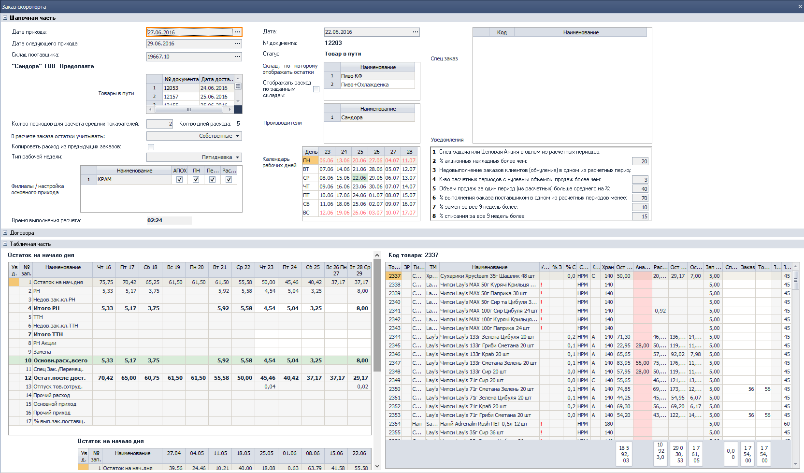
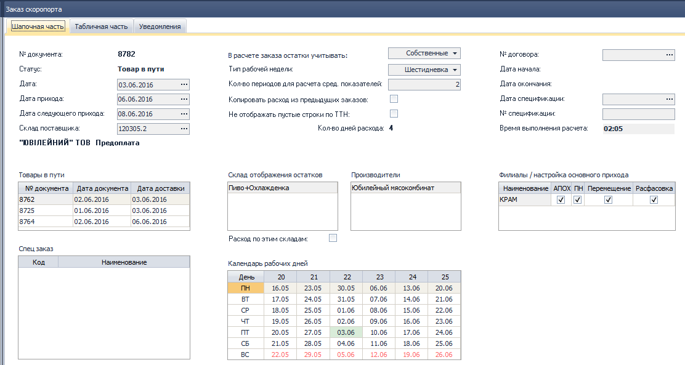
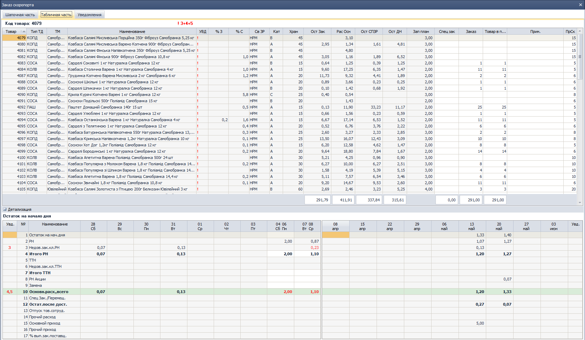
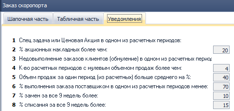
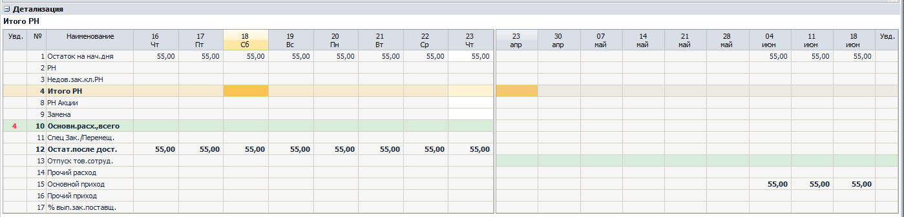

[//]:# (Абросимов)
## Настройки
*Все пользователи*
* Из дерева компонентов удален **0112 СПР Настройки системы**.
* В каждый компонент добавлена горячая клавиша **F2** - **Настройки компонента**.
 Теперь пользователь с правами доступа может настраивать работу компонена, задавая значения переменным или выбором из справочника.
* Добавлена общая горячая клавиша **Ctrl+F2** здесь пользователь управляет параметрами влияющими на работу нескольких компонентов.[^1]

**Важно!**  
*Сейчас большинство компонентов не имеют своих настроек, поэтому при вызове будет выводится окно предупреждения. В этом случае необходимо вызывать системные настройки и настраивать параметры там. Системные настройки на данный момент представляют собой бывший компонент 0112, но со временем все индивидуальные настройки компонента уйдут из системных.*

[//]:# (Смаглий)  
## 1916 ЖД Начисление ЗП на филиале (Транспортная логистика)  
*Руководители филиалов,транспортные логисты*  

При создании нового документа, для подразделения со способом распределения затрат "Транспортная логистика" для поля "Бонусы (расчетные)" реализовн алгоритм автоматического расчета значения, идентичный расчету поля "Сумма всего" в компоненте 2246 по сотруднику, который относится к выбранным подразделениям шапки и за период из шапки документа.
Другими словами, теперь бонусы для транспортной логистики (для экспедиторов и водителей-экспедиторов) проставляются автоматически и считаются по такому же алгоритму, как и в **2246 ОТЧ ЗП Экспедиции**.  

[//]:# (Смаглий)  
## 2276 ОТЧ ЗП склада  
В параметрах, в форме подбора сотрудника теперь можно выбрать и уволенных сотрудников. Раньше уволенные сотрудники были недоступны для выбора и увидеть по ним показатели можно было только построив отчет по всему складу.  

[//]:# (Смаглий)  
## 0327 ОТЧ ЖД Заказы на поставку
*Бренд-менеджеры*  
- Переработан интерфейс. Разнесены по вкладкам шапочная часть, табличная часть и уведомления.  
Было:  
  
*рис.9*  
Стало:  
  
*рис.9*  
  
*рис.9*  
  
*рис.9*  
- В шапочной части добавлена галочка "Не отображать пустые строки по ТТН". Если она установлена и расхода по ТТН за анализируемый период не было, то строки 5,6,7, касающиеся ТТН, в детализации не выводятся.
  
*рис.9*

-------------
[^1]: Доступ к настройкам задается в админконсоли в таблице **Пользователи** в колонке **Настройки**, см. [Новости релиза 2016.06.02_22](https://idistributor.gitbooks.io/distributor/content/News%20releases/2016.06.02_22/2016.06.02_22.html)
