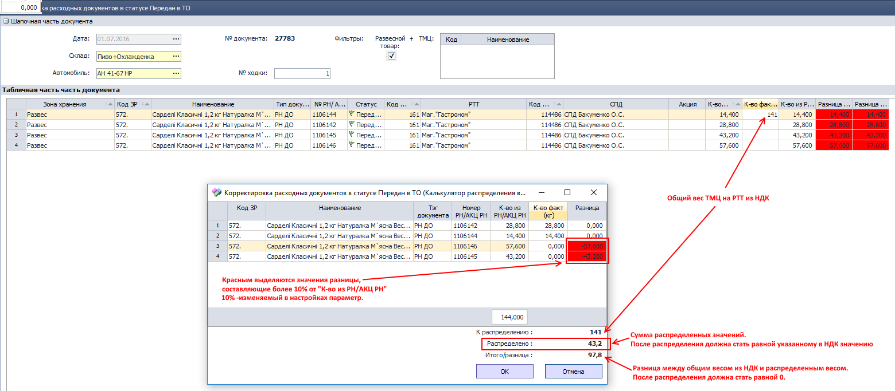
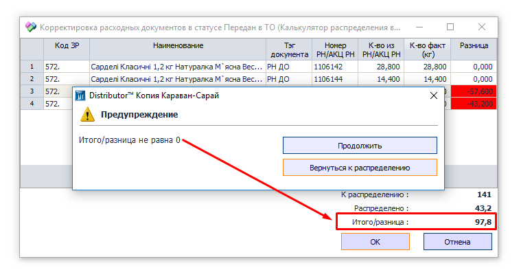
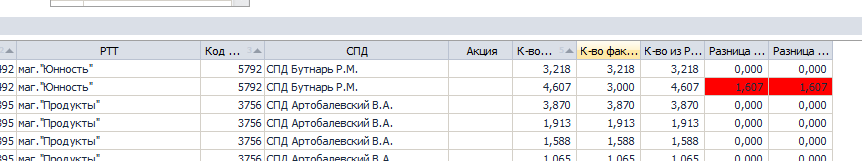
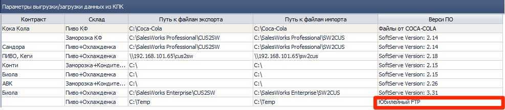
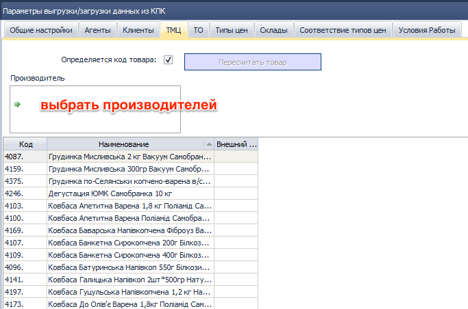
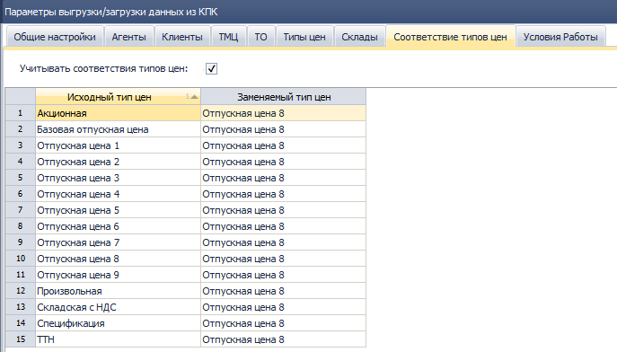
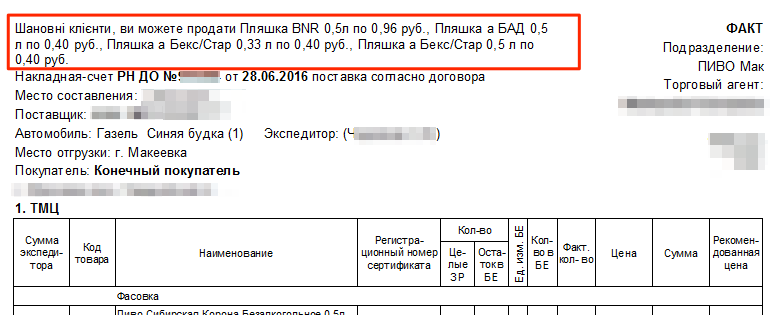
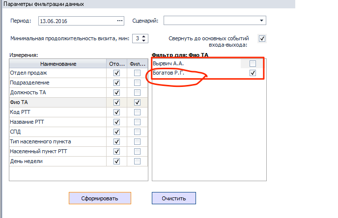

[//]:# (Смаглий)
## 1588 ЖД Формирование доставки  

*Транспортные логисты*  

Исправлена ошибка, из-за которой у некоторых типов документов информация для экспедитора выводилась только в распределенных документах. Теперь выводится везде: и в распределенных и в нераспределенных для всех типов документов.
[//]:# (Смаглий)
## 2265 ЖД Корректировка расходных документов в статусе передан в ТО  
*Операторы*  

Добавлен механизм распределения весового товара по расходным документам в одну РТТ в одном автомобиле - "Калькулятор распределения веса".  
Оператор вносит **весь вес** указанный в НДК в первый из расходных документов, который ему попадается. Обратите внимание, это важно - вносится **ВЕСЬ ВЕС**, который указан в НДК, так как в НДК все строки с одним товаром объединены в одну и товар собирается одной общей партией на всю РТТ, без разбивки по расходным документам.

После ввода веса, если **в этом автомобиле** (в этой же ходке) на **эту РТТ** с **этим товаром** есть еще расходные документы - появится окно для распределения общего веса по расходным документам:  
  
*рис.1*  
В настройках (**F2** в журнале документов) задается параметр в %, при достижении которого разница между "К-во из РН/АКЦ РН" и "К-во факт" подсвечивается красным:  

  
*рис.2*  

Если изначально внесенное из НДК значение не соответствует сумме распределенных значений, то при попытке сохранения будет выдано предупреждение:  

  
*рис.3*  

Калькулятор не запрещает каких-либо действий, ничего не блокирует. Только лишь облегчает заполнение данных и предупреждает о потенциально возможной ошибке.

Для случаев, когда нет повторений номенклатуры - процесс не изменился, все происходит как и прежде, без калькулятора. Единственное новшество - так же, как и в калькуляторе будет срабатывать красная подсветка, если разница в процентах между фактическим и усредненнымм весом более установленного параметра:  

  
*рис.4*  

-------------------
[//]:# (Абросимов)
## 1450 СПР Параметры выгрузки/загрузки данных из КПК, 1474 ФН Экспорт/Импорт данных из SoftServe
*Системные Администраторы*

- Добавлен новый протокол обмена данными для МК "Юбилейный" - **Юбилейный FTP** только экспорт.

Обмен осуществляется через FTP сервер предприятия ООО МК «Юбилейный» (поставщик)
Параметры выгрузки задаются стандартно в 1450

  
*рис.5*  

В закладке ТМЦ, необходимо выбрать производителей, по товарам которых должны осуществлятся выгрузки приходов продаж и возвратов.
  
*рис.6*

В закладке соответствие типов цен можно настроить таблицу подмен цен, чтобы в информации о продажах показывать отгрузки не по ценам из документа **РН**, а по фиктивным ценам. Это полезно, если необходимо скрыть наценку от производителя.
  
*рис.7*

----------------
[//]:# (Абросимов)
## 0968 СПР УР с покупателем.
*Отдел продаж, SV, НОП, Опреаторы, Бренд-менеджеры*

- Исправлена ошибка, которая проявлялась в редких случаях, при создании новых **УР**.
На всех базах существовало небольшое количество УР (десятки), у которых номер до точки не совпадало номеру с СПД. Это противоречие общей концепции, порождало такую ошибку. Нумерация проблемных **УР** приведена в соответствие.

----------------
[//]:# (Абросимов)
## 0200 ЖД Расходные накладные.
*Отдел продаж, операторы*
- В печатной форме **Расходная накладная на русском языке (без НДС) (WIN)** в шапке убрана надпись о покупке тары у населения (на украинском языке). Эта надпись появлялась при положительной сумме налога на хмелеводство в документе **РН**. Такой критерий определения  отображения  надписи в шапке является неправильным, а в Украине уже и не актуальным, поэтому он отключен. Если эта надпись будет кем-то востребована, то в будущих версиях программы её можно будет реализовать отдельной настройкой.

  
*рис.8*

----------------
[//]:# (Абросимов)
## 2176 ОТЧ Гермес. Контроль посещений ТА
*SV, НОП, Логистика*

- В настройках отчёта устранена некорректная работа фильтров:
  
*рис.9*

----------------
[//]:# (Абросимов)

## Общий интерфейс таблиц
*Все пользователи*

- Во всех таблицах работа фильтров стала более корректной. Если необходимо задать фильтрацию по нескольким столбцам, то при выборе значений в последующих фильтрах будут отображаться только те, которые остались после применения предыдущих фильтров.
  
*рис.10*
