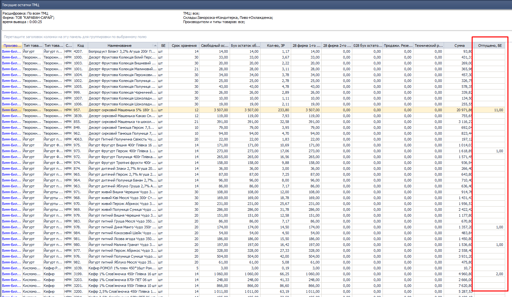

[//]:# (Абросимов)
[//]:# (Смаглий)
## 1588 ЖД Формирование доставки  

*Транспортные логисты*  

Исправлена ошибка, из-за которой у некоторых типов документов информация для экспедитора выводилась только в распределенных документах. Теперь выводится везде: и в распределенных и в нераспределенных для всех типов документов.
[//]:# (Смаглий)
## 2265 ЖД Корректировка расходных документов в статусе передан в ТО  
*Операторы*  

Добавлен механизм распределения весового товара по расходным документам в одну РТТ в одном автомобиле - "Калькулятор распределения веса".  
Оператор вносит **весь вес** указанный в НДК в первый из расходных документов, который ему попадается. Обратите внимание, это важно - вносится **ВЕСЬ ВЕС**, который указан в НДК, так как в НДК все строки с одним товаром объединены в одну и товар собирается одной общей партией на всю РТТ, без разбивки по расходным документам.

После ввода веса, если **в этом автомобиле** (в этой же ходке) на **эту РТТ** с **этим товаром** есть еще расходные документы - появится окно для распределения общего веса по расходным документам:  
  
*рис.1*  
В настройках (**F2** в журнале документов) задается параметр в %, при достижении которого разница между "К-во из РН/АКЦ РН" и "К-во факт" подсвечивается красным:  

  
*рис.2*  

Если изначально внесенное из НДК значение не соответствует сумме распределенных значений, то при попытке сохранения будет выдано предупреждение:  

  
*рис.3*  

Калькулятор не запрещает каких-либо действий, ничего не блокирует. Только лишь облегчает заполнение данных и предупреждает о потенциально возможной ошибке.

Для случаев, когда нет повторений номенклатуры - процесс не изменился, все происходит как и прежде, без калькулятора. Единственное новшество - так же, как и в калькуляторе будет срабатывать красная подсветка, если разница в процентах между фактическим и усредненнымм весом более установленного параметра:  

  
*рис.4*  

[//]:# (Смаглий)
## 1315 ОТЧ Остатки ТМЦ  
*Бренд-менеджеры, Кладовщики, Заведующие складами*  

В отчет добавлен столбец "Отгружено, БЕ". В столбце отображается суммарное количество ТМЦ по расходным документам с датой завтра и позже.

  
*рис.5*  

При двойном клике по значению в этом столбце открывается список документов, формирующих это количество:  

  
*рис.6*  

При клике на строку можно открыть соответствующий документ.  

[//]:# (Смаглий)
## 2276 ОТЧ ЗП Склада, 2292 СПР Стоимость работы клада    
*Заведующие складами, руководитель филиала*  
- Добавлен новый показатель - количество собранных заводских расфасовок в нормах расхода.  

Бертся количество БЕ в строке НДК, делтся на значение ЗР из карточки товара в гриде "Норма расхода", делится на количество человек, собравших документ.  

Рассмотрим на конкретном примере.
  
*рис.7*  

Смотрим в карточку каждого присутствующего в НДК товара, берем оттуда коэффициенты нормы расхода:  

|Код|Отпущено БЕ|Коэф|Отпущено ЗР|
|-|-|-|-|
|288|3,5|3,5|1|
|291|1,3|1,3|1|
|390|3|3|1|
|510|3|3|1|  
|Итого по НДК:|||4|  
Пусть за 100 ЗР у нас для этой зоны установлена цена 1 грн. Тогда за сборку этой НДК будет начислено (4/100)х1 грн = 0,04 грн, что и видим на скриншоте.  

Рассмотрим пример сложнее.  
  
*рис.8*  

|Код|Отпущено БЕ|Коэф|Отпущено ЗР|
|-|-|-|-|
|1345|2|20|0,1|
|1369|5|32|0,15625|
|771|1|12|0,08333|
|765|2|20|0,1|
|804|2|20|0,1|  
|Итого по НДК:|||0,53958|  
Округленно 0,54.
Так как эту НДК собирали 2 человека, то каждому из них засчитается по 0,27 ЗР, что по цене например 100 грн за 100 ЗР составит (0,27/100)х100 грн =0,27 грн:  
  
*рис.9*  

- Тарифы для строк, как сборка, так и проверка, теперь считаются не за одну строку, а за 100, что позволяет более точно настраивать тарифы.  

- В **2292 СПР Стоимость работы клада** переработан дизайн, добавлены новые параметры.
 
