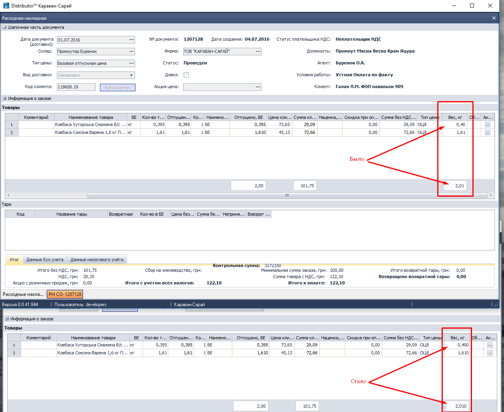
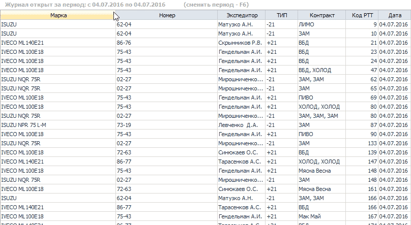
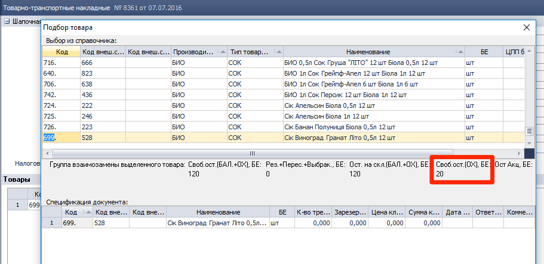
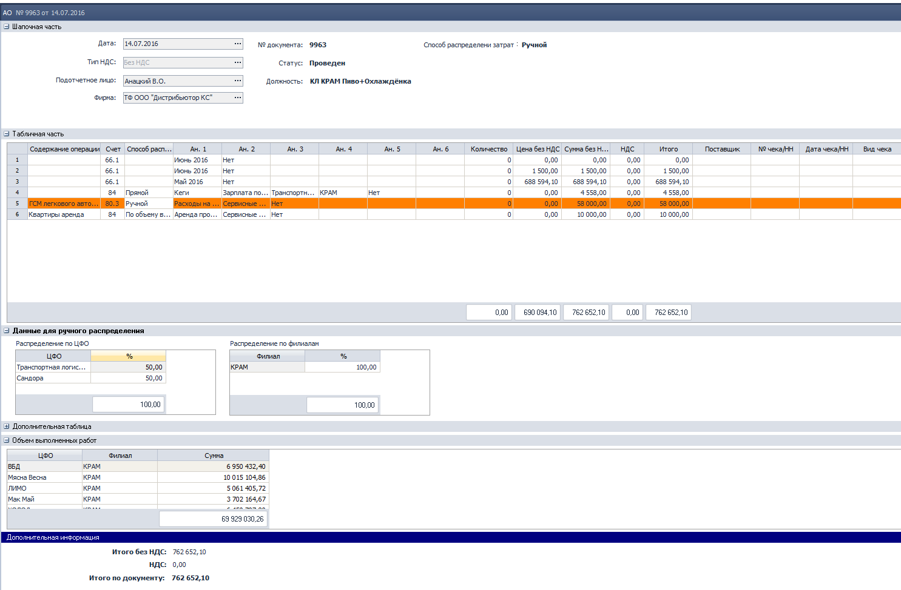

[//]:# (Смаглий)
## 1588 ЖД Формирование доставки.  

*Транспортные логисты*  

Исправлена ошибка, из-за которой у некоторых типов документов информация для экспедитора выводилась только в распределенных документах. Теперь выводится везде: и в распределенных и в нераспределенных для всех типов документов.  

----------------
[//]:# (Смаглий)
## 2265 ЖД Корректировка расходных документов в статусе передан в ТО  
*Операторы*  

Добавлен механизм распределения весового товара по расходным документам в одну РТТ в одном автомобиле - "Калькулятор распределения веса".  
Оператор вносит **весь вес** указанный в НДК в первый из расходных документов, который ему попадается. Обратите внимание, это важно - вносится **ВЕСЬ ВЕС**, который указан в НДК, так как в НДК все строки с одним товаром объединены в одну строку, товар собирается одной общей партией на всю РТТ, без разбивки по расходным документам.

После ввода веса, если **в этом автомобиле** (в этой же ходке) на **эту РТТ** с **этим товаром** есть еще расходные документы - появится окно для распределения общего веса по расходным документам:  
  
*рис.1*  
В настройках (**F2** в журнале документов) задается параметр в %, при достижении которого разница между "К-во из РН/АКЦ РН" и "К-во факт" подсвечивается красным:  

  
*рис.2*  

Если изначально внесенное из НДК значение не соответствует сумме распределенных значений, то при попытке сохранения будет выдано предупреждение:  

  
*рис.3*  

Калькулятор **не запрещает** каких-либо действий, ничего не блокирует. Только лишь облегчает заполнение данных и предупреждает о потенциально возможной ошибке.

Для случаев, когда нет повторений номенклатуры - процесс не изменился, все происходит как и прежде, без калькулятора. Единственное новшество - так же, как и в калькуляторе будет срабатывать красная подсветка, если разница в процентах между фактическим и усредненнымм весом более установленного параметра:  

  
*рис.4*  

----------------
[//]:# (Смаглий)
## 2246 ОТЧ ЗП экспедиции  
*Транспортные логисты, руководитель филиала*  

Отчет оптимизирован, выводится не дольше 2 минут.  

----------------
[//]:# (Смаглий)
## 2276 ОТЧ ЗП склада   
*Заведующие складами, руководитель филиала*  
Ранее, для НДК, у которых не заполнены "Собрал" и "Проверил", не рассчитывались количественные показатели по бонусам. Например количество строк, вес и т. д. Соответственно не рассчитывались и денежные показатели.  
Теперь количественные и денежные показатели рассчитываются для всех документов.

----------------
[//]:# (Смаглий)
## 1315 ОТЧ Остатки ТМЦ  
*Бренд-менеджеры, Кладовщики, Заведующие складами*  

В отчет добавлен столбец "Отгружено, БЕ". В столбце отображается суммарное количество ТМЦ по расходным документам с датой завтра и позже.

  
*рис.5*  

При двойном клике по значению в этом столбце открывается список документов, формирующих это количество:  

  
*рис.6*  

При клике на строку можно открыть соответствующий документ.  

Во всех формах улучшен интерфейс.  

----------------
[//]:# (Смаглий)
## 0200 ЖД Расходные накладные  
*Кладовщики, Операторы*  
В расходных накладных для поля "Вес, кг" увеличено количество знаков после запятой до трех:    
*рис.7*  

-------------------
[//]:# (Абросимов)
## 1450 СПР Параметры выгрузки/загрузки данных из КПК, 1474 ФН Экспорт/Импорт данных из SoftServe
*Системные Администраторы*

- Добавлен новый протокол обмена данными для МК "Юбилейный" - **Юбилейный FTP** только экспорт.

Обмен осуществляется через FTP сервер предприятия ООО МК «Юбилейный» (поставщик)
Параметры выгрузки задаются стандартно в 1450

  
*рис.8*  

В закладке ТМЦ, необходимо выбрать производителей, по товарам которых должны осуществлятся выгрузки приходов продаж и возвратов.
  
*рис.9*

В закладке соответствие типов цен можно настроить таблицу подмен цен, чтобы в информации о продажах показывать отгрузки не по ценам из документа **РН**, а по фиктивным ценам. Это полезно, если необходимо скрыть наценку от производителя.
  
*рис.10*

----------------
[//]:# (Абросимов)
## 0968 СПР УР с покупателем.
*Отдел продаж, SV, НОП, Опреаторы, Бренд-менеджеры*

- Исправлена ошибка, которая проявлялась в редких случаях, при создании новых **УР**.
На всех базах существовало небольшое количество УР (десятки), у которых номер до точки не совпадало номеру с СПД. Это противоречие общей концепции, порождало такую ошибку. Нумерация проблемных **УР** приведена в соответствие.

----------------
[//]:# (Абросимов)
## 0200 ЖД Расходные накладные.
*Отдел продаж, операторы*
- В печатной форме **Расходная накладная на русском языке (без НДС) (WIN)** в шапке убрана надпись о покупке тары у населения (на украинском языке). Эта надпись появлялась при положительной сумме налога на хмелеводство в документе **РН**. Такой критерий определения  отображения  надписи в шапке является неправильным, а в Украине уже и не актуальным, поэтому он отключен. Если эта надпись будет кем-то востребована, то в будущих версиях программы её можно будет реализовать отдельной настройкой.

  
*рис.11*

----------------
[//]:# (Абросимов)
## 2176 ОТЧ Гермес. Контроль посещений ТА
*SV, НОП, Логистика*

- В настройках отчёта устранена некорректная работа фильтров:

  
*рис.12*

----------------
[//]:# (Абросимов)

## Общий интерфейс таблиц
*Все пользователи*

- Во всех таблицах работа фильтров стала более корректной. Если необходимо задать фильтрацию по нескольким столбцам, то при выборе значений в последующих фильтрах будут отображаться только те, которые остались после применения предыдущих фильтров.

  
*рис.13*

----------------
[//]:# (Абросимов)
## 2020 ЖД Товарно-транспортные накладные
*Отдел продаж, Бухгалтерия*

- В форме подбора товара исправлен счетчик свободных остатков по **СОХ**. Ранее, при резервировании товара документами ТТН на СОХ, отображаемый свободный остаток не уменьшался, и можно было резервированием *"увести склад в минус"*. Теперь в форме подбора товара в отображаются реальные свободные остатки по СОХ, т.е. вычитается количество количество по счету **010.3 (Товар на резерве по складу ответ.хранения)**.

  
*рис.14*

----------------
[//]:# (Абросимов)

## 2143 ОТЧ OLAP отчет по продажам
 *Топ-менеджмент, Отдел-продаж, Бренд-менеджеры, SV, НОП*

 - В настройках отчета при выборе в качестве данных - **% наценки СРЦ** или **РЦП**, автоматически выбираются величины участвующие в подсчете процента. В данном случае
 **наценка** и **себестоимость**. Теперь реализована возможность  отключения (снятия чекбокса отображения данных) со вспомогательной расчетной величины, при этом автоматическое включение при выборе процентов оставлено. Чтобы пользователь понимал соотношение каких величин он увидит в процентах.

  
*рис.15*

- Изменилась методика расчета данных **Доход**
Теперь доход считается по формуле:  

    ***Доход грн,без НДС=Торговая наценка СРЦ,грн без НДС +Логистические услуги грн,без НДС +Компенсация грн,без НДС -100*Сумма замен+возврат грн,с ндс /(100+НДС)***

- Изменилась методика расчета **Группы ценообразования (ГЦО)**, данные теперь берутся из документа **Прайс-лист** актуального в период движения товара.

----------------
[//]:# (Абросимов)
## 0925 ЖД Перемещение ТМЦ
*Бухгалтерия*

- Исправлена ошибка пересчета итоговых сумм в документе при удалении строки с ТМЦ.
- Документы с вышеописанными расхождениями на всех базах приведены в соответствие.  

---------  
[//]:# (Семенова)
## 1721 ЖД Авансовый отчет

В Авансовый отчет добавлены алгоритмы распределение затрат по ЦФО и Филиалам для корректного формирования отчета о финансовых результатах.

*Действия Пользователя*

1.Создать авансовый отчет. 

2.Заполнить табличную часть, если операция затратная - выбран субсчет 8 или 9 класса, Пользователь должен указать способ распределения выбором из значений:

*Прямой* - Пользователь задает все аналитики счета (действующий алгоритм);

*По объему выполненных работ (ОВР)* - Пользователь выбирает этот Способ, если не может точно определить к какому ЦФО оносятся затраты или затраты относятся ко всем ЦФО.
При этом  Система на основании отчета OLAP заполняет данные для распределения в одноименном разделе за предыдущий авансовому отчету месяц.
Данные можно корректировать в ручном режиме, например, обнулить данные по ОВР по КРАМ.

*Ручной* - Пользователь выбирает этот Способ, если необходимо распределить затраты более чем на один ЦФО в заданном процентном соотношении.
Пользователь указывает данные для распределения в разделе Данные для ручного распределения.

 3.Провести Авансовый отчет, данные по распределению будут отражены в проводках.

  
*рис.16*  
В существующих документах в статусе Проведен в табличной части, для счетов учета затрат
поле Способ распределения по ЦФО и Филиалу заполнено значением Прямой.

Исправлены ошибки
при корректировке Даты в проведенном документе, при сохранении не изменялась Дата в проводке.

при вводе сумм в выплате по зарплате иногда происходил сбой, сумма не учитывалась ни в проводке ни в подсчете итогов.
