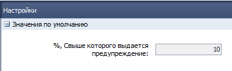

[//]:# (Абросимов)
[//]:# (Смаглий)
## 1588 ЖД Формирование доставки  

*Транспортные логисты*  

Исправлена ошибка, из-за которой у некоторых типов документов информация для экспедитора выводилась только в распределенных документах. Теперь выводится везде: и в распределенных и в нераспределенных для всех типов документов.
[//]:# (Смаглий)
## 2265 ЖД Корректировка расходных документов в статусе передан в ТО  
*Операторы*  

Добавлен механизм распределения весового товара по расходным документам в одну РТТ в одном автомобиле - "Калькулятор распределения веса".  
Оператор вносит **весь вес** указанный в НДК в первый из расходных документов, который ему попадается. Обратите внимание, это важно - вносится **ВЕСЬ ВЕС**, который указан в НДК, так как в НДК все строки с одним товаром объединены в одну и товар собирается одной общей партией на всю РТТ, без разбивки по расходным документам.

После ввода веса, если **в этом автомобиле** (в этой же ходке) на **эту РТТ** с **этим товаром** есть еще расходные документы - появится окно для распределения общего веса по расходным документам:  
  
*рис.1*  
В настройках (**F2** в журнале документов) задается параметр в %, при достижении которого разница между "К-во из РН/АКЦ РН" и "К-во факт" подсвечивается красным:  

  
*рис.2*  

Если изначально внесенное из НДК значение не соответствует сумме распределенных значений, то при попытке сохранения будет выдано предупреждение:  

  
*рис.3*  

Калькулятор не запрещает каких-либо действий, ничего не блокирует. Только лишь облегчает заполнение данных и предупреждает о потенциально возможной ошибке.

Для случаев, когда нет повторений номенклатуры - процесс не изменился, все происходит как и прежде, без калькулятора. Единственное новшество - так же, как и в калькуляторе будет срабатывать красная подсветка, если разница в процентах между фактическим и усредненнымм весом более установленного параметра:  

  
*рис.4*  
