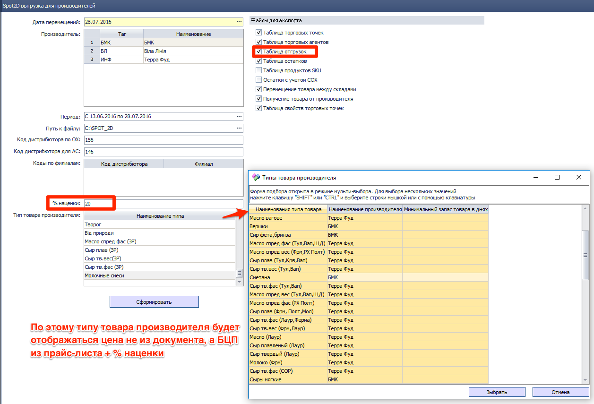
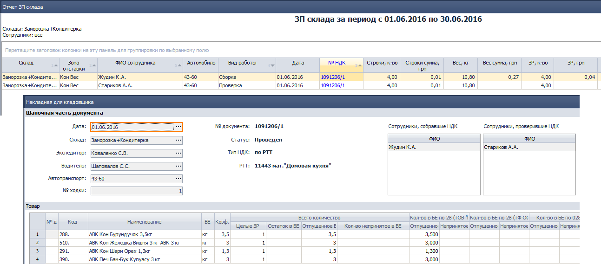
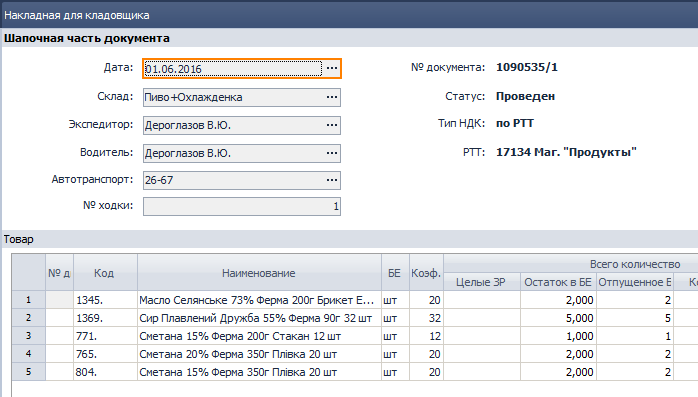
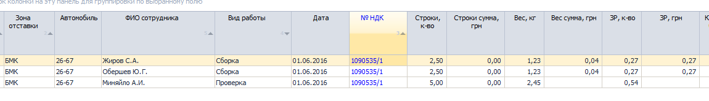
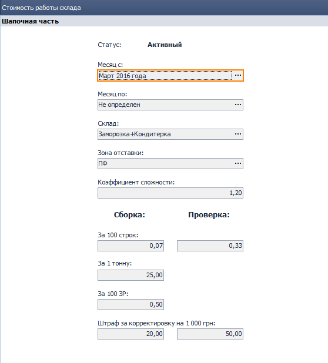

[//]:# (Абросимов)
## 1196 ЖД Акт сверки взаиморасчетов
*Бухгалтерия*

- Исправлена ошибка Access Violations периодически возникающая, когда пользователь из печатной формы сформированного отчета открывал документ на редактирование.
- Исправлены ошибки, возникающие при попытке построить отчет с большим количеством отделов продаж.

---------------
[//]:# (Абросимов)
## 0968 УР с покупателем
*Отдел продаж, Бухгалтерия*

- Расширено количество символов с 10 до 15 в коде  *Условий работы с покупателем*. Из-за существующего ограничения, на некоторых СПД с большим количеством РТТ (около 50ти), невозможно было создать новое *УР с покупателем*.

---------------
[//]:# (Абросимов)
## 1332 ОТЧ Spot2D выгрузка для производителей.
*Отдел продаж, Бренд-менеджеры*

- Реализована возможность подмены отпускной цены при экспорте информации о продажах производителю. Таблица отгрузок, Файл Delivery.

  
*рис.1*  

Пользователю необходимо в нижней таблице задать по какому типу товара производителя будет подменяться цена и указать % наценки от БЦП в актуальном прайс-листе для заполнения фиктивной цены.
- Форма подбора по типу товара производителя теперь наследует фильтрацию по производителям, выбранным в верхней таблице. Также появилась возможность мультивыбора.  

[//]:# (Смаглий)  

## 2276 ОТЧ ЗП Склада, 2292 СПР Стоимость работы Склада    
*Заведующие складами, руководитель филиала*  
- Добавлен новый показатель - количество собранных заводских расфасовок в нормах расхода.  
Бертся количество БЕ в строке НДК, делтся на значение ЗР из карточки товара в таблице "Норма расхода", делится на количество человек, собравших документ.  

Рассмотрим на конкретном примере.
  
*рис.2*  

Смотрим в карточку каждого присутствующего в НДК товара, берем оттуда коэффициенты нормы расхода:  

|Код|Отпущено БЕ|Коэф|Отпущено ЗР|
|-|-|-|-|
|288|3,5|3,5|1|
|291|1,3|1,3|1|
|390|3|3|1|
|510|3|3|1|  
|Итого по НДК:|||4|  
Пусть за 100 ЗР у нас для этой зоны установлена цена 1 грн. Тогда за сборку этой НДК будет начислено (4/100)х1 грн = 0,04 грн, что и видим на скриншоте.  

Рассмотрим пример сложнее.  
  
*рис.3*  

|Код|Отпущено БЕ|Коэф|Отпущено ЗР|
|-|-|-|-|
|1345|2|20|0,1|
|1369|5|32|0,15625|
|771|1|12|0,08333|
|765|2|20|0,1|
|804|2|20|0,1|  
|Итого по НДК:|||0,53958|  
Округленно 0,54.
Так как эту НДК собирали 2 человека, то каждому из них засчитается по 0,27 ЗР, что по цене например 100 грн за 100 ЗР составит (0,27/100)х100 грн =0,27 грн:  
  
*рис.4*  

- Тарифы для строк, как сборка, так и проверка, теперь считаются не за одну строку, а за 100, что позволяет более точно настраивать тарифы.  

- В **2292 СПР Стоимость работы склада** переработан дизайн, добавлены новые параметры:  

  
*рис.5*  

---------------

[//]:# (Смаглий)

## 2244 СПР Стоимость работы экспедитора
*Руководитель филиала, транспортные логисты*  

Компонент переименован в  
**2244 СПР Стоимость работы экспедиторов и водителей**  

  
*Рис.6.*  

Добавлены параметры для водителей:
- Цена за объем выполненной работы в грн (грн за 1 тонну);  
- Цена за РТТ (грн за 1 РТТ).  

Начисление параметров производится абсолютно идентично начислению таких же параметров экспедиторам.  

Так как один и тот же сотрудник может выступать одновременно в роли и водителя и экспедитора, то для таких случаев предусмортен выбор способа расчета начисляемого бонуса за новый параметр. Можно суммировать водительские и экспедиторские бонусы, или  брать только водительские, или только экспедиторские.  

Показатели и начисленные по показателям бонусы можно посмотреть в **2246 ОТЧ ЗП Экспедиторов и водителей**  

**Следует помнить**, что при начислении бонусов учитывается **коэффициент сложности** зоны доставки, который назначается зоне доставки в **1577 СПР Зоны доставки**. При этом применяется максимальный коэффициент ко всем килограммам или РТТ в ходке.  

Допустим, ходка включает в себя доставку по одной зоне с коэффициентом 1, другой зоне с коэффициентом 1,1 и третьей зоне с коэффициентом 1,2. В этом случае все начисленные бонусы за всю ходку (по всем зонам) будут умножены на максимальный коэффициент 1,2.

Начисленные бонусы автоматически подставляются в **1916 ЖД Начисление ЗП на филиале** для сотрудников подразделений с типом распределения затрат "Транспортная логистика"  

---------------
[//]:# (Смаглий)  
## 1916 ЖД Начисление ЗП на филиале  
*Руководитель филиала, транспортные логисты*

Ранее для расчета бонусов для подразделений с типом распределения затрат "**Транспортная логистика**" брались данные только тех документов, в которых была фирма из шапки документа "**Начисление ЗП на филиале**". Это приводило к игнорированию объемов работ, проделанных по документам другой фирмы.  
Сейчас при формировании документа учитывается объем работы по фирмам всей ветки.  

---------------
[//]:# (Смаглий)  
## 0907 СПР Категории товара  
*Отдел продаж*

Если после автоматического рассчета категорий товаров была вручную изменена категория товара, то измененное значение будет выделено красным цветом шрифта:  

*Рис.7.*  
Переработан интерфейс.  

*Рис.8.*  
Шапочная часть теперь сворачивается:  

*Рис.9.*    
Улучшена печатная форма. Уменьшено место, занимаемое шапкой, увеличено место для наименования товара, другие мелкие улучшения:  

*Рис.10.*  

---------------
[//]:# (Смаглий)  
## 1375 ЖД Накладные для кладовщика  
*Заведующие складами, операторы*  

В НДК, при клике по номеру документа в "Исходные РН для создания НДК" будет открыт соответствующий документ:

*Рис.11.*  
  
*Рис.12.*  

---------------
[//]:# (Смаглий)  
## 0600 ЖД Возврат тары от клиентов  
*Отдел продаж, бухгалтерия, транспортные логисты, заведующие складами*  

Теперь документ с тегом ВТРК попадает в нераспределенные документы в **1588 ЖД Формирование доставки**. Из Формирования доставки в ВТРК вносится информация в новый раздел документа "Информация о доставке":

*Рис.13.*  
Документ распределяется по автомобилям аналогично всем нераспределенным документам.
При проведении документа задолженность по таре уменьшается у клиента и увеличивается у экспедитора (переносится с клиента на экспедитора).  

Особенности поведения документа в **1588 ЖД Формирование доставки**.  

Для документов с тегом ВТРК поля в ФД заполняются на основании РТТ, указанной в ВТРК.  
Для распределенных документов вес и объем тары в ВТРК игнорируются при расчете значений в колонках:  

Кол-во РН  
Тоннаж, факт  
Тоннаж, % заполнения  
Объем, факт  
Объем, % заполнения  
Сумма РН.  

ВТРК принимает участие в расчете значений в поле Кол-во РТТ - аналогично РН. То есть подсчитывается количество уникальных РТТ во всех документах.  

Что бы старые проведенные документы не выпали в нераспределенные в Формировании доставки, все документы ВТРК с датой проведения раньше 03.08.2016 будут автоматически распределены в специально созданном документе "Формирование доставки" от 03.08.2016 по автомобилям. По одному автомобилю на каждого экспедитора.  
С этим документом "Формирование доставки" ничего делать не нужно, он создан с одной лишь целью - убрать старые документы из нераспределенных в ФД.

## 1588 ЖД Формирование доставки  
*Транспортные логисты*

Переработана печатная форма задания экспедитору.  
- объединены ячейки с однородной информацией - форма стала более удобочитаемой;  
- добавлено отображение документов с тегом ВТРК;
- добавлен столбец "ТЕГ документа";  
- информация для экспедитора и время доставки объединены;  
- другие мелкие улучшения.
---------------
[//]:# (Смаглий)  
## 2153 ЖД Акционные накладные  
*Отдел продаж, управляющие складами*  

Для Акционных накладных с доставкой самовывозом запрещена печать из статуса "Черновик".   

---------------
[//]:# (Абросимов - задача, Смаглий - тестирование)
## Общесистемные компоненты  
Теперь в заголовке окна документа выводится следующая информация:  

Тип документа  
Тег документа  
Номер документа  
Дата документа:  
  
*Рис.14.*  

**Ctr+Tab**  

При переключении между открытыми окнами по **Ctr+Tab** расширена подаваемая в окне переключения информация.  
Теперь для открытых элементов справочника выводится кроме тега документа еще и его номер. Например:  
  
*Рис.15.*  

---------------

[//]:# (Смаглий)
## 0327 ЖД Заказы на поставку  
*Бренд-менеджеры*  
- Добавлено примечание. Отображается как в журнале, так и в самом документе. Текстовое, ни на что не влияющее поле. Нужно для удобства пользователей при работе с большим количеством заказов.  
- Поле "Дата" документа закрыто для редактирования и переименовано в "Дата создания документа".  
- В табличной части по умолчанию выводятся столбцы в такой последовательности после Наименования:  
Заказ  
Ост ДН  
Зап план  
НЗ
  
*Рис.16.*  
  
*Рис.17.*
---------------  
[//]:# (Семенова)  

## 1919 ЖД Расчет ЗП в ЦО
*Бухгалтер *

**Обработка: **

На базе Караван-Сарай выполнена обработка документов за период 12/2015-03/2016 в статусе Проведен. В Табличной части обновлены значения поля "Вид деятельности" по связке Должность-Вид деятельности.

**Зачем?**

Для корректных данных в Отчете о Финансовых результатах за 2016г.

-------------------
[//]:# (Семенова)  
## Системные настройки

*Главный бухгалтер *

**Исправлена ошибка**

Не отображались множественные значения для параметров. Например, перечень пользователей, которых необходимо уведомлять об отсутствии договора Мат. ответственности по Складу.

-------------------
[//]:# (Семенова)  
## 0925 ЖД Перемещения ТМЦ

*Бухгалтер*

**Исправлена ошибка**

В Перемещении внутри филиала (между Складами) можно было выбрать одинаковое значение в полях Склад-отправитель и Склад-получатель. Проверка выполнялась, но позволяла сохранить неправильные значения.  

------------------------------  

## 1691 ЖД Банковские выписки(ЦО)

*Бухгалтер*

**Исправлена ошибка**

При распределении оплат размер поля УР с Клиентом превышал заданный размер.  

-------------------------------  

## 0994 ЖД Таксировка

*Бухгалтер *

**Внесены изменения:**  

В Таксировку перенесены Настройки, открываются при вызове **F2**:  

  
*Рис.18.*

**Настройки параметров**  

Пользователь в разрезе Фирм задает используемые параметры в Таксировке. 
Реализована возможность ввода значений одного параметра по нескольким Фирмам.

Нельзя вводить дублирующиеся значения параметра по одной Фирме.

Установлен приоритет:  

- если по Фирме задан параметр, применять его; 
- если Фирма=Любое значение - применять параметр для всех Фирм;
- если есть параметр заданный по Фирме и для любого значения - применять параметр ко всем Фирмам, за исключение заданной.
