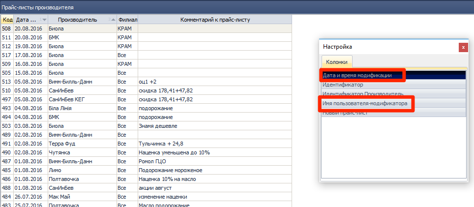
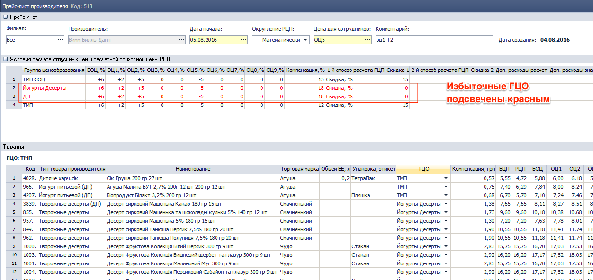
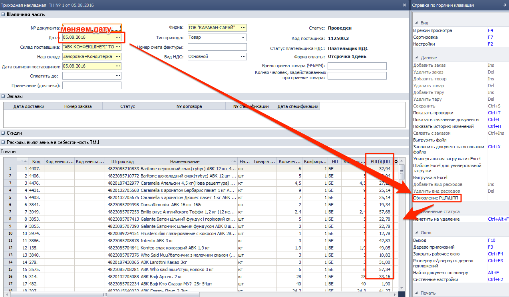

[//]:# (Абросимов)

## Поиск в строке контекстного меню.
*Все пользователи*

- Исправлена ошибка, возникающая при попытке поиска Ctrl+F по контекстному меню.

----------------
[//]:# (Абросимов)
## 0704 СПР Прайс-листы производителя.
*Отдел продаж, Бренд-менеджеры*

- Прайс-листам, как и все элементам справочников, теперь присваиваются коды. Код можно увидеть как в журнале, так и непосредственно в заголовке окна самого прайс-листа.
- Из журнала исчез столбец **Дата по**

- В Журнале документов столбец  **Филиал**, а также появилась возможность отображать скрытые столбцы:
  - Дата модификации
  - Имя пользователя -модификатора

    
  *рис.1*  
Таким образом проще отследить какие-либо изменения в документе

- Карточка документа избавилась от избыточности столбцов в табличной части **Товары**, также вернулась подсветка всей строки.
- Добавлена проверка на избыточность ГЦО:
*Все ГЦО, задействованные в прайс-листе должны содержать уникальные методы расчета, и присвоены хотя бы одной ТМЦ*

  
*рис.2*  
- Исправлены мелкие недочеты, оптимизирован интерфейс и скорость работы.

Обо всех изменениях можно прочесть в обновленном описании компонента [**0704 СПР Прайс-листы  производителя**](https://idistributor.gitbooks.io/distributor/content/Description%20of%20the%20components/0704/0704_PRICE2_LIST.html)

----------------------
[//]:# (Абросимов)
## 0916 СПР Товары
*Бренд-менеджеры*

- Добавлена проверка на остатки при переводе ТМЦ в статус пассивный. По всем фирмам, местам хранения (склады, молы) и счетам 28.1.1, 28.1.2, 028.1, 028.2, 010.1, 010.3-010.6 в случае если хотя-бы одно из значений <>0, выдается предупреждающее сообщение в диалоговом окне:

*"По данному ТМЦ есть остатки, на ...
{ №счета, МОЛ(место хранения), количество }
вы уверены что хотите перевести его в статус пассивный?"*

----------------------
[//]:# (Абросимов)
## 2143 ОТЧ OLAP отчет по продажам
*Отдел продаж, Бренд-менеджеры*

Изменены методы расчета данных по документам **Акционные накладные**:

1. **Сумма реализации - возврат с НДС** теперь всегда будет нулевая.

2. **Себестоимость СРЦ, без НДС** рассчитывается следующим образом: определяем по строке документа цену ТМЦ в СРЦ (актуальную на дату документа РН АКЦ) и умножаем на количество ТМЦ по строке.

3. **Торговая Наценка СРЦ =** (Сумма реализации - возврат, без НДС)- Себестоимость СРЦ, без НДС.  
т.е.**= - Себестоимость СРЦ, без НДС (со знаком минус)**

4. **% наценки СРЦ** - всегда будет **-100%**.

5. **Себестоимость РЦП, без НДС**: сумма по строке документа в РЦП без НДС

6. **Торговая Наценка РЦП=**(Сумма реализации-возврат)- Себестоимость РЦП, без НДС
т.е. **=- Себестоимость РЦП, без НДС (со знаком минус)**
7. **% наценки РЦП** - всегда будет **-100%**.

8. **Компенсация** - для каждой ТМЦ в строке документа берется значение Компенсация из прайс-листа, актуального на дату документа и считается по формуле: **Компенсация по строке документа:= количество отпущенного ТМЦ (БЕ) * Компенсация по ТМЦ из Прайс-Листа**

9. **Объем выполненных работ, грн** теперь считается в ценах экспедитора.

10. **Недовыполнение заявок, БЕ** = количество требуемое БЕ - Колв-во БЕ (все берется из строки документа).

11. **Недовыполнение заявок, грн** = Недовыполнение заявок,БЕ * цена экспедитора (данные из строки документа).

12. По измерению **Документ** теперь все чекбоксы (галочки) включены.

----------------------
[//]:# (Абросимов)
## 0328 ЖД Приходные накладные.
*Отдел продаж, Бренд-менеджеры, Операторы*

- При сохранении документа добавлена проверка на задвоение строк, нельзя чтобы в одном документе было 2 и более строки с одним ТМЦ.
- Исправлена неработающая кнопка в в правом контекстном меню **Обновление РЦП/ЦПП**  

  
*рис.3*

----------------------
[//]:# (Абросимов)
## 1450 СПР Параметры выгрузки/загрузки данных из КПК, 1474 ФН Экспорт/Импорт данных из SoftServe
*Отдел продаж, Бренд-менеджеры, Операторы*

- Для версии ПО **Юбилейный FTP**, значения веса теперь выгружаются в кг, что соответсвует требованиям представителей МК "Юбилейный".

----------------------
[//]:# (Абросимов)
## 1229 ОТЧ Печать остатков и прайс-листов
*Отдел продаж, Бренд-менеджеры, Операторы*

- Исправлена ошибка в печатной форме, связанная с некорректным подсчетом итогов по группам с типами товаров дистрибьютора. Теперь количество **SKU** и **SKU ЗС** отображается корректно. 
