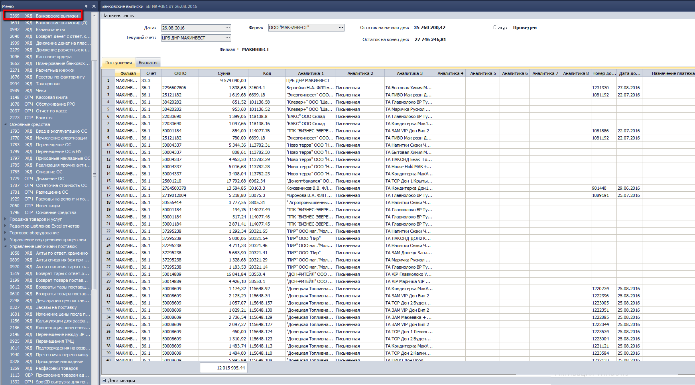
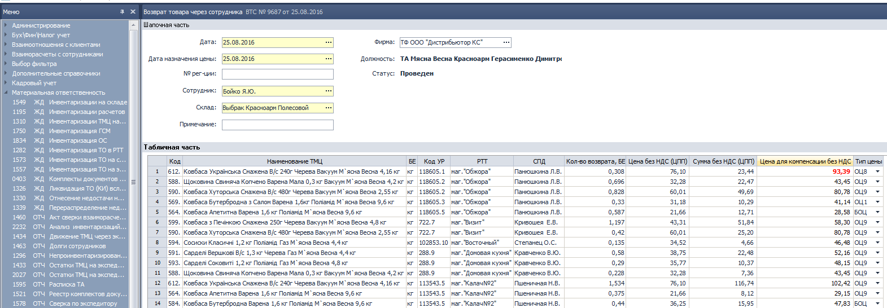
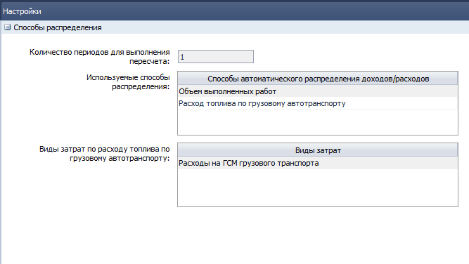
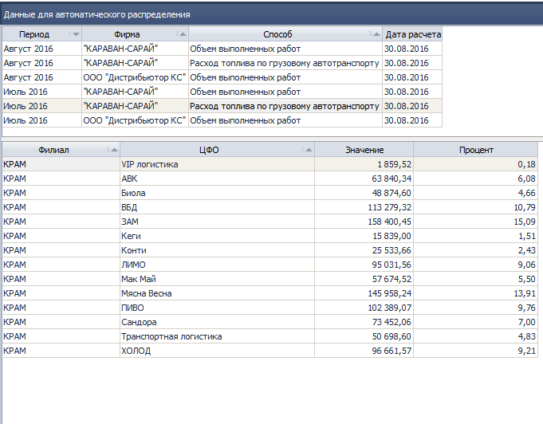

[//]:# (Абросимов)
## 0704 СПР Прайс-листы производителя.
*Отдел продаж, Бренд-менеджеры*

- Прайс-листам, как и все элементам справочников, теперь присваиваются коды. Код можно увидеть как в журнале, так и непосредственно в заголовке окна самого прайс-листа.
- Из журнала исчез столбец **Дата по**.

- В Журнале документов добавлен столбец  **Филиал**, а также появилась возможность отображать скрытые столбцы:
  - Дата модификации
  - Имя пользователя -модификатора

    
  *рис.1*  
Таким образом проще отследить какие-либо изменения в документе.

- Карточка документа избавилась от избыточности столбцов в табличной части **Товары**, также вернулась подсветка всей строки.
- Добавлена проверка на избыточность ГЦО:
*Все ГЦО, задействованные в прайс-листе должны содержать уникальные методы расчета, и присвоены хотя бы одной ТМЦ*

  
*рис.2*  
- Исправлены мелкие недочеты, оптимизирован интерфейс и скорость работы.

Обо всех изменениях можно прочесть в обновленном описании компонента [**0704 СПР Прайс-листы  производителя**](https://idistributor.gitbooks.io/distributor/content/Description%20of%20the%20components/0704/0704_PRICE2_LIST.html)

----------------------
[//]:# (Абросимов)
## 0916 СПР Товары
*Бренд-менеджеры*

- Добавлена проверка на остатки при переводе ТМЦ в статус пассивный. По всем фирмам, местам хранения (склады, молы) и счетам 28.1.1, 28.1.2, 028.1, 028.2, 010.1, 010.3-010.6 в случае если хотя-бы одно из значений <>0, выдается предупреждающее сообщение в диалоговом окне:

*"По данному ТМЦ есть остатки, на ...
{ №счета, МОЛ(место хранения), количество }
вы уверены что хотите перевести его в статус пассивный?"*

----------------------
[//]:# (Абросимов)
## 2143 ОТЧ OLAP отчет по продажам
*Отдел продаж, Бренд-менеджеры*

Изменены методы расчета данных по документам **Акционные накладные**:

1. **Сумма реализации - возврат с НДС** теперь всегда будет нулевая.

2. **Себестоимость СРЦ, без НДС** рассчитывается следующим образом: определяем по строке документа цену ТМЦ в СРЦ (актуальную на дату документа РН АКЦ) и умножаем на количество ТМЦ по строке.

3. **Торговая Наценка СРЦ =** (Сумма реализации - возврат, без НДС)- Себестоимость СРЦ, без НДС.  
т.е.**= - Себестоимость СРЦ, без НДС (со знаком минус)**

4. **% наценки СРЦ** - всегда будет **-100%**.

5. **Себестоимость РЦП, без НДС**: сумма по строке документа в РЦП без НДС

6. **Торговая Наценка РЦП=**(Сумма реализации-возврат)- Себестоимость РЦП, без НДС
т.е. **=- Себестоимость РЦП, без НДС (со знаком минус)**
7. **% наценки РЦП** - всегда будет **-100%**.

8. **Компенсация** - для каждой ТМЦ в строке документа берется значение Компенсация из прайс-листа, актуального на дату документа и считается по формуле: **Компенсация по строке документа:= количество отпущенного ТМЦ (БЕ) * Компенсация по ТМЦ из Прайс-Листа**

9. **Объем выполненных работ, грн** теперь считается в ценах экспедитора.

10. **Недовыполнение заявок, БЕ** = количество требуемое БЕ - Колв-во БЕ (все берется из строки документа).

11. **Недовыполнение заявок, грн** = Недовыполнение заявок,БЕ * цена экспедитора (данные из строки документа).

12. По измерению **Документ** теперь все чекбоксы (галочки) включены.

----------------------
[//]:# (Абросимов)
## 0328 ЖД Приходные накладные.
*Отдел продаж, Бренд-менеджеры, Операторы*

- При сохранении документа добавлена проверка на задвоение строк, нельзя чтобы в одном документе было 2 и более строки с одним ТМЦ.
- Исправлена неработающая кнопка в в правом контекстном меню **Обновление РЦП/ЦПП**  

  
*рис.3*

----------------------
[//]:# (Абросимов)
## 1450 СПР Параметры выгрузки/загрузки данных из КПК, 1474 ФН Экспорт/Импорт данных из SoftServe
*Отдел продаж, Бренд-менеджеры, Операторы*

- Для версии ПО **Юбилейный FTP**, значения веса теперь выгружаются в кг, что соответсвует требованиям представителей МК "Юбилейный".

----------------------
[//]:# (Абросимов)
## 1229 ОТЧ Печать остатков и прайс-листов
*Отдел продаж, Бренд-менеджеры, Операторы*

- Исправлена ошибка в печатной форме, связанная с некорректным подсчетом итогов по группам с типами товаров дистрибьютора. Теперь количество **SKU** и **SKU ЗС** отображается корректно.

-------------

## 1721 ЖД Авансовые отчёты
*Бухгалтер*

**Исправлены ошибки в печатной форме**:
-   В ПФ отображались данные из проводок с распределение, а не данные из табличной части;
-   уменьшены размеры таблиц до ширины формата А4 при выгрузке в Excel;
-   оптимизировано время вывода до 5сек.

-------------
## 1880 ЖД Прочие начисления (Больничные по беременности и родам)
*Бухгалтер по зарплате*

**Исправлена ошибка в расчете**

Ранее выплаты по фондам
- Фонд оплаты труда "Премия" 
- Фонд оплаты труда "Компенсация за невыплаченную заработную плату"
- Фонд оплаты труда "Компенсация за неиспользованный отпуск" 
- Фонд оплаты труда "Индексация" 
- Фонд оплаты труда "Выходное пособие"

рассчитывались, исходя из фактически отработанного времени и прибавлялись к сумме по ведомости, это привело к задвоению сумм в расчете средней зарплаты в больничном, так как данные брались и из ведомости и из дополнительного расчета.

-------------
## 1963 ОТЧ Выгрузка данных для налоговых отчетов и отчетов в ПФУ
*Бухгалтер по зарплате*

Добавлены **новые сценарии отчетов**:
- Декларация по подоходному налогу по кассовому методу (Регион) в xml-файл;
- Данные для отчета по ЕВ (Регион) в xml-файл.

Изменения необходимы для подачи отчетности в электронном виде.

-------------

## 2340 ОТЧ Регламентированный отчет по налоговому учету
*Зам. главного бухгалтера*

Внесены изменения:
- в Реестры выданных/полученных документов добавлено **поле "Вид документа"** с заполнением значениями "Накладная" / "Акт".
- добавлен **новый Тип отчета: Декларация с приложениями**.
При выборе этого типа Пользователю отображается Форма декларации и ее приложений для ручного ввода данных. 

-------------
## 2369 ЖД Банковские выписки (новый компонент)
*Бухгалтер*

Для оптимизации действий Пользователей и упрощения процесса проведения банковских выписок реализован новый компонент с разными сценариями работы в зависимости структуры компании.

**Суть изменений:**

Если  *компания не имеет филиальную структуру* с помощью одного документа отображаются в учете безналичные поступления и выплаты денежных средств.
Нет необходимости создавать Банковскую выписку ЦО, выгружать ее в другой документ Банковская выписка для формирования проводок.

Для *компаний с филиальной структурой* Банковская выписка имеет иной сценарий использования:
- Документ создается на Филиале с признаком ЦО.
- При его проведении формируются проводки только по строкам со значением поля Филиал = ЦО.
- Затем документ выгружается на остальные Филиалы (признак Выгружен /Не выгружен), для проведения и формирования проводок.

Такая схема оправдана, так как выписка формируется по расчетному счету компании в целом по всем филиалам, а контролировать дебиторскую задолженность должны торговые отделы отдельно по каждому Филиалу.

**Краткое описание:**

Создан новый документ 2369 ЖД Банковские выписки (замена существующих 2-х компонентов 1961 ЖД Банковская выписка в ЦО и 1017 ЖД Банковские выписки).

За основу нового документа взят комп.1961 ЖД Банковская выписка в ЦО:  
- изменены статусы документа на Черновик, Проведен, Помечен на удаление;
- добавлен признак Состояние: Выгружен, Не выгружен;
- добавлены настройки проводок;
- сохранен действующий функционал: выгрузка из Клиент-банка, распределение поступлений, заполнение выплат на основании Планирования платежей;
- удален функционал по факторингу (не используется);
- реализовать разные алгоритмы в зависимости от Системных настроек (Филиальной структура);
- внесены изменения в структуру документа: в шапочной части отображены итоги, добавлена детализация поля, на котором установлен курсор;в табличной части в виде закладок реализованы Поступления и Выплаты с подбитием итогов

*рис.4*

«Старые» документы с помощью Админ. консоли закрыть на редактирование.

 ----------------
## 2170 ЖД Возврат товара через сотрудника
*Бухгалтер*

**Суть изменений:**
сейчас для всех клиентов расчет цены возврата выполняется по БОЦ с учетом НДС.
Цену возможно определить более точно по связке УР Клиента-Тип цены- Прайс лист на Дату из документа.
Расчет цены возврата: данные из прайса + НДС по умолчанию в настройках.                        
**Преимущества:** возврат денег Клиенту не по максимальной цене, а по приближенной в фактической.
**Описание изменений:**
- добавлена функция определение Типа цены из УР Клиента и алгоритм расчета цен из Прайс-листов.
- в табличную часть добавлено поле Тип цены с возможностью корректировки и пересчетом Цены (подсветка красным цветом Цены).

*рис.5*

*Примечание:*
- Для существующих документов Тип Цены заполнен БОЦ.
- Не реализовано отображение Типа цены и ее расчет, если в УР выбран тип цен Спецификация (таких цен нет в Прайс-листе).
- Не выполняется пересчет цен, если сначала полностью заполнена табличная часть, а потом изменена Дата определения цены. Действия Пользователей в таких ситуациях:
в ручном режиме выбрать/перевыбрать тип цены.

-------------
## 1137 СПР Центры финансовой ответственности (ЦФО)
*Бухгалтер *

**Зачем нужны изменения?**
Период действия ЦФО будет использован в универсальном компоненте для распределения доходов/затрат, отнести доходы или расходы можно только на "действующие" ЦФО.
В последствии распределенные доходы и расходы отображаются в Отчете о Финансовых результатах, поэтому период действия ЦФО кратен минимальному периоду формирования отчета (месяц).

**Описание изменений:**
В Карточку ЦФО и список элементов добавлены поля:
- *Период действия с* - обязательное к заполнению,
- *Период действия по* - необязательное поле.

При создании нового ЦФО поле "Период действия с" заполняется текущим месяцем и годом, 
Пользователь может изменить значение поля.

С помощью скрипта заполнены поле "Период действия с" для всех ЦФО месяцем и годом создания элемента.

--------
## 2373 СПР Данные для автоматического распределения
*Бухгалтер*

Данные справочника будут использованы в универсальном компоненте для распределения доходов/затрат.

**Краткое описание:**

Для автоматического распределения доходов/затрат Пользователь может использовать:
- объем выполненных работ (ОВР)
- расход топлива грузового автотранспорта (ГСМ)

С помощью Настроек **Пользователь задает параметры**:

*рис.6*

- *Количество периодов для выполнения пересчета (обновления данных)* - 
за какое количество месяцев ежедневно выполнять расчет (обновление данных), значение по умолчанию = 1 (за предыдущий месяц);
- *Виды затрат по расходу топлива по грузовому автотранспорту* - множественный параметр для выбора одного или нескольких значений из комп.1248 СПР Виды доходов и расходов;
- *Автоматические способы распределения*  - множественный параметр для выбора используемых способов, например, в компании нет своего автотранспорта, нет расхода ГСМ, 
настройка позволит ограничить выбор этого способа в документах. 
Такая реализация позволит без особых сложностей добавить новые способы распределения в будущем.

Данные рассчитываются ежедневно обработкой, при необходимости Пользователь может запустить пересчет в ручном режиме.

**Расчет данных для распределения по ОВР**

Используются данные Отчета OLAP (комп.2143),
сгруппированные по параметрам:
- Тип периода = По дате отгрузки
- Тип отчета =Таблица
- Период = расчетное количество полных месяцев в соответствии с параметром 
(отсчет месяцев начитать с предыдущего текущему месяца);
- Измерения_Фирма = Отображать
- Измерения_Филиал = Отображать
- Измерения_Отдел продаж = Отображать
- Данные_Объем выполненных работ без корректировок, грн., без НДС = Отображать

Если при расчете OLAP произошел сбой (нет данных), данные для распределения по ОВР не обновляются.

**Расчет данных для распределения по ГСМ**

Расход топлива по грузовому автотранспорту рассчитавается на основании проводок:
-   в таблице проводок отобрать проводки с корреспонденцией счетов Дт8\*\* Кт203 и Дт9\*\* Кт203 (\*\* - любой субсчет)
-   за период = расчетное количество полных месяцев в соответствии с параметром
    (отсчет месяцев начитать с предыдущего текущему месяцу)
-   с фильтром Виды затрат = значение из Параметра
-   рассчитать количество списанного ГСМ по каждому наименованию ГСМ с группировкой:
Фирма, Период, Филиал, ЦФО;
-   перевести количественный расход ГСМ в суммарный по формуле:                        
    **Сумма ГСМ = Количество ГСМ * ЦПП_ГСМ**,   
    где ЦПП_ГСМ цена последнего прихода на последнюю дату расчетного периода из Параметров
-   рассчитать суммарный расход по всем наименованиям ГСМ

Результаты отражены в СПР Данные для автоматического распределения, при этом исключены «недействующие» ЦФО.

*рис.7*
