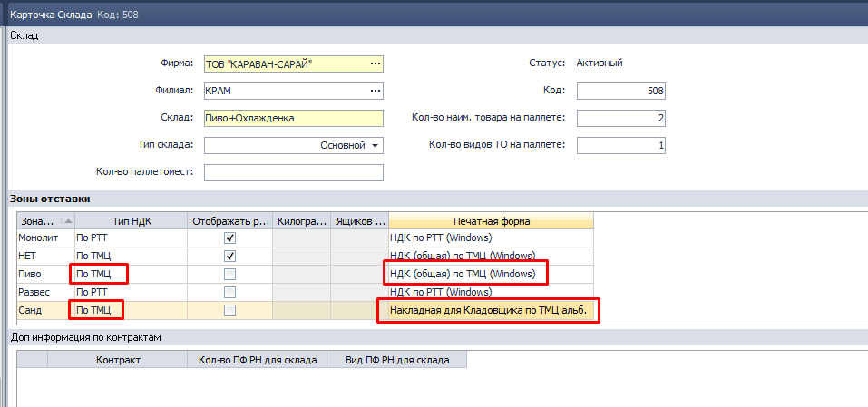
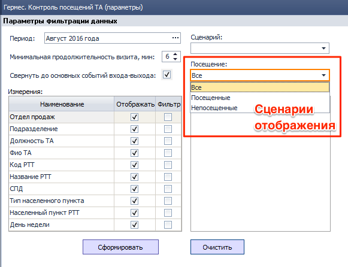
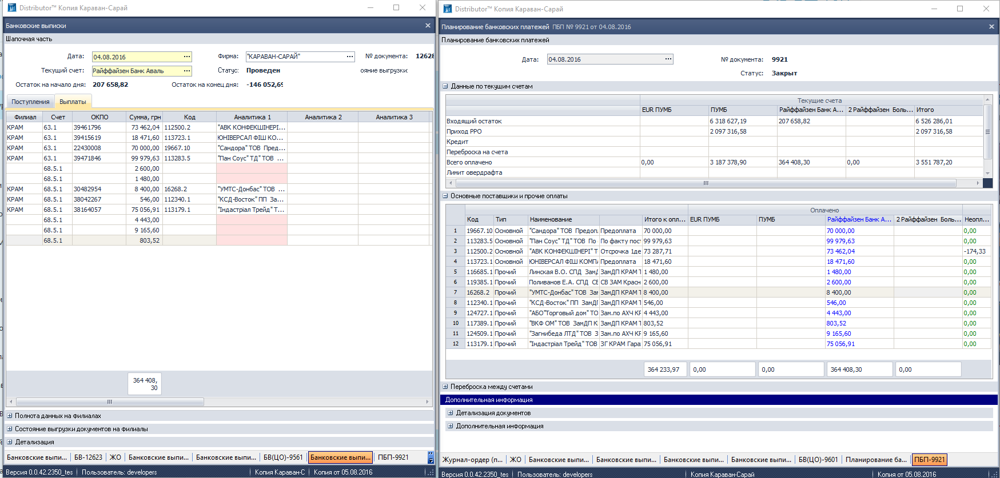
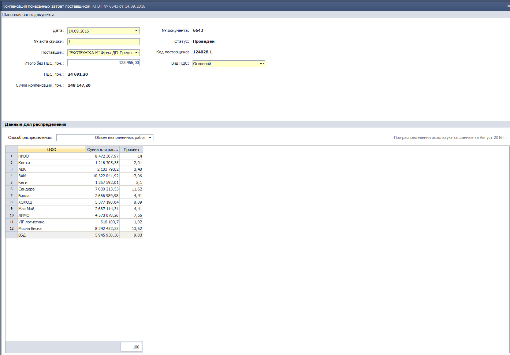

[//]:# (Смаглий)
## 1048 СПР Склады.
- В параметры зоны склада добавлена возможность привязки печатной формы (ПФ).  
Ранее для одного типа НДК можно было задать только одну ПФ и привязка могла быть сделана только программистом.  
Теперь для одного типа НДК в разных зонах могут быть разные ПФ.
  
*рис.1*  

----------
[//]:# (Смаглий)
## 1508 ОТЧ Печать/экспорт пакета документов для склада.
*Операторы, Заведующие складами*  

- Добавлен новый сценарий "Все НДК"  
При выборе этого сценария отбираются все документы НДК, всех типов, с выбранной датой доставки.
При этом используются те печатные формы, которые установлены в **1048 СПР Склады**.  
При нажатии "Печать отмеченных документов" выбранные документы будут распечатаны.  

Если для типа НДК в **1048 СПР Склады** установлена ПФ, которая предполагает объединение нескольких НДК в одну ПФ (например **Накладная для кладовщика по РТТ альб.**), то такая ПФ будет распечатана единожды, несмотря на то, что в перечне документов для печати будут видны все НДК, из которых такая ПФ будет состоять.  

-----------
[//]:# (Смаглий)
## 1588 ЖД Формирование доставки.
*Транспортные логисты, Операторы, Заведующие складами*  

- Исправлена ошибка.
В случае одновременного создания НДК несколькими пользователями из одного документа "Формирование доставки" иногда НДК дублировались.  
Теперь нельзя одновременно редактировать один документ "Формирование доставки". Каждый транспортный логист должен создать свой документ.

-------------
[//]:# (Абросимов)
## Табличные элементы
*Все пользователи*

- Исправлена ошибка с некорректным поведением курсора в табличных элементах, ранее при снятии фильтров или отмене сортировок он мог терять свою позицию.

--------------
[//]:# (Абросимов)
## О702 СПР Спецификации
*Отдел продаж, Бренд-менеджеры*

- В Табличной части **Товары** Появилась возможность одновременного удаления нескольких записей ТМЦ. Для этого над ними нужно произвести групповое выделение и нажать **Del**.
- Исправлены мелкие ошибки в наименованиях полей и горячих клавиш.

----------
[//]:# (Абросимов)
## 1450 СПР Параметры выгрузки/загрузки данных из КПК, 1474 ФН Экспорт/Импорт данных из SoftServe
*Системные Администраторы*

- В инфообмен АВК необходимо внесены изменения согласно требований производителя, а в частности в блок выгрузки ДЗ. Обработка выгрузки данных по ДЗ теперь уметь выгружать данные за интервал по дням. К примеру если интервал выгрузки ДЗ указан с 05.08.2016 по 08.08.2016 ДЗ будет выгружаться за каждый день отдельно.

- В инфообмен с МК "Юбилейный" в соответствие с требованиями производителя внесены незначительные изменения форматов выгружаемых данных.

-------------
[//]:# (Абросимов)
## Экспорт в MS Excel 2016.
*Все пользователи*

- Исправлена ошибка некорректной выгрузки большинства отчетов в MS Excel 2016.

---------------
[//]:# (Абросимов)
## 0328 ЖД Приходные накладные
*Операторы, Бренд-менеджеры*

- Исправлена ошибка, связанная с некорректной проверкой дополнительных расходов при проведении документа.

----------------
[//]:# (Абросимов)
## 2007 ОТЧ Сандора: продажи до точек
*Бренд-менеджеры*

- Исправлена ошибка, приводящая к зависанию приложения и как следствие "битым" excel файлам, при выгрузке отчета за большие периоды. Тестировалось на производителе Сандора, количество строк в файле составило 74 тыс.

[//]:# (Абросимов)

-----------------
## 1292 СПР Маршруты ТА
*Отдел продаж, SV*

- Исправлена ошибка, приводящая к спонтанному "перемещению" РТТ по дням недели, при добавлении новых УР.
- Интерфейс и алгоритмы справочника оптимизированы.

-------------
[//]:# (Абросимов)

## 2176 ОТЧ Гермес. Контроль посещений ТА
*Отдел продаж, SV, НОП*

- Изменена структура хранения истории маршрута в таблице с данными.
- Добавлены сценарии отображения:
  - Посещенные - РТТ, которые были по маршруту и по которым были визиты.
  - Не посещенные - РТТ, которые были по маршруту и по которым не было визитов.
  - Все - все РТТ по маршруту (по умолчанию, как и было ранее)

    
  *рис.3*
- Реализован более корректный фильтр по СПД, результат его работы сводится к отбору РТТ, к которым подвязаны выбранные СПД в условиях работы.
- Итоги отображаются с разделителем групп разрядов.

---------------
[//]:# (Абросимов)
## 2143 ОТЧ OLAP отчет по продажам
*Отдел продаж*

- В данных корректировка изменен знак.
  - Корректировка со знаком минус означает, что нам вернули товар.
  - Корректировка со знаком плюс означает что товара отгружено больше, чем изначально было в расходном документе, или меньше, если речь идет о документах возврата.

  --------
  ## 0983 Приходные накладные ТО ##
*Бухгалтер*

**Исправлена ошибка** при печати ПФ Акт ввода в эксплуатацию всех ТО - программа «зависала» при формировании, печатные формы не отображались.

Оптимизировано время работы – не более 30 сек. на вывод множества печатных форм.

--------------------------

## 2369 ЖД Банковские выписки ##
*Бухгалтер*

**Исправлены ошибки**:

При заполнении раздела Выплаты на основании Планирования платежей через функцию
по некоторым платежам не заполнялись Филиал и Наименование УР поставщика

!  
рис.4

При внесении изменений в проведенный документ при сохранении не обновлялись проводки.

--------------------------

## 0977 ЖД Бухгалтерские справки ##
*Бухгалтер*

**Исправлена ошибка** при заполнении табличной части, для счета 361 не отображались аналитики: Форма договоренности, Форма оплаты, Ответственная должность при выборе УР Клиента. Ошибка возникала только на некоторым контрагентам.

--------------------------

##  1770 ЖД Начисление амортизации ##
*Бухгалтер*

**Исправлена ошибка** при смене месяца.

--------------------------
## 1153 ОТЧ Оборотно-сальдовая ведомость ##
*Бухгалтер*

**Исправлена ошибка** при формировании Отчета с Настройками отображения По счетам верхнего уровня - отображались данные до субсчетов.

--------------------------

## 1673 ЖД Выдача талонов, 1689 ЖД Возврат талонов ##
*Бухгалтер*

**Исправлены ошибки**:

1. При удалении строки в табличной части неправильно рассчитывался текущий остаток (20 rule), такая же ошибка в расчете была в комп.1689 ЖД Возврат талонов.
2. Некорректно работала функция Заполнить документ по подразделению.
**Как должно быть?**

Отбирать Физ. Лицо=Сотрудник, за которым закреплено Транспортное средство

либо есть Договор по использованию личного имущества (авто) в статусе Подписан.
На дату документа Сотрудник находится на должности, относящейся к выбранному Подразделению.

--------------------------

## 2340 ОТЧ Регламентированный отчет по налоговому учету ##
*Зам. главного бухгалтера *

**Доработки Отчета:**
1. Сделан сворачивающимся раздел с реквизитами шапки Отчета.
Пользователю информативно отображаются данные, которые будут выгружены.
2. Изменен формат поля "Сумма" (целое число).
3. Выполнена автоподгонка высоты срок для длинных названии.
4. Реализован расчет строк деклараций по формулам (залиты серым цветом), исходные данные вводит Пользователь.

--------------------------

 ## 2005 ОТЧ Журнал-ордер ##
*Бухгалтер*

**Внесены изменения для ограничения доступа.**

При формировании Отчета применяются привилегии,
позволяющие видеть данные по начислению и выплате заработной платы.
Расширен перечень бухгалтерских счетов и субсчетов, на которые это привилегия распространяется,
ранее это был 661 субсчет, теперь 66, 661, 662, 663, 664 счета.

--------------------------

 ## 0328 ЖД Приходные накладные ##
*Бухгалтер*

**Суть изменений:** в Приходной накладной изменили проверку Фактической цены.

**Было:** если поле РЦП (Расчетная цена прихода) не заполнено, цену сверяли с ЦПП (Цена последнего прихода).
**Стало:** если поле РЦП не заполнено, проверку Фактическая цена ≤ РЦП не выполнять,
Пользователю выводится сообщение: "В Приходной накладной есть товары, по которым нет Расчетной цены прихода, необходимо создать Прайс-лист (комп.0704)".

Изменения в Табличной части Приходной накладной:
- переименованы поле РЦП/ЦПП в РЦП, функция Обновить РЦП/ЦПП;
- изменен алгоритм заполнения: если РЦП отсутствует, поле не заполнять.

--------------------------

## 0200 ЖД Расходные накладные, 2153 ЖД Акционные накладные, 2020 ЖД Товарно-транспортные накладные ##
*Бухгалтер *

Во все документы внесены однотипные изменения:
- переименованы поля "Кол-во возвращенное, БЕ"/"Непринятая тара в БЕ"
в "Корректировка в БЕ(+/-)",
- изменены алгоритмы расчета количества отгруженного товара/ тары: положительное число в поле "Корректировка в БЕ(+/-)" обозначает увеличение отгруженного количества ТМЦ, отрицательное – уменьшение отгруженного количества ТМЦ;
- внесены изменения в настройки проводок для всех компонентов;
- преобразованы значения во всех существующих документах – с помощью скриптов знак изменен на противоположный;
- соответствующие изменения внесены в печатные формы документов и связанные отчеты.

**Зачем нужны изменения?**
Теперь наименование поля более точно отображает его назначение - корректировки количества в соответствии с фактической отгрузкой, как в сторону увеличения, так и в сторону уменьшения.

--------------------------

## Универсальный компонент для распределения доходов и затрат

**Определения:**

*Сумма к распределению* - сумма из документа или строки документа, которую необходимо распределить по ЦФО и Филиалам.

*Сумма для расчета распределения*- любые числовые значения (аналитические данные), на основании которых производится распределение *Суммы к распределению*. Данные могут быть внесены Пользователем либо заполнены автоматически Системой в зависимости от выбранного способа распределения затрат.

*ЦПП* - цена последнего прихода, она же обычная цена ТМЦ, определенная на основании документов по оприходованию ТМЦ.

**Краткое описание:**
компонент является универсальным способом распределения доходов/расходов 
как в целом по документу (Услуги полученные, оказанные), так и построчно по документу (Авансовый отчет, Банковская выписка).
Будет применим в ряде документов, где нет «своих» методов распределения.

**Сценарий использования:**
- Пользователь создает Документ, в котором необходимо распределить доходы или затраты.

- Выбирает **Способ распределения**, один из перечня универсальных способов распределения:

| Способ распределения          | Краткое описание                                                                                                                                                                                                                                                             | Как получить данные для распределения?                  | Практическое применение                                                                                                     |
|-------------------------------|------------------------------------------------------------------------------------------------------------------------------------------------------------------------------------------------------------------------------------------------------------------------------|---------------------------------------------------------|-----------------------------------------------------------------------------------------------------------------------------|
| Ручной                        | Распределить доходы или расходы по ЦФО/Филиалам по заданному Пользователем соотношению. При построчном распределении у каждой строки свои данные                                                                                                                             | Ручной ввод числовых значений для расчета распределения | В любом компоненте, где есть «свои» данные для распределения                                                                |
| Объем выполненных работ (ОВР) | определяется ОВР за заданный в параметрах период, распределить доходы/расходы в полученном % соотношении к итоговым данным                                                                                                                                                   | Рассчитывает Система на основании Отчета OLAP           | необходимо распределить на всех, например, расходы/доходы ЦО, общие затраты Филиала                                         |
| ГСМ грузового автотранспорта  | определяется доля ЦФО и Филиала по количественному списанию ГСМ по грузовому автотранспорту, за заданный в параметрах период, количественный расход топлива по ЦФО/Филиалам пересчитывается в суммарные значения по ЦЦП на последнюю дату каждого месяца в расчетном периоде | Рассчитывает Система на основании проводок              | расходы связанные, с грузовым автотранспортом, например, ремонт/аренда гаража, оплата стоянки, ремонт грузового авто и т.д. |

- Пользователь заполняет в Документе остальные поля (ниже приведены обязательные поля для заполнения "доходных" и "расходных" проводок):
Вид деятельности, Статья доходов/расходов, Сумму к распределению.

- В Документе отображается Раздел Данные для распределения 
!  
рис.5

В зависимости от структуры компании реализовано 3 варианта:

У компании **нет Филиалов** - нет необходимости в распределении по Филиалам, он всегда определен одним значение, нужен только для заполнения одноименной Аналитики.

Компания **имеет филиальную структуру - операции отображаются на "торговом" Филиале**, 
по умолчанию все доходы и расходы связаны с Филиалом этой базы, при необходимости Пользователь может изменить Филиал. 

Компания **имеет филиальную структура - операции отображаются на Филиале с признаком ЦО** необходимо предусмотреть разные варианты, распределить на все торговые Филиалы или заданные, за исключением ЦО (например, приобретен торговый патент на торговлю алкоголем, необходимо распределить затраты на ЦФО=Пиво по всем Филиалам).

Отображение и редактирование поля Филиал зависит от Настроек.

|                   | Установлен чек-бокс в параметре "Филиальная структура" | Установлен чек-бокс в параметре "Это база ЦО?" | Поле Филиал                                                                              |
|-------------------|--------------------------------------------------------|------------------------------------------------|------------------------------------------------------------------------------------------|
| Значение настроек | Нет                                                    | -                                              | поле Филиал заполнять значением из СПР Филиал и скрыть от Пользователя                   |
| Значение настроек | Да                                                     | Нет                                            | поле Филиал отображать Пользователю, по умолчанию заполнять значением Филиал этой Базы, 

 Заполнение **Раздела Данные для распределения** зависит от Способа распределения.

Способ распределения =**Ручной**. 
Данные заполняет Пользователь с помощью ins:
- **поле Филиал** выбором из СПР Филиал.
- **поле ЦФО** выбором из СПР Центры финансовой ответственности.
- **поле Сумма для расчета распределения** Пользователь может задать % соотношение для распределения  вводом Суммы для расчета
Пример:

| Филиал | ЦФО | Сумма для расчета распределения | % распределения |
|--------|-----|---------------------------------|-----------------|
| МАК    | АВК | 1                               | 100,00          |
|         |     |                                 | 100,00          |

| Филиал | ЦФО | Сумма для расчета распределения | % распределения |
|--------|-----|---------------------------------|-----------------|
| МАК    | АВК | 1                               | 50,00           |
| ДОН    | АВК | 1                               | 50,00           |
|        |     |                                 | 100,00          |

| Филиал | ЦФО  | Сумма для расчета распределения | % распределения |
|--------|------|---------------------------------|-----------------|
| МАК    | АВК  | 1                               | 12,50           |
| ДОН    | АВК  | 1                               | 12,50           |
| КРАМ   | ПИВО | 6                               | 75              |
|        |      |                                 | 100,00          |

Итоговая сумма по полю % распределения должна быть равной 100%.

Способ распределения = **Объем выполненных работ**. 
Данные рассчитывает и заполняет Система на основании данных Отчета OLAP, см комп.2373 СПР Данные для автоматического распределения

Пример:

| Филиал | ЦФО   | Сумма для расчета распределения | % распределения |
|--------|-------|---------------------------------|-----------------|
| МАК    | АВК   | 11 500 450,25                   | 32,67           |
| МАК    | КОНТИ | 13 200 001,25                   | 37,50           |
| МАК    | ПИВО  | 10 500 300,00                   | 29,83           |
|        |       |                                 | 100,00          |

Способ распределения =**ГСМ грузового автотранспорта**. 
Данные рассчитывает и заполняет Система на основании проводок
Дт803,9** Кт203
за период, заданный в параметрах,с заданным Видом затраты в Параметрах
по Фирме из Документа 
Рассчитать количество списанного ГСМ и перевести его в сумму путем умножения
количествам ГСМ на ЦПП на последнюю дату расчетного периода из Параметров.

Пример (НЕ филиальная структура):

| ЦФО   | Сумма для расчета распределения | % распределения |
|-------|---------------------------------|-----------------|
| ЛИМО  | 40 876,40                       | 33,44           |
| КОНТИ | 70 560,60                       | 57,72           |
| ПИВО  | 10 800,30                       | 8,84            |
|       |                                 | 100,00          |

6. Пользователь проводит документ.
Система выполняет блокирующие проверки: заполненные данные распределения для всех выбранных способов.
Если данных нет, выводить сообщение: "Нет данных для распределения, для проведения измените Способ распределения".

7. При проведении Система выполняет расчет распределение, формирует проодки с распределением.

--------------------------

## 2186 ЖД Компенсация понесенных затрат поставщиком
*Бухгалтер*

**Суть изменений:** реализовано распределение доходов (компенсация понесенных затрат)
через Универсальный компонент.
Изменены настройки проводок.

Для всех существующих документов в статусе Проведен выполнен переход, заполнены:
- поле Способ распределения=Ручной
- данные распределения 100% на ЦФО, определенное по связке Поставщик-ЦФО.  
