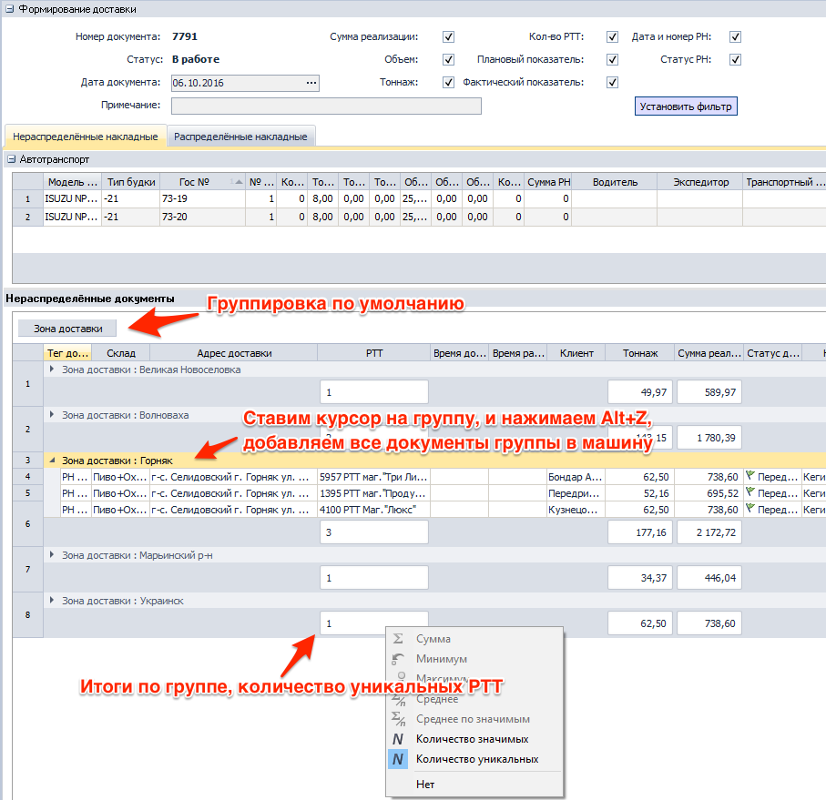
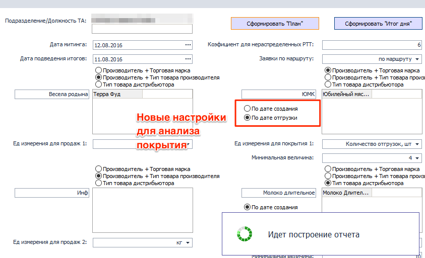
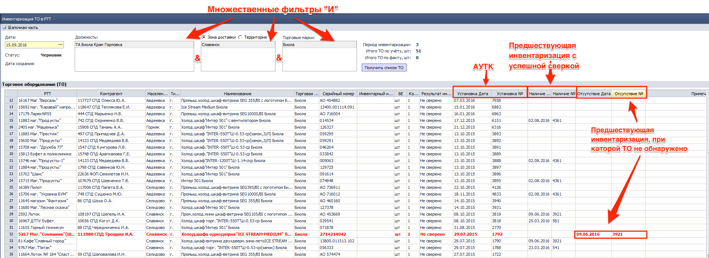
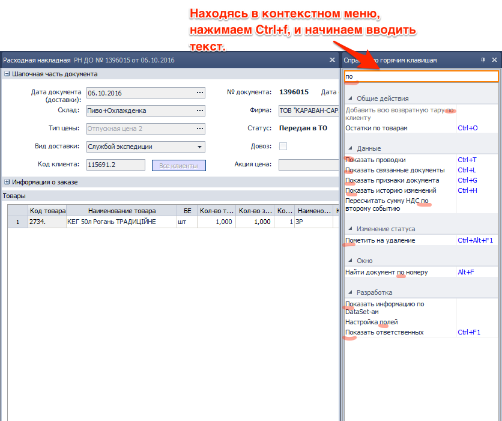

[//]:# (Абросимов)
## 0989 ЖД Чеки
*Кассир, Бухгалтер*

- Устранены причины появления критической ошибки OutOfMemory, которая могла возникнуть при выборе в журнале существенного периода (месяц и более).

----------------
[//]:# (Абросимов)
## 2143 ОТЧ OLAP отчет по продажам
*Отдел продаж, НОП, SV*

- Исправлена ошибка, связанная с некорректным наполнением таблицы OLAP значениями **Себестоимость РЦП** и **% Наценки РЦП**

----------------
[//]:# (Абросимов)
## 1474 ФН Экспорт/Импорт данных из SoftServe
*Сис.админ*

- Исправленна ошибка подбора УР при импорте заявок с мобильных устройств.

----------
[//]:# (Абросимов)
## 0702 СПР Спецификация.
*Бренд-менеджеры, НОП*

- Исправлена ошибка, позволяющая создавать несколько спецификаций с пересечением по периоду. Все спецификации в системе, у которых нет признака **акция** должны быть уникальны в рамках периода, СПД и Отдела продаж.
- В модальном окне, которое возникает в случае обнаружения пересечения с другой спецификацией, теперь отображается информация с какими документами конфликтует существующий.

--------------
[//]:# (Абросимов)
## 1588 Формирование доставки.
*Транспортные логисты*

- При открытии компонента в таблице "Нераспределенные документы" изменено расположение столбцов:

 - Тег;
 - Склад;
 - Адрес;
 - РТТ;
 - Время доставки;
 - Время работы;
 - Клиент.
- Поле **Зона доставки** вынесено на панель группировки.
- Для **Зоны доставки**   по умолчанию установлены групповые итоги "Количество уникальных" РТТ

*рис.1*

- Изменены наиболее часто используемые комбинации "горячих клавиш":
  - **Alt+Z** - Добавить документы в авто.
  - **Alt+X** - Выложить документы из авто
- Исправлена ошибка с печатью по неявному выбору автомобиля. Документы печатаются по выделенным автомобилям в текущей вкладке (Нераспределенные накладные или распределенные накладные)

- Реализовано добавление документов в автомобиль всей группой, например по зоне доставки (см рис.1).

--------------
[//]:# (Абросимов)

## 2176 ОТЧ Гермес. Контроль посещений ТА
*Отдел продаж, SV, НОП*

- Исправлена некорректная работа со сценариями пользователей и параметрами отображения данных.

--------------
[//]:# (Абросимов)
## 1815 ОТЧ Утренний митинг.
*Отдел продаж, SV*

- Исправлена ошибка,  которая могла возникать при формировании **Плана** по подразделению, наполнявшая таблицу **Покрытие** не продающими должностями (например бухгалтер, который числится в подразделении)

- В настройках отчета реализован выбор типа периода для оценки покрытия.
 - **По дате создания** - как было раньше,
 - **По дате документа** - по дате отгрузки, новая настройка.

Эти настройки применимы для оценки всех видов покрытия, но особенно актуальны для оценки покрытия в **Отгрузок, шт**, поскольку не просто отбирают документы по другому периоду, но и «схлопывают» несколько документов созданных в разные дни на одну дату (или же наоборот), считая это одной отгрузкой.

*рис.2*

---------
## 2214 ОТЧ Боевой лист.
*Отдел продаж, SV*

- Реализована возможность настраивать период, для оценки покрытия как по дате создания (как сейчас), так и по дате отгрузки. Сценарий работы аналогичен комп **1815** (см. описание выше).

- Аналогично компоненту **1815** отбор ТМЦ для анализа планов продаж и покрытия реализован  по 3 сценариям:
 1. Производитель+ Торговая марка
 2. Производитель+ Тип товара производителя
 3. Тип товара дистрибьютора

Формы подбора для всех трех сценариев приведены в соответствие.

--------------
[//]:# (Абросимов)
## 0200 ЖД Расходные накладные.
*Отдел продаж, операторы, бухгалтерия*

- Исправлена ошибка, которая проявлялась при быстром внесении изменений в документ, с последующем его закрытием, приводившая к закрытию приложения.

--------------
[//]:# (Абросимов)
## 1292 СПР Маршруты ТА
*Отдел продаж, SV*

- Исправлены мелкие ошибки, влияющие на стабильность работы.

-----------------------
[//]:# (Абросимов)
## 0989 ЖД Чеки.

- Оптимизирован журнал документов. Благодаря оптимизации он стал  в 3.5 раза меньше потреблять памяти, и на больших периодах (около месяца) теперь не возникает ошибка.

-----------------------

[//]:# (Абросимов)
## 1282 ЖД Инвентаризация ТО в РТТ
*Ревизоры*

- Компонент полностью переработан, изменен как внешний интерфейс, так и алгоритмы. Вследствие чего добавились новые возможности, и работа в нем стала более удобна для понимания.

- Электронный документ содержит две рабочих поля:

1. **Шапка с итогами и фильтрами.**  Здесь задаются основные параметры такие как: дата сверки и параметры фильтрации. Таким образом можно выбрать **должность**, по которой производить сверку, **территорию**, и **торговую марку ТО**. Фильтры не обязательны для заполнения, поэтому если ничего не выбрать и нажать кнопку **получить список ТО**, в нижней таблице появится все оборудование, которое на данный момент установлено у клиентов. Шапочная часть сворачивается нажатием на (+) в левом верхнем углу.

*рис.3*

2. Таблица **Торговое оборудование**. Содержит список всего оборудования, было отобрано при помощи фильтров. Отдельно вынесена колонка  **Торговая марка ТО, Населенный пункт** и **Тип населенного пункта**.  Результаты прошлых сверок также вынесены в отдельные колонки.
  - **Установка Дата и №** - отображает дату и номер **АУТК**, согласно которого оборудование было передано РТТ
  - **Наличие Дата и №** - отображает предшествующий документ **Инвентаризация (ИРТО)**, в котором зафиксирована успешная сверка (был в наличии). По сути эта информация о том, кто и когда из ревизоров выдел это оборудование в последний раз.
  - **Отсутсвие Дата и №** - отображает информацию о том что при последней сверке оборудование обнаружено не было. При этом вся строка будет подсвечена красным.

  Все ячейки с номерами в вышеописанных колонках кликабельны, и нажав на соответствующую можно провалиться в документ **АУТК** или **ИРТО**.

- По аналогичному принципу переработана печатная форма.

-----------------------
[//]:# (Абросимов)

## Поиск по контекстному меню.
*Все пользователи*

- Реализована функции поиска по контекстному меню **Ctrl+f**, аналогично дереву компонентов.

*рис.4*

-----------------------
[//]:# (Абросимов)
## Отчет об ошибках
*Все пользователи*

- Русифицирован интерфейс отправки отчета об ошибках.
