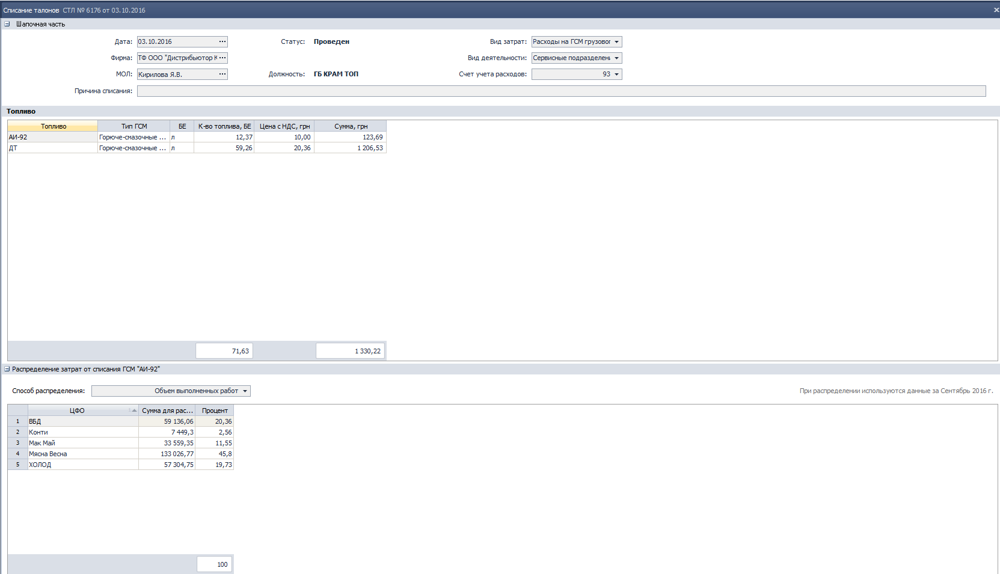

[//]:# (Абросимов)
## 1474 ФН Экспорт/Импорт данных из SoftServe
*Сис.админ*

- Исправленна ошибка подбора УР при импорте заявок с мобильных устройств.

----------
[//]:# (Абросимов)
## 0702 СПР Спецификация.
*Бренд-менеджеры, НОП*

- Исправлена ошибка, позволяющая создавать несколько спецификаций с пересечением по периоду. Все спецификации в системе, у которых нет признака **акция** должны быть уникальны в рамках периода, СПД и Отдела продаж.
- В модальном окне, которое возникает в случае обнаружения пересечения с другой спецификацией, теперь отображается информация с какими документами конфликтует существующий.

--------------
[//]:# (Абросимов)
## 1588 Формирование доставки.
*Транспортные логисты*

- При открытии компонента в таблице "Нераспределенные документы" изменено расположение столбцов:

 - Тег;
 - Склад;
 - Адрес;
 - РТТ;
 - Время доставки;
 - Время работы;
 - Клиент.
- Поле **Зона доставки** вынесено на панель группировки.
- Для **Зоны доставки**   по умолчанию установлены групповые итоги "Количество уникальных" РТТ

*рис.1*

- Изменены наиболее часто используемые комбинации "горячих клавиш":
  - **Alt+Z** - Добавить документы в авто.
  - **Alt+X** - Выложить документы из авто
- Исправлена ошибка с печатью по неявному выбору автомобиля. Документы печатаются по выделенным автомобилям в текущей вкладке (Нераспределенные накладные или распределенные накладные)

- Реализовано добавление документов в автомобиль всей группой, например по зоне доставки (см рис.1).

--------------
[//]:# (Абросимов)

## 2176 ОТЧ Гермес. Контроль посещений ТА
*Отдел продаж, SV, НОП*

- Исправлена некорректная работа со сценариями пользователей и параметрами отображения данных.

--------------
[//]:# (Абросимов)
## 1815 ОТЧ Утренний митинг.
*Отдел продаж, SV*

- Исправлена ошибка,  которая могла возникать при формировании **Плана** по подразделению, наполнявшая таблицу **Покрытие** не продающими должностями (например бухгалтер, который числится в подразделении)

- В настройках отчета реализован выбор типа периода для оценки покрытия.
 - **По дате создания** - как было раньше,
 - **По дате документа** - по дате отгрузки, новая настройка.

Эти настройки применимы для оценки всех видов покрытия, но особенно актуальны для оценки покрытия в **Отгрузок, шт**, поскольку не просто отбирают документы по другому периоду, но и «схлопывают» несколько документов созданных в разные дни на одну дату (или же наоборот), считая это одной отгрузкой.

*рис.2*

---------
## 2214 ОТЧ Боевой лист.
*Отдел продаж, SV*

- Реализована возможность настраивать период, для оценки покрытия как по дате создания (как сейчас), так и по дате отгрузки. Сценарий работы аналогичен комп **1815** (см. описание выше).

- Аналогично компоненту **1815** отбор ТМЦ для анализа планов продаж и покрытия реализован  по 3 сценариям:
 1. Производитель+ Торговая марка
 2. Производитель+ Тип товара производителя
 3. Тип товара дистрибьютора

Формы подбора для всех трех сценариев приведены в соответствие.

--------------
[//]:# (Абросимов)
## 0200 ЖД Расходные накладные.
*Отдел продаж, операторы, бухгалтерия*

- Исправлена ошибка, которая проявлялась при быстром внесении изменений в документ, с последующем его закрытием, приводившая к закрытию приложения.

--------------
[//]:# (Абросимов)
## 1292 СПР Маршруты ТА
*Отдел продаж, SV*

- Исправлены мелкие ошибки, влияющие на стабильность работы.

-----------------------
[//]:# (Абросимов)
## 0989 ЖД Чеки.

- Оптимизирован журнал документов. Благодаря оптимизации он стал  в 3.5 раза меньше потреблять памяти, и на больших периодах (около месяца) теперь не возникает ошибка.

-----------------------

[//]:# (Абросимов)
## 1282 ЖД Инвентаризация ТО в РТТ
*Ревизоры*

- Компонент полностью переработан, изменен как внешний интерфейс, так и алгоритмы. Вследствие чего добавились новые возможности, и работа в нем стала более удобна для понимания.

- Электронный документ содержит две рабочих поля:

1. **Шапка с итогами и фильтрами.**  Здесь задаются основные параметры такие как: дата сверки и параметры фильтрации. Таким образом можно выбрать **должность**, по которой производить сверку, **территорию**, и **торговую марку ТО**. Фильтры не обязательны для заполнения, поэтому если ничего не выбрать и нажать кнопку **получить список ТО**, в нижней таблице появится все оборудование, которое на данный момент установлено у клиентов. Шапочная часть сворачивается нажатием на (+) в левом верхнем углу.

*рис.3*

2. Таблица **Торговое оборудование**. Содержит список всего оборудования, было отобрано при помощи фильтров. Отдельно вынесена колонка  **Торговая марка ТО, Населенный пункт** и **Тип населенного пункта**.  Результаты прошлых сверок также вынесены в отдельные колонки.
  - **Установка Дата и №** - отображает дату и номер **АУТК**, согласно которого оборудование было передано РТТ
  - **Наличие Дата и №** - отображает предшествующий документ **Инвентаризация (ИРТО)**, в котором зафиксирована успешная сверка (был в наличии). По сути эта информация о том, кто и когда из ревизоров выдел это оборудование в последний раз.
  - **Отсутсвие Дата и №** - отображает информацию о том что при последней сверке оборудование обнаружено не было. При этом вся строка будет подсвечена красным.

  Все ячейки с номерами в вышеописанных колонках кликабельны, и нажав на соответствующую можно провалиться в документ **АУТК** или **ИРТО**.

- По аналогичному принципу переработана печатная форма.

-----------------------
[//]:# (Абросимов)
## 2143 ОТЧ OLAP отчет по продажам.
*Отдел продаж*
- Исправлена ошибка, связанная с некорректным наполнением таблицы OLAP значениями **Себестоимость РЦП** и **% Наценки РЦП**

- Таблица Таблица OLAP теперь рассчитывает и хранит новые данные, для документов  **РН ДО, РН СО, ВЗТК, ВТС**.

 1. **Стоимость в БОЦ, с НДС** - берется из актуального на дату документа прайс-листа  и прибаляется НДС.
 2. **Скидка от БОЦ, с НДС** - Разница между суммой продаж с НДС и Стоимостью в БОЦ с НДС.
 3. **% Скидки от БОЦ** = **Скидка от БОЦ, с НДС**/**Стоимость в БОЦ, с НДС** * 100%

 
 *рис.4*

-  Для документов **ТТН**  **Сумма реализации без НДС** и **Сумма реализации с НДС** теперь не рассчитывается. Поскольку движение по этим документам для дистрибьютора реализацией не считается.

- Изменен подход к расчету и хранению данных **Сумма РН по Маршрут** в таблице OLAP. Теперь это стало измерением **Заказ по маршруту?** и для каждой строки документа (формально для всего документа) оно может принимать одно из трех значений:
  - по маршруту
  - не по маршруту
  - не определено

| Документ | по маршруту | не по маршруту | не определено|
|--|--|--|--|
|РН ДО, РН СО| заявка взята по маршруту|заявка взята не по маршруту| нет маршрута ТА|
|ВЗТК, ВТС, РН АКЦ, РН АКЦ С, ТТН  |- |- |всегда|

Данные берутся из шапки документа **РН**, у остальных документов этих данных нет, поэтому по ним будет всегда значение **не определено**.

*рис.5*

- Если сформировать отчет с детализацией до документа, т.е. в настройках поставить отображение **Номер документа**, то ячейки с номером становятся кликабельны и позволяют "провалиться" в сам документ.

-----------------------
[//]:# (Абросимов)
## 1716 ОТЧ Эффективность транспортной логистики.
*Директора филиалов, транспортные логисты*

- Исправлена ошибка деления на ноль при не заполненных плановых показателях.
Теперь если показатель нулевой или пустой, при формировании отчета не происходит ни деление ни сравнение с пустым показателем.

-----------------------
[//]:# (Абросимов)

## Поиск по контекстному меню.
*Все пользователи*

- Реализована функции поиска по контекстному меню **Ctrl+f**, аналогично дереву компонентов.

*рис.6*

-----------------------
[//]:# (Абросимов)
## Отчет об ошибках
*Все пользователи*

- Русифицирован интерфейс отправки отчета об ошибках.

-----------------------
[//]:# (Семенова)

## 0112 Настройка параметров системы (Ctrl+F2)

*Бухгалтер*

**Исправлена ошибка**
Не корректно отрабатывала функция **Прекратить** при множественном выборе уведомлений
по мат. ответственности, действия выполнялись только по отношению к 1-му уведомлению.

**Внесены изменения**
Пользователи получали уведомления по мат. ответственности как об отсутствии действующих договоров, так и об их наличии, последние исключили из перечня.

 ------------------------------

## 1963 Выгрузка данных для налоговых отчетов и отчетов в ПФУ

*Бухгалтер*

**Исправлена ошибка** при выгрузке данных по ЕСВ (персонификация) по больничным листам  в календарных днях.

------------------------------

## 2376 СПР Настройки импорта БB

*Аналитик, Разработчик*

Создан системный справочник для настройки соответствия полей файла, экспортируемого из Клиент-банка и документа комп.2369 Банковские выписки.
Универсальная настройка позволит добавлять и настраивать импорт данных для любого банка.

  
рис.7

В справочник внесены данные в разрезе банков, для которых уже реализован импорт:

| МФО    | Наименование банка               |
|--------|----------------------------------|
| 315966 | Райффайзен банк Аваль            |
| 300614 | Креди Агриколь Банк              |
| 400019 | Центральный Республиканский Банк |

------------------------------

## 2369 ЖД Банковские выписки

*Бухгалтер*

**Внесены изменения**

Добавлены Настройки документа (F2).
**Версии импорта БВ** - множественный параметр, где Пользователь указывает наименования банков, по которым загружаются данные из Клиент-банка.
Настройки отображаются при вызове функции Импорт выписки из Клиент-банка. 

В Табличной части БВ Поступление при смене счета убрали **очищение данных в полях ОКПО** и **Сумма**.
**Подсчет итогов по полю Сумма** теперь выполняется независимо от установленных фильтров.

В Журнал документов вынесено **поле Счет**. 

------------------------------

## 1757 ЖД Списание талонов

*Бухгалтер*

**Внесены изменения:**

1. Добавлены **Настройки документа (F2)**.

  
рис.8

Пользователь с помощью множественных параметров задает:
-   **Виды затрат**, которые можно выбрать в документе 
    Расходы на ГСМ грузового автотранспорта
    Расходы на ГСМ легкового автотранспорта
    Расходы на ГСМ оборудования
-   **Применимые способы распределения** для универсального компонента;
-   **Счет учета расходов**: 803,92,93. 

Значения по умолчанию для одноименных полей: 
-   **Вид затрат** установить значение Расходы на ГСМ грузового автотранспорта
-   **Способ распределения** установить значение Объем выполненных работ
-   **Счет учета расходов** установить значение 80.3

2.Изменения в документе

  
рис.9

 **В Шапочной части** удалены поля:
- **№ документа**  - номер генериться и отображается в служебной строке; 
- **Должность для отнесения затрат** – добавлен универсальный способ распределения затрат; 
- **ФИО сотрудника на должности для отнесения затрат**; 

добавлены поля: 
- **Вид затрат** - обязательное поле, при создании нового документа отображается значение по умолчанию. Пользователь может изменить значение поля на заданные в Настройках; 
- **Вид деятельности** – заполняется по умолчанию по связке: МОЛ - Подразделения - Вид деятельности. Пользователь может изменить значение выбором из одноименного справочника.
При ручной корректировке, значение по связке не пересчитывается;
- **Счет учета расходов** - обязательное поле, при создании нового документа отображать значение по умолчанию. Пользователь может изменить значение поля на заданные в Настройках.
 
**Табличная часть** включены свойства грида, по умолчанию отображается сумма по полям Количество топлива, Сумма. Для поля **Количество топлива БЕ** увеличена разрядность до 3-х знаков после запятой. 

**Раздел Итоги** удален. 

Добавлен **универсальный компонент для распределения затрат от списания топлива**. 
Распределяются суммы из поля **Количество топлива** построчно.
В существующих документах заполнены данные:
Способ распределения = Ручной,
рассчитаны и отражены существующие % распределения. 

**Изменены настройки проводок**: 
в проводке Дт\*\*\*Кт2031 
**счет по дебету** определяется из поля **Счет учета расходов**, а его его аналитики:
- Вид затрат - из одноименного поля в шапке;
- Вид деятельности - из одноименного поля в шапке;
- ЦФО - из данных для распределения;
- Филиал - из данных для распределения.

В журнале документов переименовано поле **Должность для отнесения затрат** в **Должность МОЛ** (исправлена ошибка в названии поля).    
