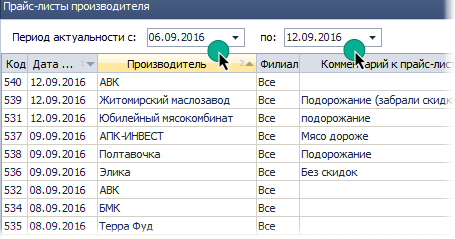
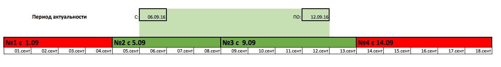
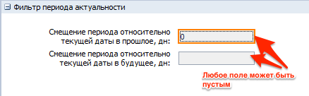
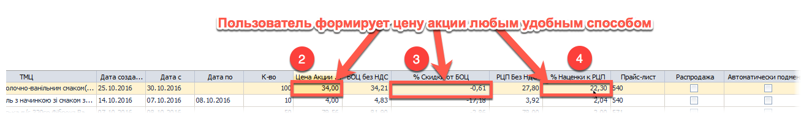
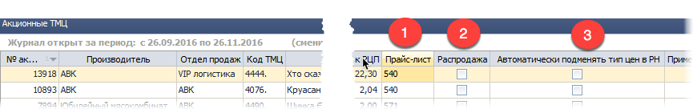
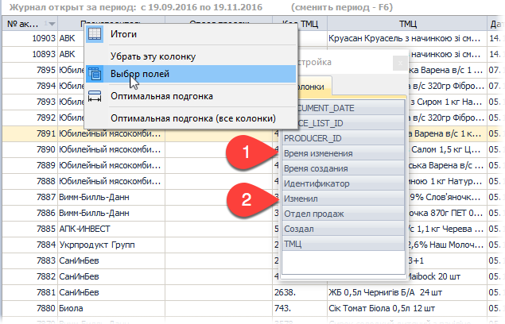
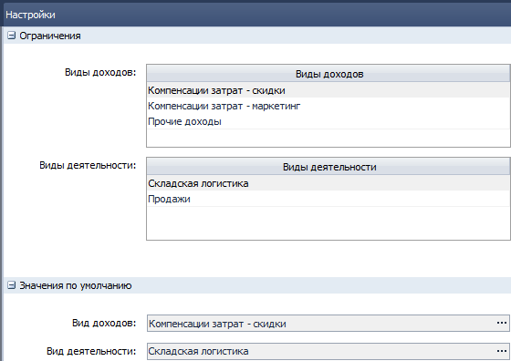
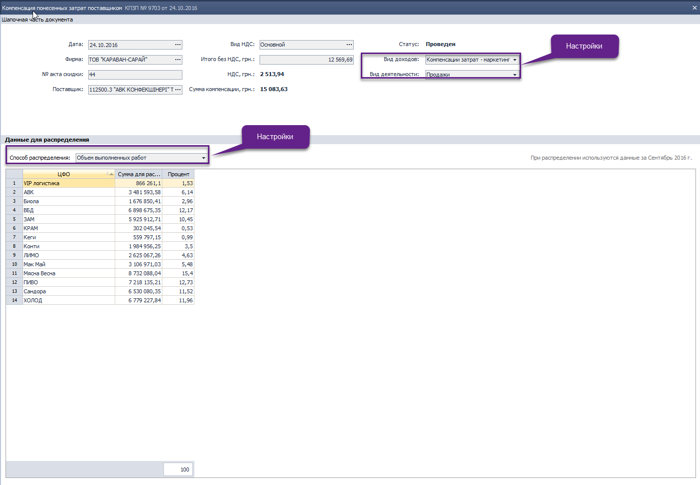
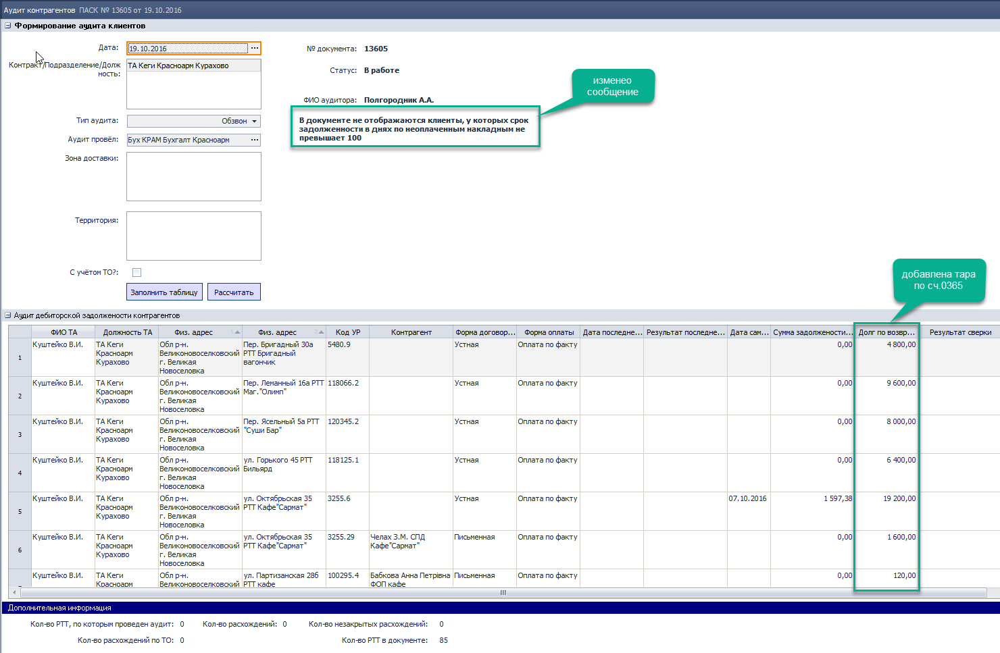

[//]:# (Абросимов)
## Исправлены критические ошибки
*Все пользователи*
- Уважаемые пользователи программы Distrubutor, в течение 3х недель мы тщательно обрбатывали все присылаемые вами отчеты об ошибках и вносили исправления в программу. От лица команды разработчиков хотим выразить отдельную благодарность самым активным пользователям:

 - Андреев Станислав
 - Бубенко Станислав
 - Вноровский Владимр
 - Волков Владислав
 - Дзигора Александр
 - Жиленко Наталья
 - Иванова Татьтяна
 - Карюк Татьяна
 - Максим (ЧП Хлебников)
 - Миронец Наталья
 - Приступа Андрей
 - Смаглий Виктория
 - Сыщенко Ирина
 - Ушанков Юрий
 - Фурманова Надежда
 - Щербак Сергей

Спасибо всем, кто не оставался равнодушным! Совместными усилиями мы сделаем
нашу с вами программу лучше.

------------------------
[//]:# (Абросимов)
## Итоги и групповые итоги таблиц
*Все пользователи*

- Исправлено отображение общих итогов и групповых итогов таблиц, теперь все итоги отображаются с разделителем групп разрядов, и без лишних знаков после запятой.

--------------------
[//]:# (Абросимов)
## Справочники с периодом актуальности.
*Все пользователи*

- Для справочников, элементы которых содержат поля: **дата действия с:** и **дата действия по:** реализован новый фильтр отображения. Рассмотрим на примере Прайс-листа:

  - Предположим у нас есть по одному производителю 4 прайс-листа.
№1 с 1.09, №2 с 6.09, №3 с 9.09 и № 4 с 14.09.
  - Зададим фильтрацию по периоду актуальности с 6.09 по 14.09
  
  *рис.1*

  - В результате отобразятся 2 прайс-листа №2 и №3, принцип отбора наглядно виден на рисунке.
  
  *рис.2*    
Периоды актуальности можно задавать открытыми в одну или обе стороны.

- В эти справочники добавлена настройка Фильтра периода актуальности по умолчанию (по F2)

  *рис.3*

На рис.3 пример настройки, когда при открытии справочника всегда будут отображаться актуальные на сегодня прайс-листы

---------------

[//]:# (Абросимов)
## 2167 СПР Акционные ТМЦ
*Бренд-менеджеры*

- в справочнике изменены столбцы:
  1. Отдел Продаж - обязательно для заполнения.
  2. Цена акции - может заполняться вручную или вычисляться автоматически (см. далее)
  3. % Скидки от БОЦ - может заполняться вручную или вычисляться автоматически (см. далее)
  4. % Наценки от РЦП - может заполняться вручную или вычисляться автоматически (см. далее)
  
  *рис.4*    
  Столбцы 2, 3 и 4 влияют друг на друга, т.е. пользователь заполняет один из них остальные рассчитаются сами. Например:
   цена БОЦ 10 грн., а Цена РЦП 5 грн. Пользователь вводит цену акции 8 грн, Скидка от БОЦ заполнится автоматически и будет = -20%, а наценка к РЦП будет 60%. Затем пользователь может изменить скидку исправив -20%, на -10%. Цена акции станет 9 грн., а наценка от РЦП 80%.  
   **Внимание!** Чтобы начать работу с этими столбцами, необходимо выбрать прайс-лист, при изменении прайс-листа значения сотрутся.

- Добавлены столбцы:

*рис.5*
 1. Прайс-лист - с помощью новой формы подбора пользователь теперь сам выбирает нужный документ, который актуален в период действия акции (их может быть несколько), из выбранного прайс-листа берется цена БОЦ и РЦП.
 2. Распродажа - если поставить галочку, то в РН по данной позиции товара можно будет выбрать тип цены АКЦ_РЖ. В следующем релизе при помощи этой отметки можно будет создавать Спец.Задачу для торгового отдела.
 3.  Автоматически подменять тип цен в РН - в следующем релизе будет реализована автоматическая замена типа цены в накладной.  
 На данный момент столбцы №№ 2 и 3, можно не заполнять.

  - Время изменения - дата и время последних изменений;
  - Изменил - автор последних изменений (имя пользователя в системе).

- Также добавлены новые информационные столбцы:
 1. Время изменения - дата и время последних изменений;
 2. Изменил - автор последних изменений (имя пользователя в системе).

 
 *рис.6*

Столбцы скрыты по умолчанию, но при необходимости их можно добавлять (см рис).

-----------------
[//]:# (Шарай)
## 0916 СПР Товары

*Бренд-менеджеры*

Исправлена ошибка, позволяющая присваивать "Вес БЕ,гр" товарам с Базовой Единицей "кг". Теперь при выборе БЕ "кг" поле автоматически очищается и блокируется.

------------------------------
## 1916 ЖД Начисление ЗП на филиале
*Начальник отдела*

**Исправлена ошибка:** не корректно выполнялась проверка данных распределения по ЦФО заработной платы сотрудника при переходе в статус К начислению.

Фактически проверка выполнялась по одному сотруднику: 1-му в табличной части или Физлицу, на котором установлен курсор. Сейчас проверка выполняется по всем сотрудникам и блокирует изменение статуса документа.

------------------------------
## 1196 ОТЧ Акт сверки взаиморасчетов
*Бухгалтер*

**Исправлена ошибка:** не правильно рассчитывался количественный остаток возвратной тары в детализации в Акте сверки.

------------------------------
## 2340 Регламентированный отчет по налоговому учету
*Бухгалтер*

Приведены в соответствие с законодательными изменениями форма Декларация с приложениями и формат выгрузки данных в xml файл.

------------------------------
## 2376 СПР Настройки импорта БB 
*Аналитик*

Добавлена функция Удалить строку. Теперь возможно как добавить, так и удалить настройку.

------------------------------
## 2369 ЖД Банковские выписки
*Бухгалтер*

Упрощён функционал:
- **удалены Настройки** (F2), без которых можно обойтись, изменив саму функцию импорта;
- **изменена функция Импорт выписки из Клиент-банка**. Функция активна, если для банка, выбранного в поле Текущий счет, есть Настройка импорта в комп.2376.Проверка выполняется по коду МФО.

------------------------------
##  1721 ЖД Авансовые отчёты
*Бухгалтер*

Добавлена **печатная форма Авансового отчета**, при вызове функции Печать отображается форма, соответствующую уровню Фирмы.

------------------------------
## 2186 ЖД Компенсация понесенных затрат поставщиком
*Бухгалтер*

**Внесены изменения:**

Добавлены **Настройки** документа (F2).
Пользователь с установленными правами задает параметры для полей: Вид доходов, Вид деятельности, которые являются аналитиками в «доходных» проводок, указывает способы распределения доходов.

  
рис.7

В документ добавлены поля, одноимённые настройкам.
  
рис.8

Изменены настройки проводок - аналитики к "доходной"" проводке определяются из одноименных полей в документе.

------------------------------
## 1164 ЖД Аудит контрагентов
*Инспектор по дебиторской задолженности*

**Внесены изменения:**
- В расчет долга по возвратной таре добавлен счет 0365.
- В ПФ Детализация задолженности до неоплаченных РН с возвратной тарой - наименование и количество тары отображаются из остатка по счету 0365. 
- Изменено информационное сообщение в зависимости от типа аудита:
*Выездной* - исключены УР с Формой договоренности=Письменная и Формой оплаты с р/с;
*Обзвон* - исключений нет.

  
рис.9

------------------------------
## 1034 СПР Физлица
*Инспектор по кадрам*

Добавлена печатная форма **Личная карточка (рус.)**
