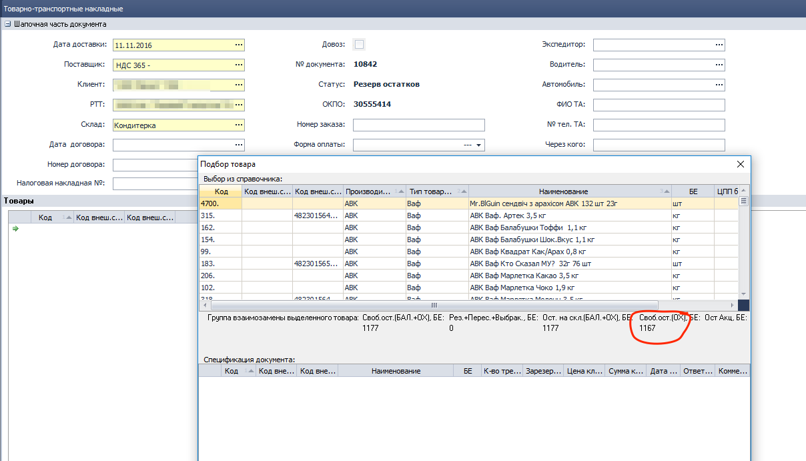
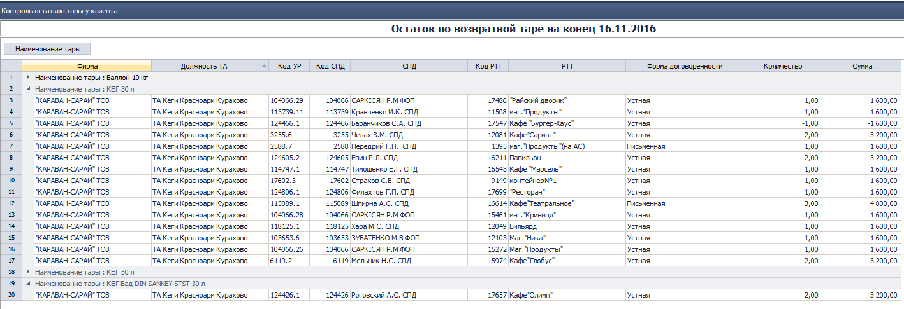

[//]:# (Абросимов)
## Исправлены критические ошибки
*Все пользователи*
- Уважаемые пользователи программы Distrubutor, в течение  последних 3х недель мы также тщательно обрабатывали все присылаемые вами отчеты об ошибках и вносили исправления в программу. Хочется отметить, что их стало гораздо меньше, но тем не менее они были. От лица команды разработчиков выражаем благодарность самым активным пользователям:

 - Андреев Станислав,
 - Бубенко Станислав,
 - Вноровский Владимир,
 - Волков Владислав,
 - Гримоловский Евгений,
 - Дзигора Александр,
 - Дмитриева Татьяна,
 - Землянский Андрей,
 - Кровко Юлия,
 - Пашина Алла,
 - Покидова Марина,
 - Ушанков Юрий,
 - Федирко Андрей,
 - Фурманова Надежда,
 - Хлебникова Ирина,
 - Чигрина Ольга.

Спасибо всем, кто не оставался равнодушным! В результате наших совместных с вами усилий в этом релизе мы исправили ряд критических багов, которые особенно часто проявлялись в следующих компонентах:

 - **0200**	ЖД Расходные накладные;
 - **0398**	ЖД Возвраты товара от клиентов;
 - **0704**	СПР	Прайс-листы производителя;
 - **1084**	ОТЧ	Ежедневные отгрузки;
 - **1111**	СПР	Производители;
 - **1315**	ОТЧ	Остатки ТМЦ;
 - **1474**	ФН	Экспорт/Импорт данных из SoftServe;
 - **1588**	ЖД	Формирование доставки;
 - **1681**	ЖД	Изменение цены после поставки;
 - **2143**	ОТЧ	OLAP отчет по продажам;
 - **2310**	ОТЧ	Финансовые результаты.

------------------------

[//]:# (Абросимов)
## 0327 ЖД Заказы на поставку
*Бренд-менеджеры*

- Исправлена ошибка, приводящая к дублированию строк в документе, в таблице с товарами.

-----------
[//]:# (Абросимов)
## 2020 ЖД Товарно-транспортные накладные
*Бренд-менеджеры, операторы*

- Исправлена ошибка: При резервировании товара на СОХ (Склад ответ. хранения), в форме подбора товара расчет свободного остатка не учитывал резервы по ТТН в будущих периодах. - исправлено, все резервы (ТТН в статусе резерв и передан в ТО) учитываются, остатки корректны.

  
  *рис.1*

-----------
[//]:# (Абросимов)

## 2159 ОТЧ Отчет по расходу ГСМ
*SV*

- Исправлена ошибка: В отчете могла отображаться информация по другому подразделению - теперь, только по выбранному.

-----------
[//]:# (Абросимов)
## 0916 СПР Товары
*Бренд-менеджеры*

- Исправлена ошибка, позволяющая пользователю редактировать карточку **Товар** (некоторые свойства), в режиме просмотра.

-----------
[//]:# (Абросимов)
## 0200 ЖД Расходные накладные
*Операторы*

- При "набитии" заявки акционная цена теперь может подставляться автоматически.   
 _Как это работает:_  
   - В компоненте **2167 СПР Акционные ТМЦ** Пользователь создает акцию и ставит галочку в столбце "Автоматически подменять тип цен в РН".
     
     *рис.2*

   - Формируем РН, в форме подбора товара, находим ТМЦ по которой действует Акция.
   В момент добавления товара (данной ТМЦ) в РН, программа сравнит цены, и если по данной позиции акционная цена окажется ниже цены из УР, то произойдет замена цены на более низкую, т.е. **акционную**. (*на данном примере: если клиент работает по БОЦ, то цена в накладной будет 20,60*)

   ------------------------------
## 1374 ОТЧ Остатки возвратной тары у клиентов
*Инспектор по дебиторской задолженности*

**Внесены изменения:**

   Добавлена возможность выбора Фирм при построении Отчета. Пользователь может выбрать несколько Фирм при необходимости.

   Изменили форму отображения данных Отчета:
   - отказались от древовидной группировки по должности,
   - выборочных объединений по форме договоренности.
   - добавили группирующую панель, включили свойства грида для подсчета итоговых значений.

     
   *рис. 3*
