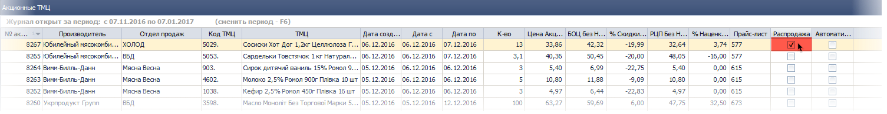
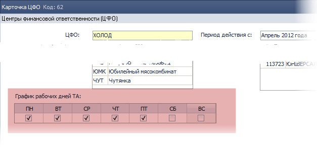
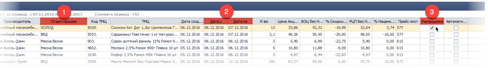
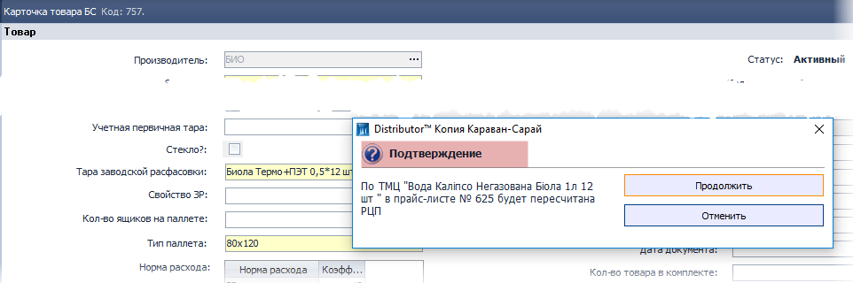
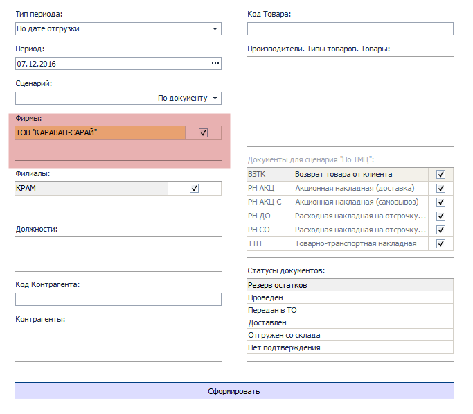
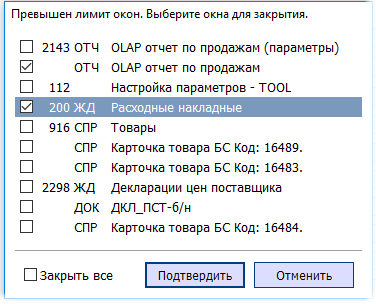
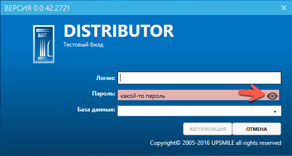
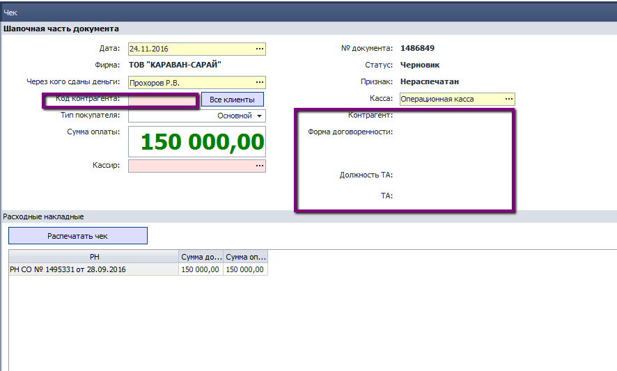

[//]:# (Абросимов)
## Исправлены критические ошибки.
*Все пользователи*

Традиционно говорим: "Спасибо самым активным пользователям!":

 - Алексей Пономарев,
 - Андреев Станислав,
 - Ачкасов Михаил,
 - Бубенко Станислав,
 - Вноровский Владимир,
 - Волков Владислав,
 - Дацков Иван,
 - Дзигора Александр,
 - Дмитриева Татьяна,
 - Евгения Синдеева,
 - Екатерина Алфимова,
 - Землянский Андрей,
 - Малолетнева Мария,
 - Наталья Миронец,
 - Новикова Таня,
 - Одарченко Андрей,
 - Покидова Марина,
 - Татьяна Дмитриева,
 - Татьяна Иванова,
 - Ушанков Юрий,
 - Чигрина Ольга!"

Благодаря Вам мы исправили критические ошибки, которые особенно часто проявлялись в следующих компонентах:

 - **0200** ЖД Расходные накладные
 - **0704** СПР Прайс-листы производителей
 - **0994** ЖД Таксировки
 - **1196** ОТЧ Акт сверки взаиморасчетов
 - **1282** ОТЧ Инвентаризация ТО в РТТ
 - **1588** ЖД Формирование доставки
 - **1632** ОТЧ Оборачиваемость ДЗ (аналитический)
 - **1768** ЖД Списание материалов
 - **2111** ЖД Очередность доставки
 - **2117** ЖД Сторчек
 - **2176** ОТЧ Гермес. Контроль посещений ТА
 - **2310** ОТЧ Финансовые результаты

------------------------

[//]:# (Абросимов)
## 2167 СПР Акционные ТМЦ.
*Бренд-менеджеры*

- Появилась возможность редактировать свойства **Распродажа** и **Автоматически подменять тип цен в РН**, по Акционным ТМЦ даже при наличии уже созданных документов РН.

- Теперь для того чтобы создать **Спец. задачу** для отдела продаж, достаточно как и раньше просто завести акционные ТМЦ, по планируемой дате документа (дата доставки, не дата создания РН!), задать определенный период, можно несколько дней или с открытым периодом, и поставить признак **Распродажа**. Компонент **2155	ЖД	Спец задача** больше не принимает участия в постановке ежедневных целей для Отделов продаж. Планы рассчитываются автоматически.

*рис.1*

------------------------

## 1137	СПР	Центры финансовой ответственности (ЦФО).
*НОП*
- В карточку ЦФО добавлена таблица: **График рабочих дней ТА**:

*рис.2*

Она необходима для корректного подсчета рабочих дней, в различных компонентах. Пример использования описан ниже.

------------------------
[//]:# (Абросимов)
## 1815 ОТЧ Утренний митинг.

- Изменился подход к формированию плана Спец.задачи на Отдел.  
   При формировании плана, ТМЦ для Спец.задача теперь берутся из компонента 2167 по следующим критериям:
    1. По отделу продаж (из поля подразделение/должность)
    2. По дате митинга +1 день , удовлетворяющие периоду актуальности
    3. Наличие признака РЖ

*рис.3*

    Расчет плана в БЕ происходит следующим образом:

     План =(Кол-во(2167)- Vпродаж по ТМЦ(2143))/Остаток рабочих дней;

     Vпродаж по ТМЦ(2143) - расчитывается по дате создания за период дат:
                            ДатаМитинга - (Дата С(из 2167) -1день);

     Остаток рабочих дней = (Дата По(из 2167) -1день) - (Дата Митинга) - КоличествоВыходных;

     Количество Выходных  -  рассчитывается сопоставлением оставшегося периода
                            с графиком работы ЦФО(1137);

     Если график не задан или акция с открытым периодом,
      то деления на остаток рабочих дней не происходит.

  - При формировании Итогов Дня, ТМЦ для Спец.задачи по каждой должности теперь берутся из компонента 2167 аналогично вышеописанному. Количество проданного  товара  берется как и раньше из 2143 по дате создания документа РН.

Данные изменения упростят работу пользователя с планами по спец. задаче, делая их более прозрачными, и точными. Одна из основных особенностей состоит в том что теперь план и факт будут в одних ценах - ценах акции.

-  В печатных формах ряд визуальных улучшений, повышающих удобство и информативность.

-----------
[//]:# (Абросимов)

## 2214 ОТЧ Боевой лист.
*SV*

- Изменения в печатной форме. Добавлена "Шпаргалка" торговому агенту, в которой  отображены все актуальные скидки и прочие активности:
 - **Фокус дня** -  наполняется из компонента 1826 по отделу продаж и дате отчета. Добавлен столбец для записи основных преимуществ;

 - **Акционные ТМЦ**  - наполняется из компонента 2167 по отделу продаж и периоду актуальности даты отчета +1 день. Жирным выделены ТМЦ с признаком **Распродажа**, по ним ставится **Спец.задача**;

 - **Акции Цена** -  наполняется из компонента 2204 по отделу продаж и периоду актуальности даты отчета +1 день;

 - **Акции Подарок** -  наполняется из компонента 2061 по отделу продаж и периоду актуальности даты отчета;

 - **Скидки по группам ценообразования** - наполняется из компонента 0704, по ассортименту для продаж заданному в 1137, отбираются все актуальные прайс-листы на дату отчета +1 день.

 - **Ограничения по заменам** - наполняется из компонента 0417, по ассортименту для продаж заданному в 1137.

-  Исправлена ошибка, выводящая на печать документы для непродающих должностей, которые числятся в подразделении. Ряд визуальных улучшений, повышающих удобство и информативность.

-----------
[//]:# (Абросимов)

## 1789 ЖД Ация.
- Удален за ненадобностью устаревший компонент.

-----------

[//]:# (Абросимов)
## 0916 СПР Товары.
*Бренд-менеджеры*

- Мало кто из пользователей догадывался о том, что при изменении в карточке объема ТМЦ, запускается обработка "пересчет прайс-листа", которая изменяет РЦП в актуальном прайс-листе, в том случае если она (РЦП) зависит от объема БЕ. Как следствие, может также изменится Компенсация или Доп.расходы. Сейчас при сохранении карточки ТМЦ с измененным (или добавленным) свойством **Объем БЕ**, пользователю выдается предупреждающее сообщение:

*рис.4*

-----------
[//]:# (Абросимов)
## 0704 СПР Прайс-листы производителя.
*Бренд-менеджеры*

- Устранены недочеты связанные с переходом Прайс-листа на одну дату - дату начала. Теперь при сохранении проверка осуществляется по следующему принципу:  

  На одну дату (дата С), по одному производителю и по одному признаку Филиал (признак "Все филиалы" такой же равнозначный признак ), не может быть более одного прайс-листа.  

  **Даты по** у прайс-листов больше не существует в системе.

-----------
[//]:# (Абросимов)
## 2143 ОТЧ OLAP Отчет по продажам.
*НОП, SV, Бренд-менеджеры*
- Исправлена ошибка связанная с отсесечением дат на больших периодах отчета (более одного года)
- В "ночном" расчете таблицы OLAP, изменена методика определения актуального прайс-листа, теперь в нем используется только  дата начала действия.

-----------
[//]:# (Абросимов)
## 0702 ЖД Спецификации.
*Бренд-менеджеры, НОП*

- Исправлена ошибка при работе с полем **Примечание**. В журнал документов добавлен столбец с этим полем.

-----------
[//]:# (Абросимов)
## 0702 ЖД Спецификации.
*Бренд-менеджеры, НОП, SV, Операторы*

- Изменен интерфейс настроек отчета, добавлено окно выбора фирм:

     
   *рис.5*

Фильтр по фирмам участвует во всех сценариях, отображение - только в сценарии "По документу"

- В отчете по сценарию "По ТМЦ" добавлен столбец **Торговая марка**

- Исправлены ошибки, проявляющиеся как при работе с настройками, так и в некорректном подсчете сумм по РН АКЦ.

-----------
[//]:# (Абросимов)
## Общесистемные настройки
*Системные администраторы, все пользователи*

- Добавлен параметр: 157155 Ограничения\Лимит Открытых окон. Целое число - задает ограничение на количество открытых окон в одном запущенном приложении Distributor. Значение 0 и пусто - нет ограничений.

- При попытке пользователем открыть окно сверх лимита, ему будет выдано следующее сообщение:

 
 *рис.6*

 Далее пользователю необходимо из списка выбрать какие окна он может закрыть. Список отсортирован по времени последнего открытия - самые "свежие" внизу. Как только лишние окна будут закрыты, откроется то, которое было сверх лимита.

 Эти изменения направлены в первую очередь на повышение производительности клиентской части программы и снижение нагрузки на сервер. Как показывает практика, пользователи открывают окна, но забывают их закрывать.

-----------
[//]:# (Абросимов)
## Окно входа в программу
 *Все пользователи*
- При входе в систему у пользователя появилась возможность отобразить набираемый пароль.

 
 *рис.7*

----
## 1096 ЖД Кассовые ордера

 *Кассир*

 **Исправлена ошибка:** в **РКО** с типом **Выплата депонированной зп** неправильно рассчитывалось значение поля **Сумма** в шапочной части, вместо итога по всем выплатам был 0,00. Как следствие, **не отрабатывала проверка остатка по кассе** при проведении РКО. В существующих документах выполнен пересчет и отображены корректные данные.

--------
## 0400 Возвратные накладные на склад ТМЦ

 *Бухгалтер*

 **Исправлена ошибка:** при расчете **количества ТМЦ к возврату** по документу **Накладная для кладовщика** корректировка учитывалась только с одним знаком.

------------
## 1964 ОТЧ Финансовые результаты

*Главный бухгалтер, зам. глав. бухгалтера*

 **Исправлена ошибка:** при построении отчета **Финансовые результаты для статистики** и последующей выгрузке в Excel не отображались данные отчета.

-----------------
## 1895 Месяц начисления з/п

 *Бухгалтер по расчету зп*

 **Исправлена ошибка:** не корректно отрабатывала проверка на закрытие редактирования документов по начислению з/п:

 -   1872 ЖД Расчетные ведомости

 -   1916 ЖД Начисление ЗП на филиале

 В документы добавлена проверка на **Rule 95** **Запрещено корректировать документ, за период времени ранее даты начисления ЗП**, с возможностью настроить права на редактирование в Админ. консоли.

-----------
## 0989 ЖД Чеки

 *Кассир*

 **Исправлена ошибка:** в Чеке не отражались **данные из Условия работы Клиента** как при печати из Таксировки, так и при создании в ЖД Чеки, документ не проводился.
 
 *рис.8*

-------------
## 0200 ЖД Расходные накладные

 *Оператор, бухгалтер*

 **Исправлена ошибка:** в документе не обновлялся **Вид НДС** на значение по умолчанию при смене Фирмы нижнего уровня на верхний.

-------------
## 1196 ОТЧ Акт сверки взаиморасчетов

 *Бухгалтер*

 **Исправлена ошибка:** в Акте сверки с Поставщиком неправильно рассчитывалось сальдо начальное и конечное.

--------------
## 1164 ЖД Аудит контрагентов

 *Инспектор*

 Для **возможности формирования Аудита клиентов по разным Фирмам** в раздел Формирование аудита клиентов добавлено обязательное поле **Фирма** - заполняет Пользователь, для выбора доступно нескольких Фирм, например, верхнего и нижнего уровня.

 Значение поля **Фирма**

 -   используется в качестве **фильтра при расчете задолженности**;

 -   отображается **в печатных формах**;

 -   при его изменении выполняется очистка данных в табличной части с предварительным уведомлением Пользователей.

 В существующих документах поле Фирма заполнено программно.

--------------
##  1912 ОТЧ Лицевой счет

 *Бухгалтер по расчету зп*

 Для удобства Пользователей **Военный взнос** отображен в отдельной графе, ранее он учитывался только в общей сумме удержаний.

-------------------- 
## 1859 ЖД Плановый график работы

 *Бухгалтер*

 -   документы отсортированы **по хронологии: Месяц+год**, вверху отображаются последние документы;

 -   отображён **Статус** в документе, ранее он отображался только в Журнале.

 -   **исправлена ошибка** при создании документа - не всегда отображалось правильное количество дней, это происходило, если в месяце формирования документа дней больше, чем в предыдущем.
