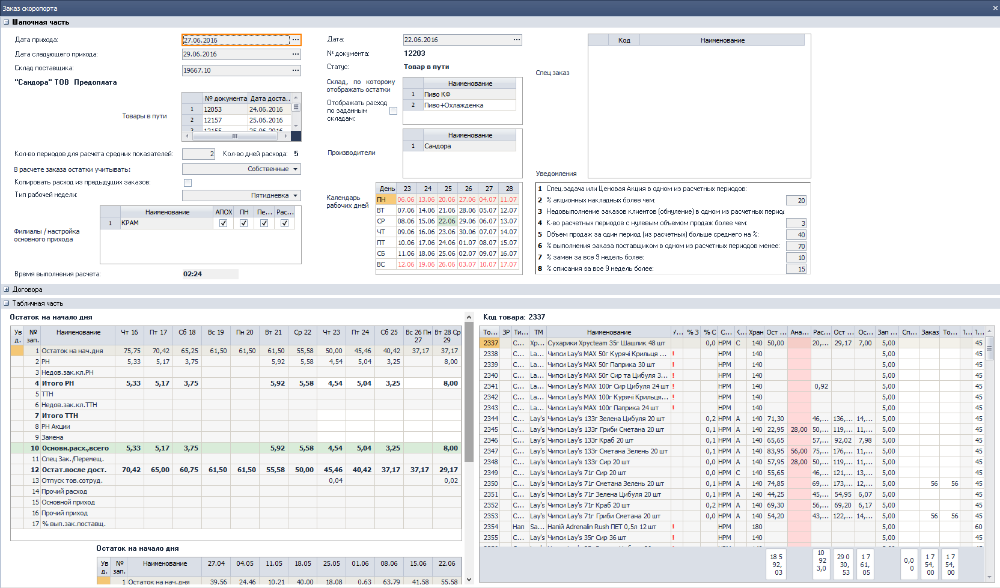
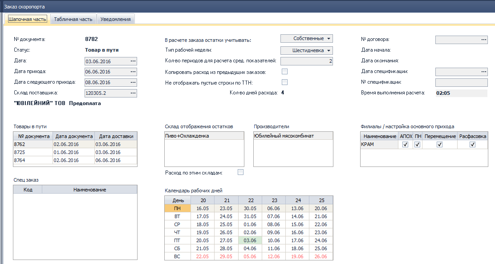
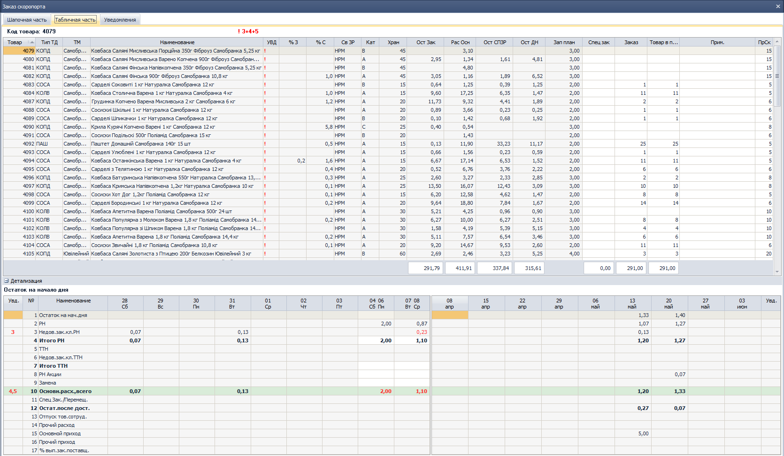
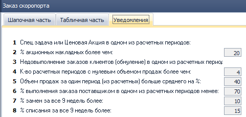
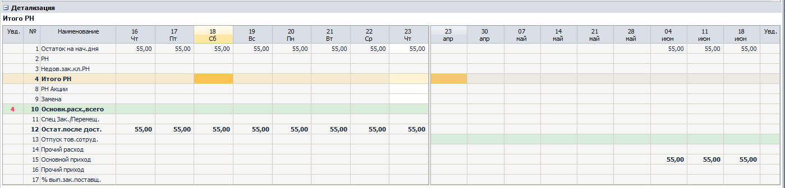
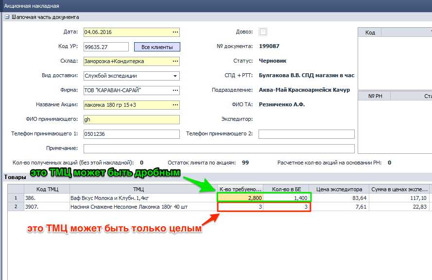
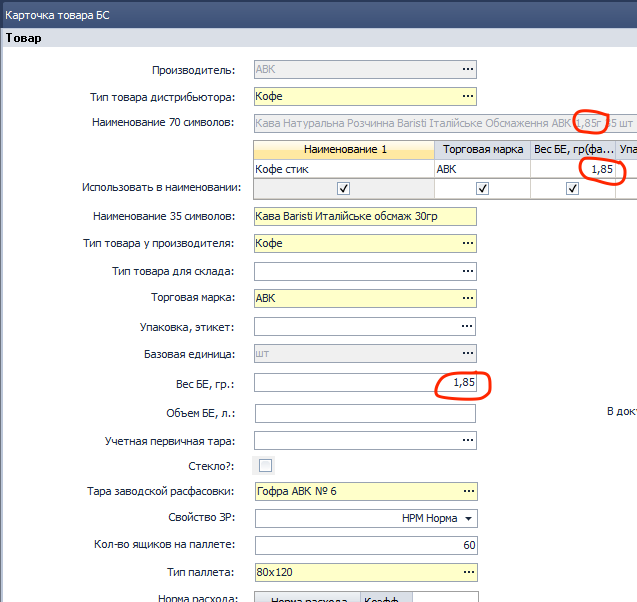
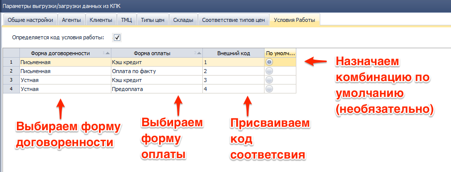
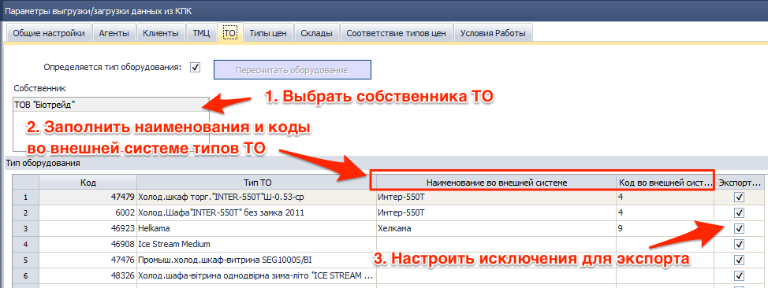
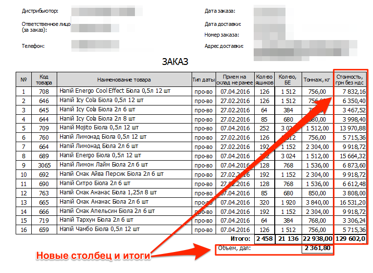

[//]:# (Абросимов) 
## Настройки
*Все пользователи*

* Из дерева компонентов удален **0112 СПР Настройки системы**.
* В каждый компонент добавлена горячая клавиша **F2** - **Настройки компонента**.
 Теперь пользователь с правами доступа может настраивать работу компонента, задавая значения переменным или выбором из справочника.[^1]
* Добавлена общая горячая клавиша **Ctrl+F2** здесь пользователь управляет параметрами влияющими на работу нескольких компонентов.

**Важно!**  
*Сейчас большинство компонентов не имеют своих настроек, поэтому при вызове будет выводится окно предупреждения. В этом случае необходимо вызывать системные настройки и настраивать параметры там. Системные настройки на данный момент представляют собой бывший компонент 0112, но со временем все индивидуальные настройки компонента уйдут из системных.*

-----------
[//]:# (Абросимов)
## Работа с таблицами.
*Все пользователи*

* Добавлены две новых опции:
 * **Сбросить все фильтры - Ctrl+F5**
 * **Отменить все сортировки Ctrl+F7**  

Сброс происходит как быстрых фильтров так и тех, которые задаются в шапке таблицы.

|Операция|Установка|Снятие|Сбросить все|
|---|--|--|
|Быстрый фильтр|F5|F5|Ctrl+F5|
|Быстрая сортировка|F7|F7|Ctrl+F7|

---------------
[//]:# (Абросимов)
## Одностраничные печатные формы.
*Все пользователи*

* Исправления. На некоторых печатных формах проявлялась ошибка, когда документ занимающий не более страницы, при печати прогонял через принтер второй пустой лист. Данная ошибка  устранена.

-------------
[//]:# (Смаглий)  
## 1916 ЖД Начисление ЗП на филиале (Транспортная логистика)  
*Руководители филиалов,транспортные логисты*  

При создании нового документа, для подразделения со способом распределения затрат "Транспортная логистика" для поля "Бонусы (расчетные)" реализовн алгоритм автоматического расчета значения, идентичный расчету поля "Сумма всего" в компоненте *2246 ОТЧ ЗП экспедиции* по сотруднику, который относится к выбранным подразделениям шапки и за период из шапки документа.
Другими словами, теперь бонусы для транспортной логистики (для экспедиторов и водителей-экспедиторов) проставляются автоматически и считаются по такому же алгоритму, как и в **2246 ОТЧ ЗП Экспедиции**.  

------------
[//]:# (Смаглий)  
## 2276 ОТЧ ЗП склада
*Руководители филиалов,транспортные логисты*  

- В параметрах, в форме подбора сотрудника теперь можно выбрать и уволенных сотрудников. Раньше уволенные сотрудники были недоступны для выбора и увидеть по ним показатели можно было только построив отчет по всему складу.  
- В форму подбора теперь выводятся только сотрудники выбранного склада.

------------
[//]:# (Смаглий)  
## 0327 ЖД Заказы на поставку
*Бренд-менеджеры*

- Переработан интерфейс. Разнесены по вкладкам шапочная часть, табличная часть и уведомления.  
Было:  
  
*рис.1*  
Стало:  
  
*рис.2*  
  
*рис.3*  
  
*рис.4*  
- В шапочной части добавлена галочка "Не отображать пустые строки по ТТН". Если она установлена и расхода по ТТН за анализируемый период не было, то строки 5,6,7, касающиеся ТТН, в детализации не выводятся.
  
*рис.5*  

---------------
[//]:# (Смаглий)  
## 0200 ЖД Расходные накладные
*Отдел продаж, операторы*  

Добавилась возможность быстрого просмотра остатков по ТМЦ в накладной. Для этого нажимаем **Ctrl+O** (от первой буквы слова " **о** - остатки"), находясь в расходной накладной. Открывается компонент **1315 ОТЧ Остатки ТМЦ**, в котором выводятся только товары из расходной накладной, выделена строка с ТМЦ, на которой стояли в РН. При этом открывшийся отчет 1315 полноценно работет. Единственное ограничение - в нем присутствуют только товары из РН. Если есть какое-то количество товара в резерве, то можно кликнуть на это количество и откроется перечень документов, формирующих резерв.  

--------------
[//]:# (Смаглий)  
## 1315 ОТЧ Остатки ТМЦ  
*Отдел продаж, операторы*

Исправлена ошибка, состоявшая в том, что при расчете остатков не учитывались расходные документы с датой в будущем периоде.

---------------
[//]:# (Абросимов)
## 2153 ЖД Акционные накладные
*Отдел продаж, Операторы*  

-Исправлена ошибка, при которой у пользователя была возможность задать штучным ТМЦ дробное количество требуемых БЕ. Теперь количество БЕ с типом **ШТ** или **Комплект** задается только натуральными числами.

*рис.6*
- Исходя из вышеописанной логики, в табличной части также изменено представление - штучный товар всегда отображается целыми числами (без запятой).

----------------
[//]:# (Абросимов)
## 0916 СПР Товары
*Отдел продаж, Бренд-менеджеры*
- Расширены возможности справочника. Вес БЕ штучного товара или комплекта теперь может задаваться с точностью до сотых долей грамма (2 знака после запятой).

*рис.7*

--------------
[//]:# (Абросимов)
## 1808 ОТЧ Комплект ТА
*Отдел продаж, SV, Операторы*

- Исправлена ошибка, при которой не сохранялись настройки отчета по должности. Теперь всё работает как и ранее, достаточно один раз сконфигурировать необходимые настройки, для определенной должности и нажать кнопку "Сформировать". При последующем открытии отчета и выборе этой должности настройки подтянутся автоматически.

------------
[//]:# (Абросимов)
## 1450 СПР Параметры выгрузки/загрузки данных из КПК, 1474 ФН Экспорт/Импорт данных из SoftServe
*Администраторы*

В соответсвии с требованиями компаний "САН ИнБев" и "Биола" реализован механизм экспорта, информации об остатках и движении  **Торгового оборудования (ТО)**, взятом у них в аренду для последующего размещения на торговых площадках клиентов дистрибьютора(**РТТ**), по договорам субаренды.
* В настройках компонента **1450** в закладке склады, появилась новая запись - **Склады ТО**. Здесь необходимо задать код склада для выгрузки ТО. Оборудование ищется по всем складам, поэтому если необходимо развести по разным складам (например: склад неисправного оборудования), можно воспользоваться нижней, добавочной таблицей исключений.

*рис.8*

* В настройках компонента **1450** добавлена закладка **ТО** в ней необходимо:
 * Выбрать собственника ТО, чьё оборудование будет экспортироваться
 * Перенаполнить таблицу
 * В таблице сопоставить типы ТО из УС Distributor, с названиями и кодами типов ТО во внешней системе
 * Галочками настроить исключения для выгрузки

 
 *рис.9*

-----------------
 [//]:# (Абросимов)
 ## 0327 ЖД Заказы на поставку
 *Бренд-менеджеры*
* Изменения печатной формы:
 * удален столбец адрес ТМЦ;
 * добавлен столбец стоимость, грн без ндс;
 * Добавлены итоги - Объем, дал.
 
 *рис.10*

 -------------------
 ## 2170 ЖД Возврат товара через сотрудника

 *Бухгалтер*

 **Внесены изменения:** поле Фирма открыто на редактирование в документе, Пользователь может выбрать только Фирму нижнего уровня.

 -----------------------
 ## 2220 ЖД Накладная на сотрудника

 *Бухгалтер*

 **Внесены изменения:** поле Фирма открыто на редактирование в документе, Пользователь может выбрать только Фирму нижнего уровня.

 Выполняется проверка: является ли Физ. Лицо сотрудником Фирмы из документа?

 Лимит по товару обновляется по Физ. Лицу без учета данных в разрезе Фирм.

 --------------------
 ## 2170 ЖД Возврат товара через сотрудника

 *Бухгалтер*

 **Внесены изменения:** поле Фирма открыто на редактирование в документе, Пользователь может выбрать только Фирму нижнего уровня.

 -------------------------------
 ## 1073 СПР Фирмы

 *Бухгалтер*

 **Суть проблемы:** Расчетный счет по умолчанию задается в СПР Филиалы, при наличии нескольких Фирм и одного Филиала невозможно правильно отобразить расчетные счета в документах.

 Внесены изменения в **комп.1073 СПР Фирмы** в раздел Основная информация добавлено поле Расчетный счет по умолчанию с возможностью выбора значения из комп.1021 СПР Текущие счета.

 Внесены изменения **в ПФ: Счет-фактура для РН** из комп.0200, **Счет-Фактура** из комп.1001**  отображается расчетный счет из комп.1073 по Фирме.

 В **комп.2099 СПР СПД** добавлена ПФ Счет-фактура для РН.

 В **комп.2098 СПР Филиал** поле Счет по умолчанию скрыто.

 ---------------------------

 ## 1607 ОТЧ Контроль информации в карточке товара

 *Бухгалтер*

 **Внесены изменения:** отображение поля Код акциза (УКТВЭД) в Отчете заменили на одноименный элемент справочника.

 -----------------------------

 ## Обработка по замене Вида деятельности

 На базах Мак Инвест и Караван-Сарай
 обработкой выполнена замена Вида деятельности в Путевом листе
 в гриде Распределение по ЦФО и Филиалам
 и в аналитике счета 803 в проводке по Дт803 Кт2032.

 Критерии отбора Путевых листов:
 период с 01.12.2015 по 31.03.2016;
 Статус = Проведен.

 Если Способ распределения затрат=По подразделению,
 Вид деятельности определен по связке Должность водителя-Подразделение-Вид деятельности.

 Если Способ распределения затрат=По объему выполненных работ,
 Вид деятельности замен на элемент СПР Вид деятельности=Транспортная логистика.

 Если Способ распределения затрат=Ручной,обработку не выполняли.

 **Зачем?** Для отражения корректных данных в отчете о финансовых результатах по списанию ГСМ, начислению амортизации по авто.

 ---------------------
 ##  2340 ОТЧ Регламентированный отчет по налоговому учету

 *Бухгалтер*

 Добавлена функция экспорта данных в XML-файл для подачи декларации по прибыли в электронном виде.

 ----------------------
 ## 2140 ОТЧ Анализ ЗП

 *Бухгалтер*

 Добавлена функция Выгрузить в Excel.

 ------------------------
 ## 2310 ОТЧ Финансовые результаты

 *Бухгалтер*

 В Отчет добавлены
 - расчет поля Финансовый результат общий, % в графе Итоги;
 - отображение не распределенных доходов и/или расходы в графе без наименования,
 - если в проводке нет аналитики: Вид деятельности, Филиал, ЦФО, в разрезе которых
 строится Отчет;
 - функция Обновить (по аналогии с комп.2005), для пересчета и отображения данных по последним заданным параметрам Отчета

 Обновить данные возможно в сформированном отчете. Для обновления детализации необходимо закрыть и открыть по-новой расшифровку строки/ячейки.

  -----------------------
 ## 1065 Акт установки ТО клиенту, 1176 Акт возврата ТО от клиента - печатные формы

 *Бухгалтер*

 Добавлены ПФ на русском языке.

 В Системные настройки (комп.0112) в подраздел Значения по умолчанию добавлен параметр Приоритетный язык, который позволяет определять язык, на котором отображаются значения параметров для ПФ.

 -------------
 ##  1770 ЖД Начисление амортизации

 *Бухгалтер*

 **Изменения внесены**

 1. В грид Показатели для распределения: расходы ГСМ автотранспорта в поле Автомобиль теперь отображается Гос.номер ТС с буквенными обозначениями из справочника 1095. Это позволит однозначно определить автомобиль для анализа распределения затрат.

 2. Наполнены значениями Настройки документа Начисление амортизации в бухгалтерском учете разделами: Виды деятельности и Виды затрат.

 3. В комп.0190 Настройки проводок внесены изменения в настройки проводок значение из Справочника на заменили на Параметр из Настроек.

 ----------------------------
 ## 0328 ЖД Приходные накладные

 *Бухгалтер*

 Снята блокирующая проверка в Приходной накладной при оприходовании возвратной тары.

 -------------------------
 ##  0977 ЖД Бухгалтерские справки
 *Бухгалтер*

 Доработки для удобства Пользователей: 
 1. Добавлена возможность заполнения аналитик: Форма договоренности и
 Ответственная должность при выборе УР Клиента (счет 361-364).

 2. Добавлено поле с нумерацией строк по аналогии с гридом в РН.

 3. Скрыты лишние технические поля, которые отображаются по выборе полей.

 -------------------
 ##  0200 ЖД Расходные накладные

 *Бухгалтер*

 В расчете Скидки в Расходной накладной по функции Убрать/добавить скидку снята проверка условия Вид доставки=Службой экспедиции.

 Это временное решение для возможности применения скидки без настроек.

 ----------------------

 ##  0159 СПР План счетов

 *Бухгалтер *

 Для всех счетов доходов/расходов добавлены аналитики Вид деятельности и Филиал
 продажах.

-------------
[^1]: Доступ к настройкам задается в админконсоли в таблице **Пользователи** в колонке **Настройки**, см. [Новости релиза 2016.06.02_22](https://idistributor.gitbooks.io/distributor/content/News%20releases/2016.06.02_22/2016.06.02_22.html)
