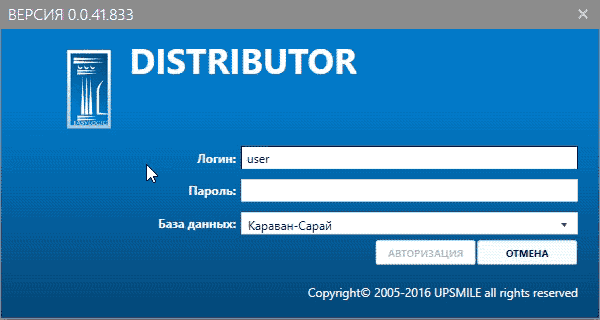
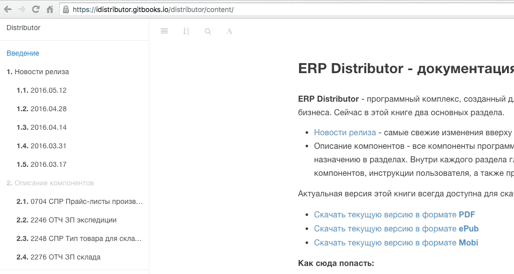

## ERP Distributor - документация пользователя.

**ERP Distributor** - программный комплекс, созданный для успешного ведения дистрибьюторского бизнеса. Сейчас в этой книге два основных раздела.
- [Новости релиза](https://idistributor.gitbooks.io/distributor/content/News%20releases/2016.12.07_49/2016.12.07_49.html) - самые свежие изменения вверху ленты.
- [Описание компонентов](https://idistributor.gitbooks.io/distributor/content/Description%20of%20the%20components/System/if.html) - все компоненты программы сгруппированы по функциональному
назначению в разделах. Внутри каждого раздела главы, описывающие  назначение этих компонентов, инструкции пользователя, а также примеры их использования.

Актуальная версия этой книги всегда доступна для скачивания по ссылкам:

* [Скачать текущую версию в  формате **PDF**](https://www.gitbook.com/download/pdf/book/idistributor/distributor)
* [Скачать текущую версию в формате **ePub**](https://www.gitbook.com/download/epub/book/idistributor/distributor)
* [Скачать текущую версию в формате **Mobi**](https://www.gitbook.com/download/mobi/book/idistributor/distributor)

**Как сюда попасть:**

  
[**Глоссарий:**](https://idistributor.gitbooks.io/distributor/content/GLOSSARY.html)  
(Краткий словарь основных терминов)

  
